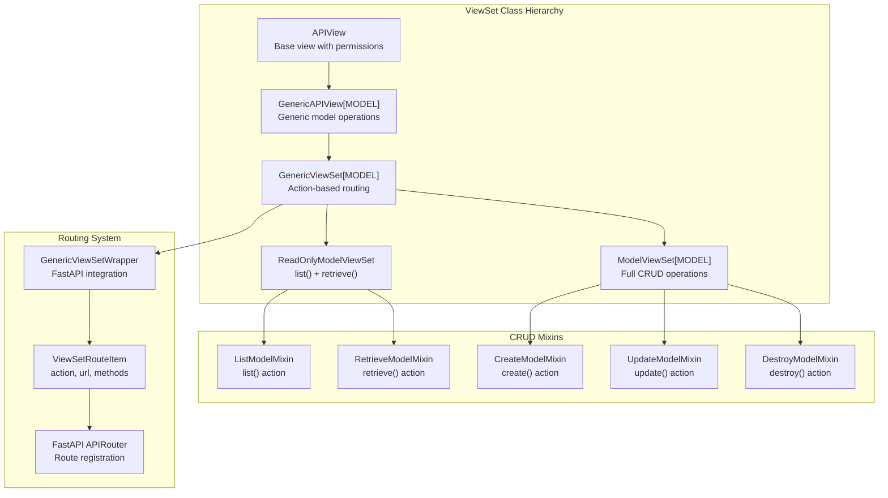
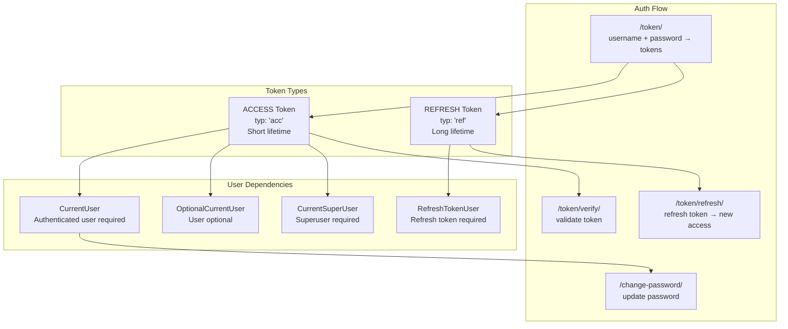
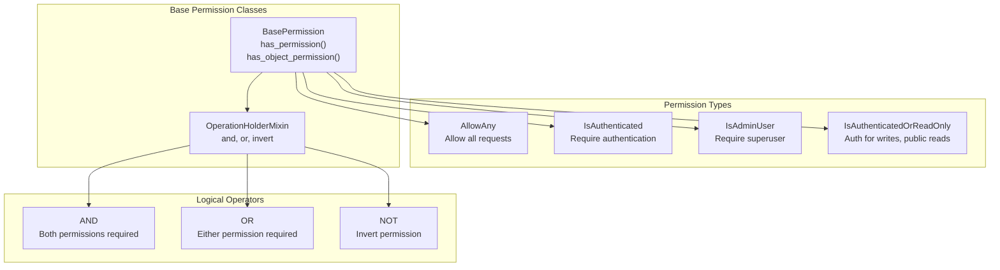
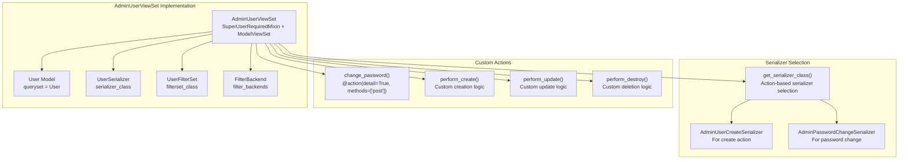
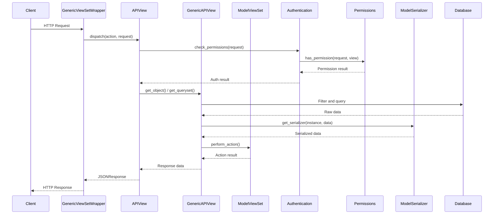

# API Development

> **Relevant source files**
> * [fastapp/contrib/auth/filters.py](/fastapp/contrib/auth/filters.py)
> * [fastapp/contrib/auth/serializers.py](/fastapp/contrib/auth/serializers.py)
> * [fastapp/contrib/auth/utils.py](/fastapp/contrib/auth/utils.py)
> * [fastapp/contrib/auth/validators.py](/fastapp/contrib/auth/validators.py)
> * [fastapp/contrib/auth/views.py](/fastapp/contrib/auth/views.py)
> * [fastapp/paginate/base.py](/fastapp/paginate/base.py)
> * [fastapp/paginate/pro.py](/fastapp/paginate/pro.py)
> * [fastapp/permissions/base.py](/fastapp/permissions/base.py)
> * [fastapp/permissions/role.py](/fastapp/permissions/role.py)
> * [fastapp/views/viewsets.py](/fastapp/views/viewsets.py)

This document covers the API development system in QingKongFramework, including ViewSets, authentication, authorization, and API patterns. The framework provides Django-like ViewSets built on FastAPI, with JWT authentication and role-based permissions.

For information about the underlying data layer that powers these APIs, see [Core Data Layer](Core-Data-Layer.md). For details about the application structure and configuration, see [Framework Architecture](Framework-Architecture.md).

## ViewSet Architecture

QingKongFramework implements a Django-like ViewSet pattern that automatically generates REST API endpoints from model classes. The system uses a wrapper pattern to convert ViewSet methods into FastAPI routes.



Sources: [fastapp/views/viewsets.py L197-L575](/fastapp/views/viewsets.py#L197-L575)

The ViewSet system automatically maps actions to HTTP methods using the `REST_ACTION_METHOD_MAPPING`:

| Action | HTTP Method | URL Pattern | Purpose |
| --- | --- | --- | --- |
| `list` | GET | `/` | List all objects |
| `retrieve` | GET | `/{id}/` | Get single object |
| `create` | POST | `/` | Create new object |
| `update` | PUT | `/{id}/` | Update existing object |
| `destroy` | DELETE | `/{id}/` | Delete object |

Sources: [fastapp/views/viewsets.py L51-L57](/fastapp/views/viewsets.py#L51-L57)

## Authentication System

The framework implements JWT-based authentication with support for access and refresh tokens. Authentication is handled through dependency injection using FastAPI's `Depends` system.



Sources: [fastapp/contrib/auth/utils.py L156-L197](/fastapp/contrib/auth/utils.py#L156-L197)

 [fastapp/contrib/auth/views.py L56-L139](/fastapp/contrib/auth/views.py#L56-L139)

### Authentication Utilities

The `get_current_user_factory` function creates dependency injection functions for different authentication scenarios:

```markdown
# Key authentication dependencies
CurrentUser = Annotated[UserProtocol, Depends(get_current_user_factory(TokenTypeEnum.ACCESS))]
OptionalCurrentUser = Annotated[Optional[UserProtocol], Depends(get_current_user_factory(raise_exception=False))]
CurrentSuperUser = Annotated[UserProtocol, Depends(get_current_user_factory(extra_action=is_superuser))]
```

Sources: [fastapp/contrib/auth/utils.py L156-L172](/fastapp/contrib/auth/utils.py#L156-L172)

## Permission System

The framework provides a flexible permission system with support for combining permissions using logical operators.



Sources: [fastapp/permissions/base.py L107-L123](/fastapp/permissions/base.py#L107-L123)

 [fastapp/permissions/role.py L5-L51](/fastapp/permissions/role.py#L5-L51)

Permissions can be combined using logical operators:

```markdown
# Example: Require authentication AND admin status
combined_permission = IsAuthenticated & IsAdminUser

# Example: Allow authenticated users OR read-only access
flexible_permission = IsAuthenticated | IsAuthenticatedOrReadOnly
```

Sources: [fastapp/permissions/base.py L6-L21](/fastapp/permissions/base.py#L6-L21)

## API Development Patterns

### ViewSet Implementation Example

The `AdminUserViewSet` demonstrates typical ViewSet implementation patterns:



Sources: [fastapp/contrib/auth/views.py L246-L303](/fastapp/contrib/auth/views.py#L246-L303)

### Pagination Integration

ViewSets automatically integrate with the pagination system:

| Pagination Class | Response Format | Query Parameters |
| --- | --- | --- |
| `BasePaginate` | `{"data": [], "total": N}` | `page_size`, `current` |
| `ProPaginate` | `{"data": [], "total": N, "success": true}` | `pageSize`, `current` |

Sources: [fastapp/paginate/base.py L14-L31](/fastapp/paginate/base.py#L14-L31)

 [fastapp/paginate/pro.py L30-L35](/fastapp/paginate/pro.py#L30-L35)

## Request Processing Flow

The following diagram shows how requests flow through the ViewSet system:



Sources: [fastapp/views/viewsets.py L71-L172](/fastapp/views/viewsets.py#L71-L172)

 [fastapp/views/viewsets.py L214-L238](/fastapp/views/viewsets.py#L214-L238)

## Custom Actions

ViewSets support custom actions using the `@action` decorator:

```python
@action(detail=True, methods=["post"], url_path="change-password")
async def change_password(self, request, pk=None):
    user = await self.get_object()
    # Custom logic here
    return JSONResponse({"message": "password changed"})
```

Custom actions are automatically discovered and added to the router with appropriate URL patterns.

Sources: [fastapp/contrib/auth/views.py L267-L279](/fastapp/contrib/auth/views.py#L267-L279)

## Error Handling

ViewSets integrate with the framework's exception system:

* `get_object_or_404` for object retrieval
* Permission denied exceptions for unauthorized access
* Validation errors from ModelSerializer
* HTTP exceptions with appropriate status codes

Sources: [fastapp/views/viewsets.py L337-L344](/fastapp/views/viewsets.py#L337-L344)

 [fastapp/views/viewsets.py L200-L225](/fastapp/views/viewsets.py#L200-L225)