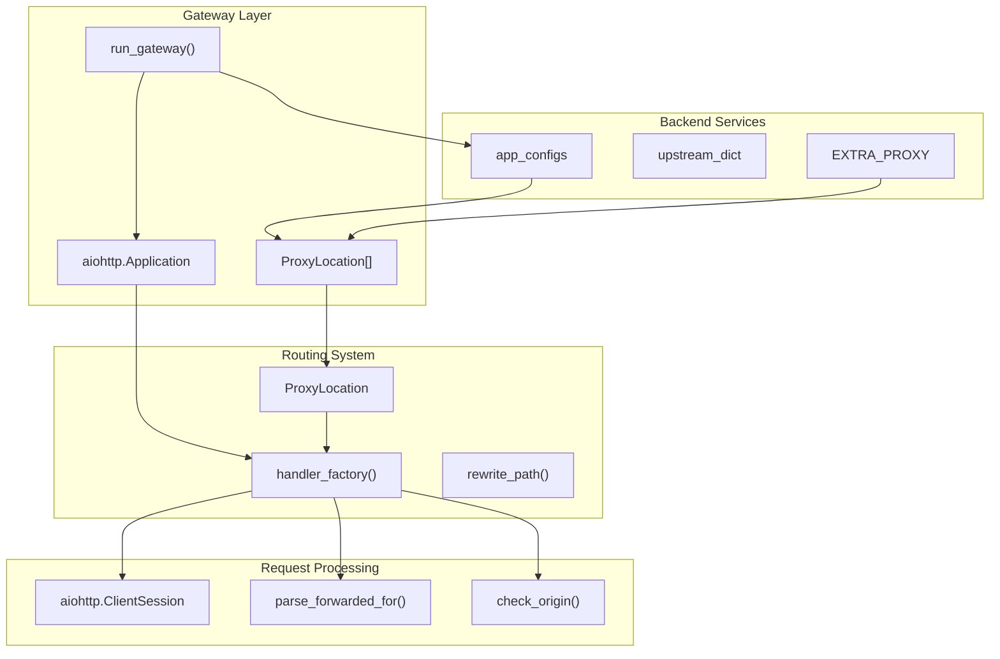
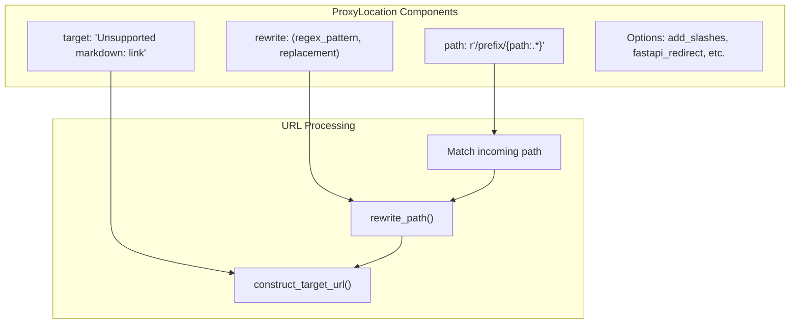
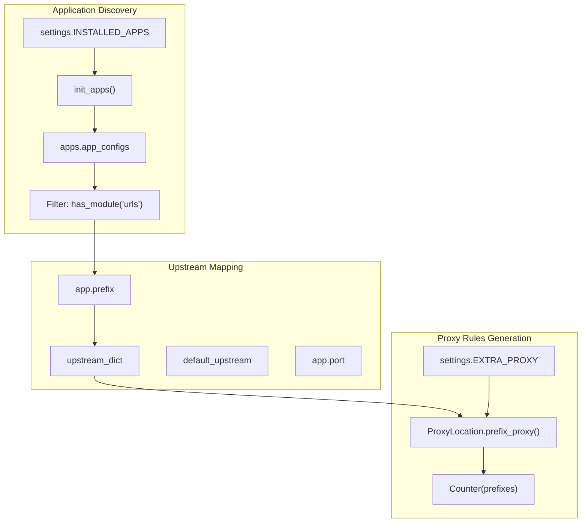
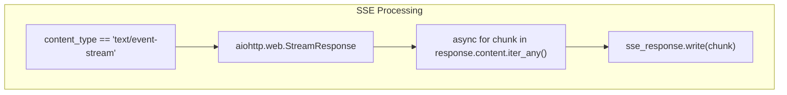
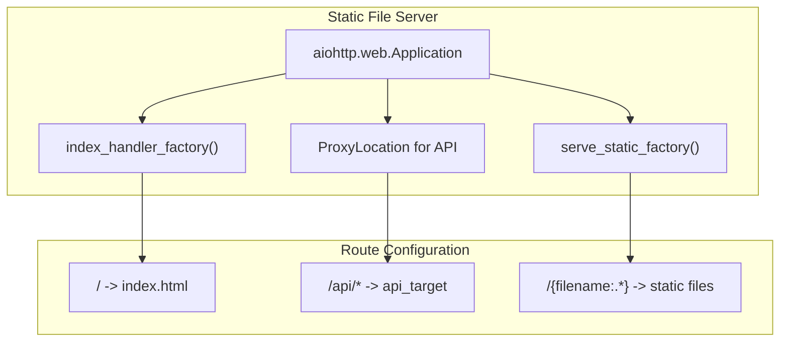

# API Gateway and Load Balancing

> **Relevant source files**
> * [fastapp/commands/load_data.py](/fastapp/commands/load_data.py)
> * [fastapp/commands/user.py](/fastapp/commands/user.py)
> * [fastapp/misc/gateway.py](/fastapp/misc/gateway.py)
> * [fastapp/misc/serve_static.py](/fastapp/misc/serve_static.py)
> * [fastapp/utils/json.py](/fastapp/utils/json.py)
> * [pyproject.toml](/pyproject.toml)
> * [setup-pure.py](/setup-pure.py)

This document covers the API gateway system in QingKongFramework, which provides request routing, load balancing, and proxy functionality for distributed service architectures. The gateway acts as a single entry point that routes requests to appropriate backend services based on URL prefixes and application configurations.

For information about server deployment commands, see [Server Commands](Server-Commands.md). For caching infrastructure, see [Caching System](Caching-System.md).

## Architecture Overview

The QingKongFramework gateway is built on `aiohttp` and provides a reverse proxy system that automatically discovers applications and routes requests based on configured prefixes. It supports load balancing across multiple upstream servers and provides advanced features like CORS handling, Server-Sent Events (SSE) proxying, and FastAPI-specific redirects.



Sources: [fastapp/misc/gateway.py L278-L352](/fastapp/misc/gateway.py#L278-L352)

## Proxy Location System

The `ProxyLocation` class is the core component that defines how requests are routed and rewritten. It handles URL path matching, target URL construction, and request forwarding configuration.



| Property | Description | Example |
| --- | --- | --- |
| `path` | URL pattern for matching requests | `r'/api/{path:.*}'` |
| `target` | Upstream server URL | `http://127.0.0.1:8001` |
| `rewrite` | Regex pattern for URL rewriting | `(r'^/api/(.*)$', r'/$1')` |
| `prefix` | Extracted prefix for routing | `api` |
| `add_slashes` | Add trailing slashes to URLs | `False` |
| `fastapi_redirect` | Handle FastAPI-style redirects | `False` |

Sources: [fastapp/misc/gateway.py L31-L112](/fastapp/misc/gateway.py#L31-L112)

## Load Balancing Configuration

The gateway supports load balancing through the `upstream_dict` parameter, which maps application prefixes to upstream server addresses. Applications are automatically discovered through the `INSTALLED_APPS` configuration.



The load balancing configuration uses this mapping logic:

* Each application gets a prefix from its configuration
* Upstream servers are resolved via `upstream_dict.get(prefix, default_upstream)`
* Additional proxy rules can be defined in `settings.EXTRA_PROXY`

Sources: [fastapp/misc/gateway.py L291-L332](/fastapp/misc/gateway.py#L291-L332)

## Request Processing Flow

The gateway processes requests through a comprehensive handler system that manages proxying, authentication headers, CORS, and special response types like SSE.

```mermaid
sequenceDiagram
  participant Client
  participant aiohttp.web.Application
  participant handler_factory()
  participant aiohttp.ClientSession
  participant Backend Service

  Client->>aiohttp.web.Application: "HTTP Request"
  aiohttp.web.Application->>handler_factory(): "Route to proxy handler"
  handler_factory()->>handler_factory(): "construct_target_url()"
  handler_factory()->>handler_factory(): "parse_forwarded_for()"
  handler_factory()->>aiohttp.ClientSession: "Create session"
  aiohttp.ClientSession->>Backend Service: "Proxy request"
  loop [SSE Response]
    Backend Service->>aiohttp.ClientSession: "text/event-stream"
    aiohttp.ClientSession->>handler_factory(): "Stream response"
    handler_factory()->>aiohttp.web.Application: "StreamResponse"
    aiohttp.web.Application->>Client: "SSE stream"
    Backend Service->>aiohttp.ClientSession: "Regular response"
    aiohttp.ClientSession->>handler_factory(): "Response content"
    handler_factory()->>handler_factory(): "swagger_proxy_middleware()"
    handler_factory()->>handler_factory(): "CORS headers"
    handler_factory()->>aiohttp.web.Application: "aiohttp.web.Response"
    aiohttp.web.Application->>Client: "Final response"
  end
```

The handler performs these key operations:

1. **URL Construction**: Uses `construct_target_url()` to build the upstream URL
2. **Header Processing**: Adds `X-Forwarded-For` and `Host` headers as needed
3. **Response Handling**: Manages different response types (SSE, redirects, regular)
4. **Middleware Processing**: Applies Swagger proxy fixes and CORS headers

Sources: [fastapp/misc/gateway.py L171-L275](/fastapp/misc/gateway.py#L171-L275)

## Advanced Gateway Features

### Server-Sent Events (SSE) Support

The gateway provides transparent SSE proxying for real-time applications:



### CORS and Security

The gateway handles CORS based on `settings.ADD_CORS_HEADERS` and validates origins against `settings.ALLOWED_HOSTS`:

| Feature | Implementation | Location |
| --- | --- | --- |
| Origin Validation | `check_origin()` | [fastapp/misc/gateway.py L133-L143](/fastapp/misc/gateway.py#L133-L143) |
| CORS Headers | Added to all responses | [fastapp/misc/gateway.py L255-L262](/fastapp/misc/gateway.py#L255-L262) |
| Forwarded Headers | `X-Forwarded-For` processing | [fastapp/misc/gateway.py L155-L168](/fastapp/misc/gateway.py#L155-L168) |

### FastAPI Integration

Special handling for FastAPI applications includes:

* Swagger UI proxy middleware for documentation routes
* OpenAPI spec rewriting for prefixed endpoints
* Redirect handling for trailing slash behavior

Sources: [fastapp/misc/gateway.py L114-L130](/fastapp/misc/gateway.py#L114-L130)

 [fastapp/misc/gateway.py L190-L249](/fastapp/misc/gateway.py#L190-L249)

## Static File Gateway Integration

The framework also provides a static file server with integrated API proxying through `serve_static.py`:



This configuration supports single-page applications with API integration, where static assets are served directly while API calls are proxied to backend services.

Sources: [fastapp/misc/serve_static.py L60-L103](/fastapp/misc/serve_static.py#L60-L103)

## Configuration and Deployment

### Gateway Settings

| Setting | Purpose | Type |
| --- | --- | --- |
| `INSTALLED_APPS` | Applications to proxy | `List[str]` |
| `NO_EXPORT_APPS` | Apps to exclude from gateway | `List[str]` |
| `EXTRA_PROXY` | Additional proxy rules | `List[Dict]` |
| `ALLOWED_HOSTS` | CORS origin validation | `List[str]` |
| `ADD_CORS_HEADERS` | Enable CORS processing | `bool` |

### Command Line Usage

The gateway can be started using the management command:

```
python manage.py gateway --host 127.0.0.1 --port 8000
```

The gateway automatically discovers applications with `urls.py` modules and creates proxy rules based on their prefix and port configurations.

Sources: [fastapp/misc/gateway.py L278-L352](/fastapp/misc/gateway.py#L278-L352)