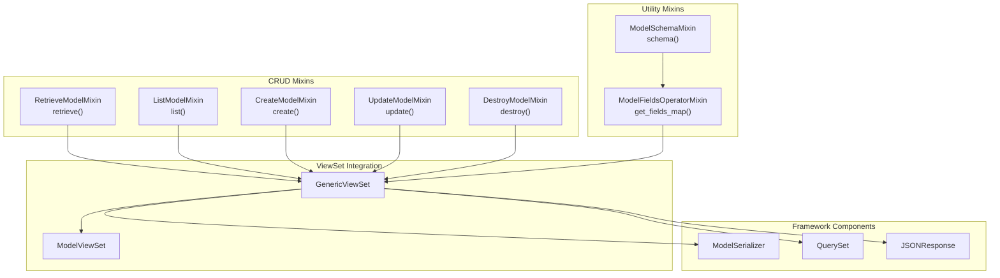
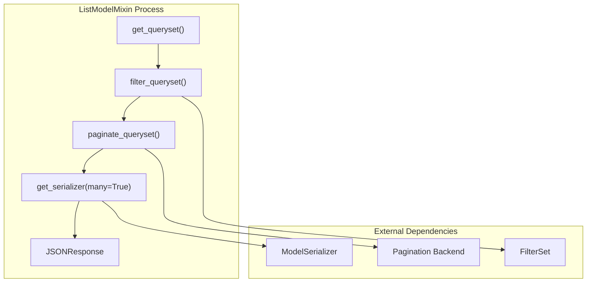
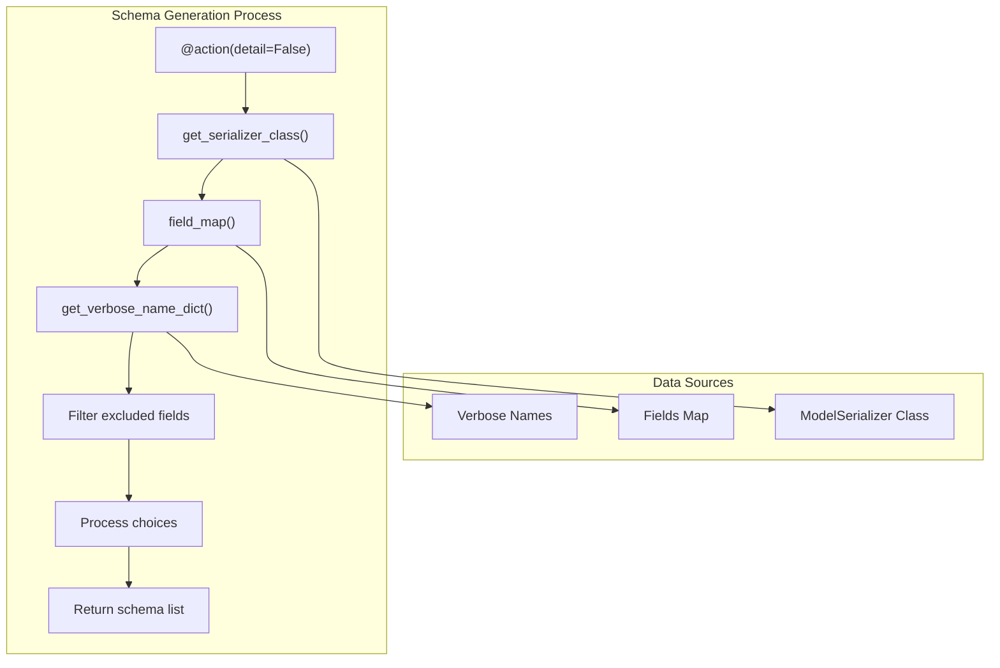

# API View Mixins

> **Relevant source files**
> * [fastapp/utils/model.py](/fastapp/utils/model.py)
> * [fastapp/views/mixins.py](/fastapp/views/mixins.py)

This document covers the ModelMixin classes that provide CRUD (Create, Read, Update, Delete) operations and schema generation capabilities for ViewSets in QingKongFramework. These mixins implement Django REST framework-style patterns adapted for async operations with FastAPI and Tortoise ORM.

For information about the ViewSet system that uses these mixins, see [ViewSets and CRUD Operations](ViewSets-and-CRUD-Operations.md). For details about the underlying ModelSerializer system, see [ModelSerializer System](ModelSerializer-System.md).

## Overview

The API view mixins provide reusable components that ViewSets can inherit to gain specific CRUD functionality. Each mixin implements a single responsibility and can be combined as needed. The mixins are designed to work seamlessly with the framework's ModelSerializer, FilterSet, and pagination systems.



**Mixin Architecture Overview**
Sources: [fastapp/views/mixins.py L1-L194](/fastapp/views/mixins.py#L1-L194)

## CRUD Operation Mixins

The framework provides five core mixins that implement standard CRUD operations. Each mixin defines both the main operation method and a customizable `perform_*` method for business logic customization.

### RetrieveModelMixin

The `RetrieveModelMixin` handles retrieving a single model instance by its primary key. It uses the ViewSet's `get_object()` method to fetch the instance and serializes it for the response.

| Method | Purpose | Return Type |
| --- | --- | --- |
| `retrieve()` | Fetch and serialize single instance | `JSONResponse` |

```mermaid
sequenceDiagram
  participant Client
  participant ViewSet + RetrieveModelMixin
  participant ModelSerializer
  participant Tortoise ORM

  Client->>ViewSet + RetrieveModelMixin: "GET /api/model/{id}/"
  ViewSet + RetrieveModelMixin->>ViewSet + RetrieveModelMixin: "get_object()"
  ViewSet + RetrieveModelMixin->>Tortoise ORM: "Query by primary key"
  Tortoise ORM-->>ViewSet + RetrieveModelMixin: "Model instance"
  ViewSet + RetrieveModelMixin->>ViewSet + RetrieveModelMixin: "get_serializer(instance)"
  ViewSet + RetrieveModelMixin->>ModelSerializer: "Create serializer"
  ModelSerializer-->>ViewSet + RetrieveModelMixin: "Serialized data"
  ViewSet + RetrieveModelMixin-->>Client: "JSONResponse"
```

**RetrieveModelMixin Flow**
Sources: [fastapp/views/mixins.py L17-L25](/fastapp/views/mixins.py#L17-L25)

### ListModelMixin

The `ListModelMixin` handles listing multiple model instances with filtering and pagination support. It integrates with the FilterSet system for query parameter filtering and supports paginated responses.

| Method | Purpose | Return Type |
| --- | --- | --- |
| `list()` | Filter, paginate, and serialize queryset | `JSONResponse` |

The mixin automatically applies filtering via `filter_queryset()` and pagination via `paginate_queryset()`. If pagination is active, it returns a paginated response; otherwise, it returns all filtered results.



**ListModelMixin Process Flow**
Sources: [fastapp/views/mixins.py L28-L42](/fastapp/views/mixins.py#L28-L42)

### CreateModelMixin

The `CreateModelMixin` handles creating new model instances from request data. It validates the input data using the ModelSerializer and creates the instance via the `perform_create()` method.

| Method | Purpose | Return Type |
| --- | --- | --- |
| `create()` | Validate and create new instance | `JSONResponse` (201) |
| `perform_create()` | Execute the creation logic | `MODEL` |

The mixin returns the created instance data with a 201 Created status code. The `perform_create()` method can be overridden to customize creation behavior.

Sources: [fastapp/views/mixins.py L45-L65](/fastapp/views/mixins.py#L45-L65)

### UpdateModelMixin

The `UpdateModelMixin` handles updating existing model instances. It fetches the instance, validates the update data, and performs the update operation.

| Method | Purpose | Return Type |
| --- | --- | --- |
| `update()` | Validate and update existing instance | `JSONResponse` (200) |
| `perform_update()` | Execute the update logic | `None` |

The mixin returns the updated instance data with a 200 OK status code. The update process uses the same serializer for both validation and response formatting.

Sources: [fastapp/views/mixins.py L73-L97](/fastapp/views/mixins.py#L73-L97)

### DestroyModelMixin

The `DestroyModelMixin` handles deleting model instances. It fetches the instance and performs the deletion via the `perform_destroy()` method.

| Method | Purpose | Return Type |
| --- | --- | --- |
| `destroy()` | Delete existing instance | `JSONResponse` (204) |
| `perform_destroy()` | Execute the deletion logic | `None` |

The mixin returns an empty response with a 204 No Content status code after successful deletion.

Sources: [fastapp/views/mixins.py L105-L117](/fastapp/views/mixins.py#L105-L117)

## Utility Mixins

Beyond CRUD operations, the framework provides utility mixins for model introspection and schema generation.

### ModelFieldsOperatorMixin

The `ModelFieldsOperatorMixin` provides methods for introspecting model fields and generating field maps. It offers fine-grained control over which fields to include in the field map.

| Method | Purpose | Parameters |
| --- | --- | --- |
| `get_fields_map()` | Generate comprehensive field mapping | `include_backward`, `include_m2m`, `include_auto`, `include_fk_id` |
| `get_verbose_name_dict()` | Create field name to verbose name mapping | `extra_verbose_name_dict` |

The field map filtering options allow precise control over field inclusion:

| Parameter | Purpose |
| --- | --- |
| `include_backward` | Include backward foreign key fields |
| `include_m2m` | Include many-to-many fields |
| `include_auto` | Include auto-generated fields (timestamps, etc.) |
| `include_fk_id` | Include foreign key ID fields |

Sources: [fastapp/views/mixins.py L125-L143](/fastapp/views/mixins.py#L125-L143)

 [fastapp/utils/model.py L4-L39](/fastapp/utils/model.py#L4-L39)

### ModelSchemaMixin

The `ModelSchemaMixin` provides an API endpoint for generating field schema information. It creates a comprehensive schema description including field names, verbose names, validation requirements, and choice options.

The mixin defines a `schema_exclude_fields` set that filters out common system fields from the schema response:

```
schema_exclude_fields = {
    "created_at", "updated_at", "created_by_id", 
    "updated_by_id", "created_by", "updated_by", "is_deleted"
}
```

The schema endpoint returns structured field information:

| Field | Type | Description |
| --- | --- | --- |
| `field_name` | `str` | The actual field name |
| `verbose_name` | `str` | Human-readable field name |
| `required` | `bool` | Whether field is required |
| `choices` | `list` | Available choices (if applicable) |



**Schema Generation Process**
Sources: [fastapp/views/mixins.py L151-L185](/fastapp/views/mixins.py#L151-L185)

## Integration Patterns

The mixins are designed to be mixed and matched based on the required functionality. Common combination patterns include:

| ViewSet Type | Included Mixins | Use Case |
| --- | --- | --- |
| Read-only API | `RetrieveModelMixin`, `ListModelMixin` | Public data display |
| Full CRUD API | All CRUD mixins | Complete resource management |
| Create-only API | `CreateModelMixin`, `ListModelMixin` | Log or event collection |
| Schema-aware API | CRUD mixins + `ModelSchemaMixin` | Dynamic form generation |

The TypeScript-style type annotations ensure proper typing when mixins are combined:

```python
# Type checking classes ensure proper mixin composition
class CreateModelMixinType(CreateModelMixin, GenericViewSet): pass
class UpdateModelMixinType(UpdateModelMixin, GenericViewSet): pass
class DestroyModelMixinType(DestroyModelMixin, GenericViewSet): pass
```

All mixins integrate seamlessly with the framework's core systems including authentication, permissions, filtering, and pagination through the ViewSet base class methods.

Sources: [fastapp/views/mixins.py L67-L71](/fastapp/views/mixins.py#L67-L71)

 [fastapp/views/mixins.py L99-L103](/fastapp/views/mixins.py#L99-L103)

 [fastapp/views/mixins.py L119-L123](/fastapp/views/mixins.py#L119-L123)