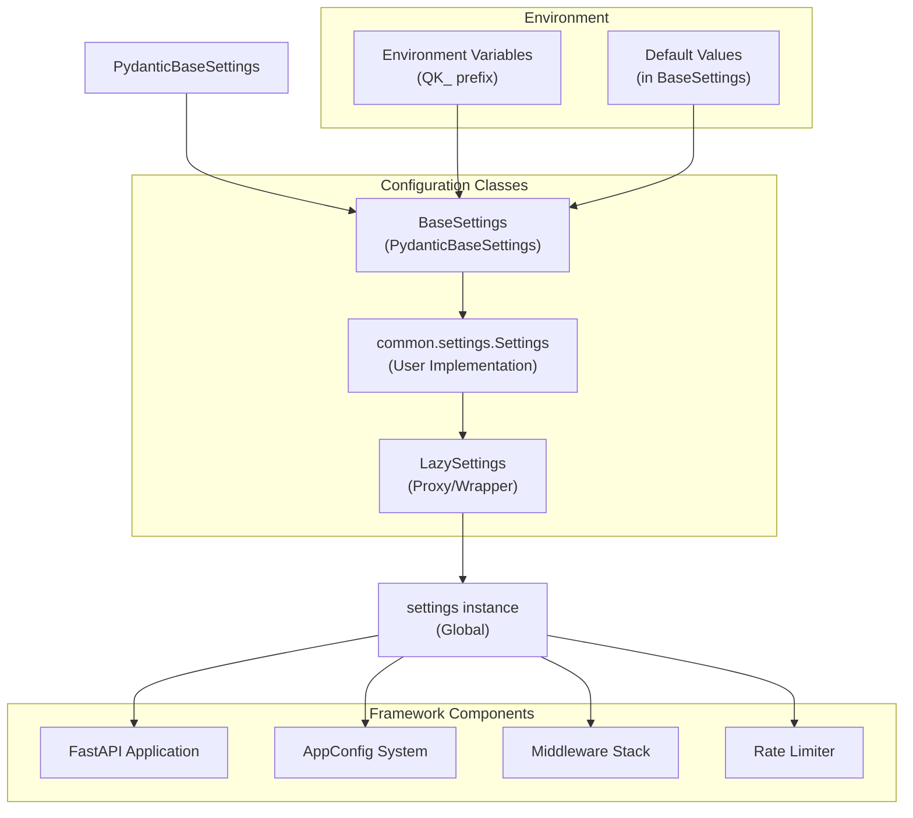
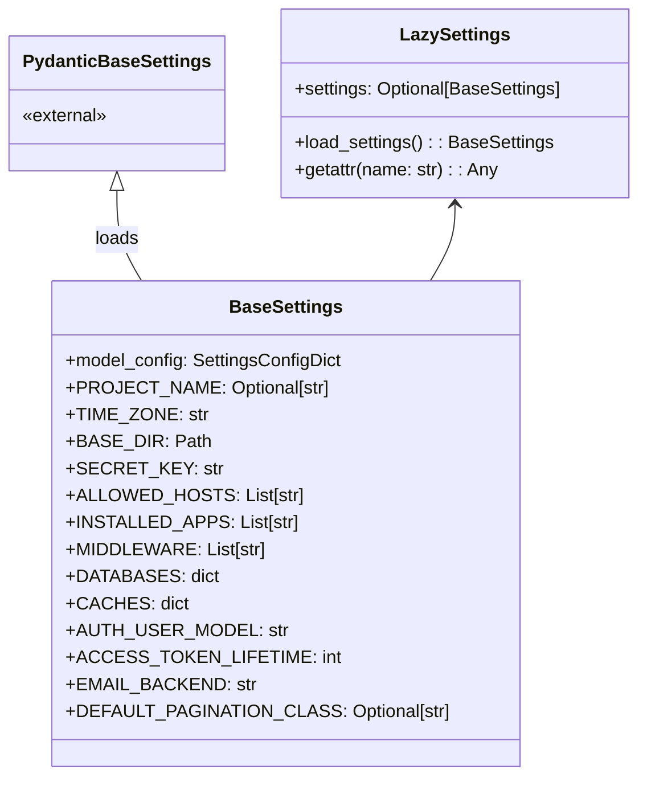
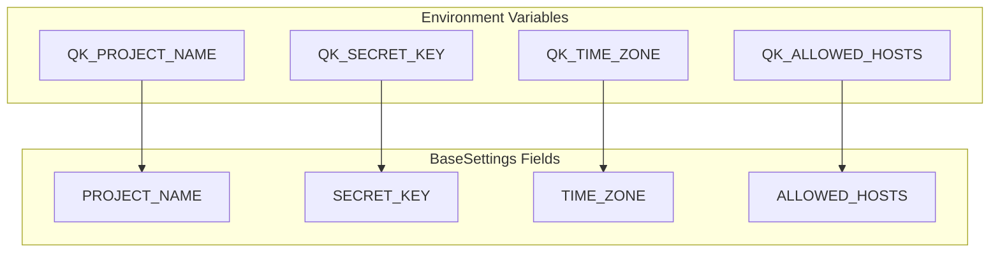
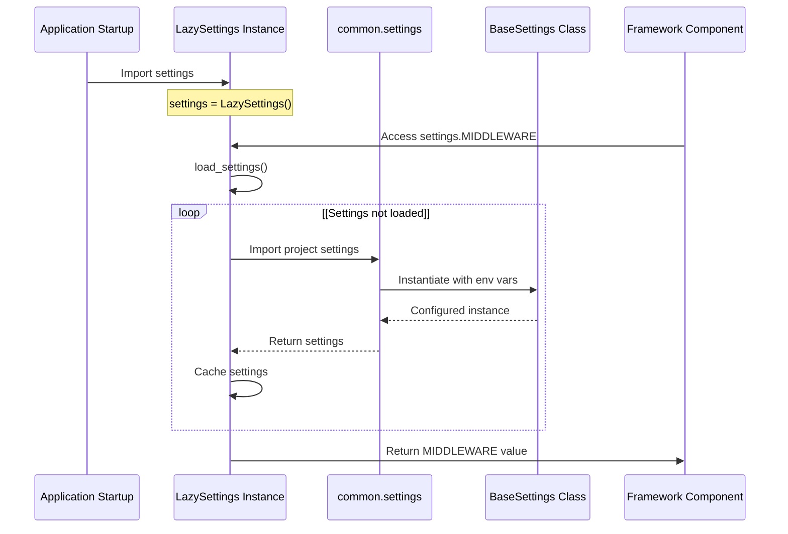
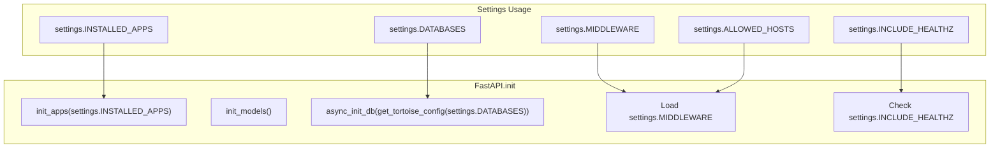
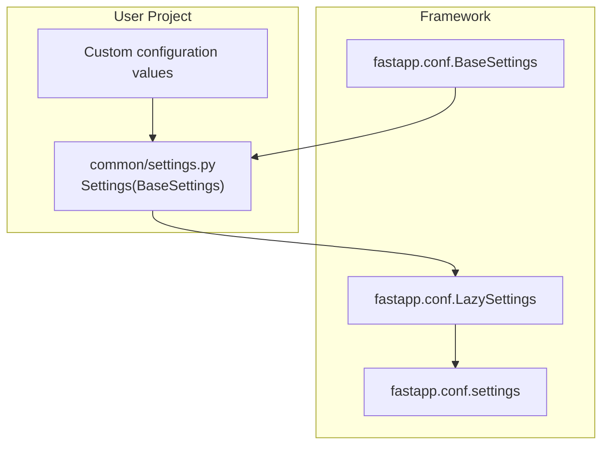

# Application Configuration

> **Relevant source files**
> * [fastapp/apps/config.py](/fastapp/apps/config.py)
> * [fastapp/conf.py](/fastapp/conf.py)
> * [fastapp/exception_handlers.py](/fastapp/exception_handlers.py)
> * [fastapp/fastapi.py](/fastapp/fastapi.py)
> * [fastapp/misc/ascii_art.py](/fastapp/misc/ascii_art.py)

## Purpose and Scope

This document covers the configuration management system in QingKongFramework, which provides a centralized settings mechanism built on Pydantic Settings. The system handles environment variable loading, lazy initialization, and provides type-safe configuration access throughout the framework.

For information about application discovery and the `INSTALLED_APPS` setting, see [Application Discovery and Structure](Application-Discovery-and-Structure.md). For database-specific configuration, see [Database Management](Database-Management.md).

## Configuration Architecture

The configuration system consists of two main classes that work together to provide flexible, type-safe settings management:

**Sources:** [fastapp/conf.py L11-L133](/fastapp/conf.py#L11-L133)

 [fastapp/fastapi.py L19](/fastapp/fastapi.py#L19-L19)

 [fastapp/apps/config.py L46](/fastapp/apps/config.py#L46-L46)

## Core Configuration Classes

### BaseSettings Class

The `BaseSettings` class extends Pydantic's `BaseSettings` to provide the foundation for all configuration in the framework:

**Sources:** [fastapp/conf.py L11-L94](/fastapp/conf.py#L11-L94)

### LazySettings Implementation

The `LazySettings` class provides lazy initialization of settings, loading them only when first accessed:

| Method | Purpose | Implementation |
| --- | --- | --- |
| `load_settings()` | Loads settings from `common.settings` | Imports and caches settings instance |
| `__getattr__()` | Proxy attribute access | Delegates to loaded settings instance |
| `__init__()` | Initialize with no settings | Sets `self.settings = None` |

**Sources:** [fastapp/conf.py L95-L132](/fastapp/conf.py#L95-L132)

## Configuration Categories

The framework organizes configuration into logical categories:

### Core Framework Settings

| Setting | Type | Default | Description |
| --- | --- | --- | --- |
| `PROJECT_NAME` | `Optional[str]` | `None` | Project identifier |
| `BASE_DIR` | `Path` | Required | Project root directory |
| `SECRET_KEY` | `str` | `"longlivethegreatunityofthepeople"` | Cryptographic secret |
| `TIME_ZONE` | `str` | `"Asia/Shanghai"` | Default timezone |
| `ALLOWED_HOSTS` | `List[str]` | `["127.0.0.1", "localhost"]` | Trusted host list |

### Application and Middleware Settings

| Setting | Type | Default | Description |
| --- | --- | --- | --- |
| `INSTALLED_APPS` | `List[str]` | `[]` | Registered applications |
| `MIDDLEWARE` | `List[str]` | `["fastapp.middleware.trustedhost.TrustedHostMiddleware"]` | Middleware stack |
| `NO_EXPORT_APPS` | `List[str]` | `[]` | Apps excluded from port mapping |

### Database and Caching

| Setting | Type | Description |
| --- | --- | --- |
| `DATABASES` | `dict[str, dict[str, Any]]` | Database connection configurations |
| `CACHES` | `dict[str, dict[str, Any]]` | Cache backend configurations |

**Sources:** [fastapp/conf.py L14-L94](/fastapp/conf.py#L14-L94)

## Environment Variable Support

The configuration system automatically loads environment variables with the `QK_` prefix:

**Sources:** [fastapp/conf.py L12](/fastapp/conf.py#L12-L12)

## Settings Loading and Usage Flow

The framework uses a lazy loading pattern to ensure settings are available throughout the application lifecycle:

**Sources:** [fastapp/conf.py L109-L129](/fastapp/conf.py#L109-L129)

 [fastapp/fastapi.py L91-L97](/fastapp/fastapi.py#L91-L97)

## Integration with Framework Components

### FastAPI Application Setup

The configuration system integrates tightly with the FastAPI application initialization:

**Sources:** [fastapp/fastapi.py L79-L109](/fastapp/fastapi.py#L79-L109)

### AppConfig Integration

The `AppConfig` class also relies on settings for port management and application configuration:

| Setting Used | Purpose in AppConfig |
| --- | --- |
| `settings.ENABLE_PORT_MAP_FILE` | Controls port file generation |
| `settings.PROJECT_NAME` | Used in port lock file naming |
| `settings.BASE_DIR.name` | Fallback for lock file naming |
| `settings.NO_EXPORT_APPS` | Excludes apps from port assignment |

**Sources:** [fastapp/apps/config.py L46-L64](/fastapp/apps/config.py#L46-L64)

## Configuration Extension Pattern

Users extend the configuration system by creating their own settings class in `common.settings`:

**Sources:** [fastapp/conf.py L120-L125](/fastapp/conf.py#L120-L125)