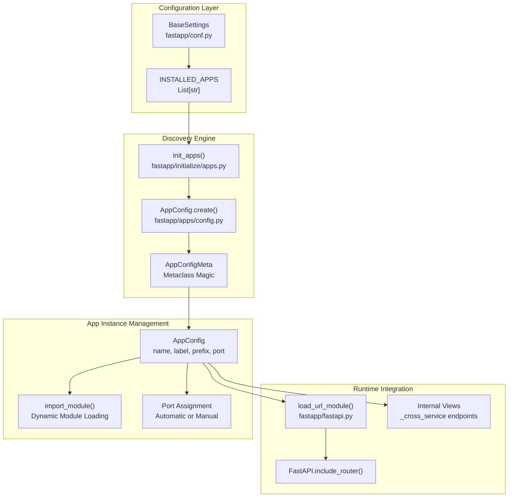
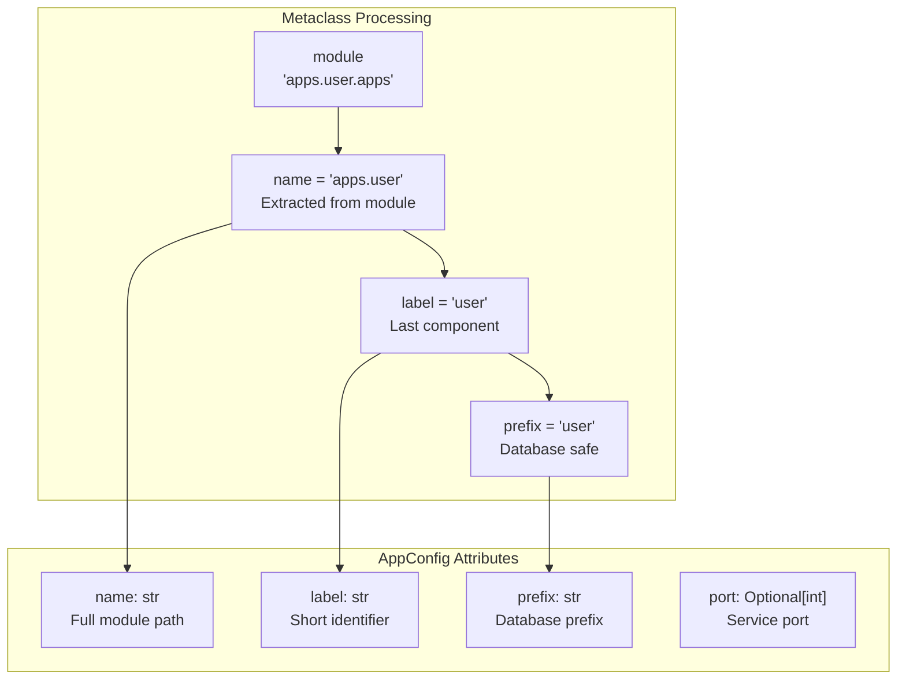
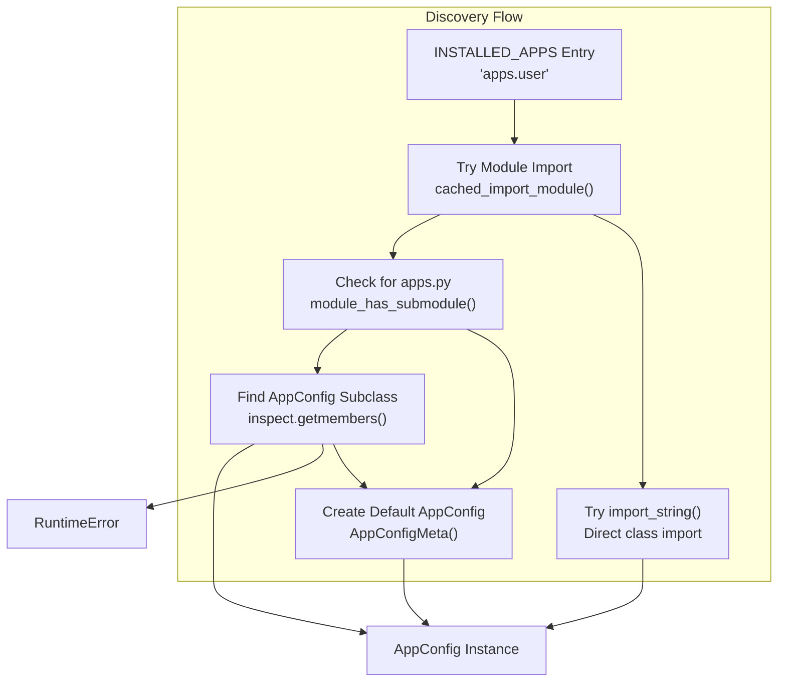
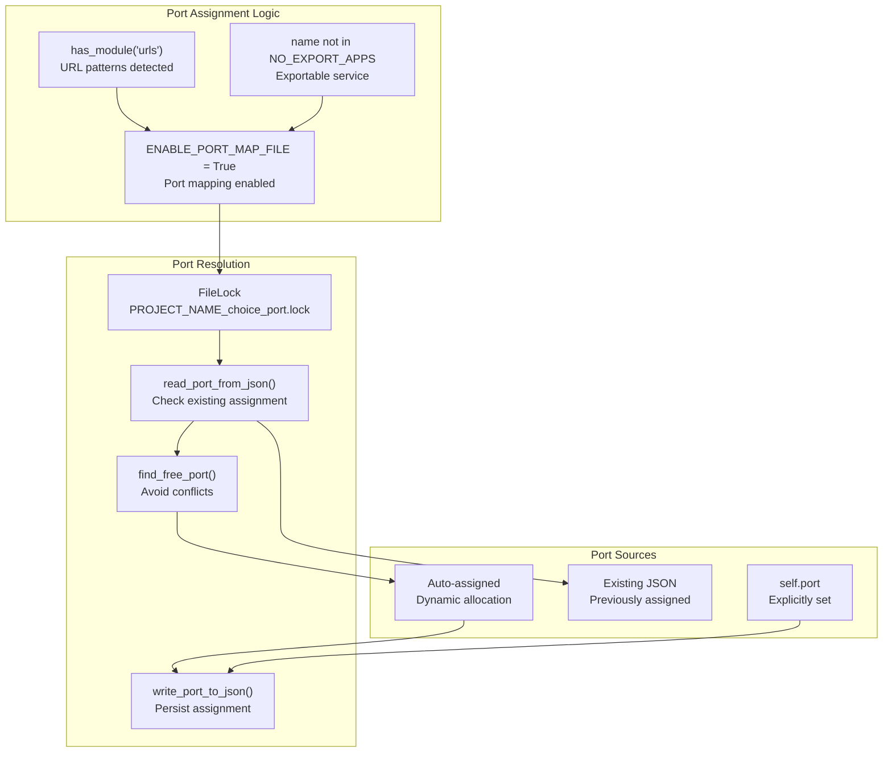
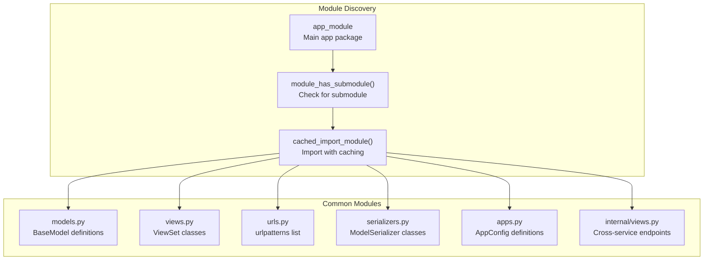
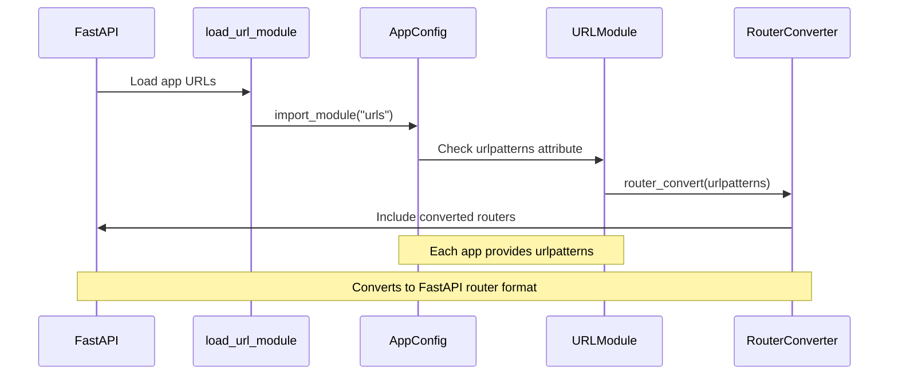
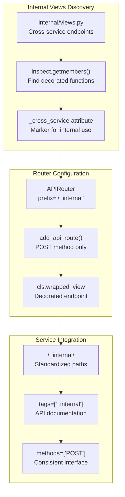
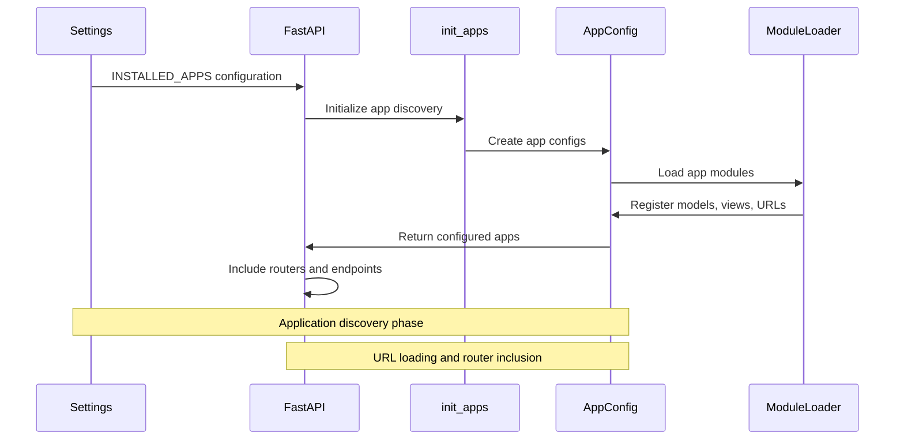

# Application Discovery and Structure

> **Relevant source files**
> * [fastapp/apps/config.py](/fastapp/apps/config.py)
> * [fastapp/conf.py](/fastapp/conf.py)
> * [fastapp/exception_handlers.py](/fastapp/exception_handlers.py)
> * [fastapp/fastapi.py](/fastapp/fastapi.py)
> * [fastapp/misc/ascii_art.py](/fastapp/misc/ascii_art.py)

This document covers the application discovery and loading system in QingKongFramework, including the `AppConfig` system, `INSTALLED_APPS` configuration, and modular application structure. This system provides Django-like application organization while integrating with FastAPI's routing and lifecycle management.

For configuration management details, see [Application Configuration](Application-Configuration.md). For ViewSet routing patterns, see [ViewSets and CRUD Operations](ViewSets-and-CRUD-Operations.md).

## Application Discovery Overview

The framework uses a sophisticated application discovery system that automatically detects, configures, and loads modular applications based on the `INSTALLED_APPS` setting. Each application is represented by an `AppConfig` instance that manages module loading, port assignment, and URL routing.



**Sources:** [fastapp/conf.py L27](/fastapp/conf.py#L27-L27)

 [fastapp/apps/config.py L31-L175](/fastapp/apps/config.py#L31-L175)

 [fastapp/fastapi.py L79-L126](/fastapp/fastapi.py#L79-L126)

## AppConfig System Architecture

The `AppConfig` class serves as the central configuration object for each application, with automatic attribute generation through its metaclass and flexible module discovery patterns.

### AppConfigMeta Metaclass

The `AppConfigMeta` metaclass automatically generates application metadata:



**Sources:** [fastapp/apps/config.py L19-L28](/fastapp/apps/config.py#L19-L28)

### Application Discovery Patterns

The framework supports multiple application configuration patterns:

| Pattern | Description | Location | Auto-Discovery |
| --- | --- | --- | --- |
| **Module-based** | App module with optional `apps.py` | `apps/user/` | ✓ |
| **AppConfig subclass** | Custom AppConfig in `apps.py` | `apps/user/apps.py` | ✓ |
| **Explicit class** | Direct AppConfig class reference | `INSTALLED_APPS` | ✗ |



**Sources:** [fastapp/apps/config.py L72-L175](/fastapp/apps/config.py#L72-L175)

## Port Management System

Applications with URL patterns are automatically assigned network ports for microservice deployment, with file-based coordination to prevent conflicts.



**Sources:** [fastapp/apps/config.py L47-L64](/fastapp/apps/config.py#L47-L64)

 [fastapp/utils/fs.py](/fastapp/utils/fs.py)

 [fastapp/utils/ports.py](/fastapp/utils/ports.py)

## Module Loading and URL Integration

Applications provide modular functionality through dynamic module loading and automatic URL pattern integration with FastAPI routing.

### Dynamic Module Loading



**Sources:** [fastapp/apps/config.py L177-L183](/fastapp/apps/config.py#L177-L183)

### URL Pattern Loading

The framework automatically loads URL patterns from each application's `urls.py` module:



**Sources:** [fastapp/fastapi.py L60-L64](/fastapp/fastapi.py#L60-L64)

## Internal Service Communication

Applications can expose internal endpoints for cross-service communication using the `_cross_service` decorator pattern.



**Sources:** [fastapp/fastapi.py L111-L123](/fastapp/fastapi.py#L111-L123)

## Application Structure Convention

QingKongFramework follows a standardized directory structure for applications:

```go
apps/
├── user/                      # Application package
│   ├── __init__.py           # Package marker
│   ├── apps.py               # AppConfig definition (optional)
│   ├── models.py             # BaseModel classes
│   ├── views.py              # ViewSet classes  
│   ├── serializers.py        # ModelSerializer classes
│   ├── filters.py            # FilterSet classes
│   ├── urls.py               # URL patterns
│   └── internal/             # Internal services (optional)
│       └── views.py          # Cross-service endpoints
├── product/                  # Another application
│   └── ...
└── __init__.py              # Apps package marker
```

### Application Lifecycle Integration



**Sources:** [fastapp/fastapi.py L79-L126](/fastapp/fastapi.py#L79-L126)