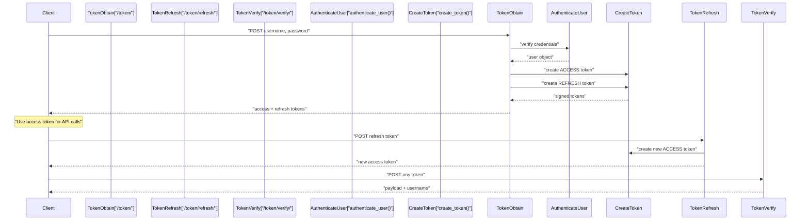
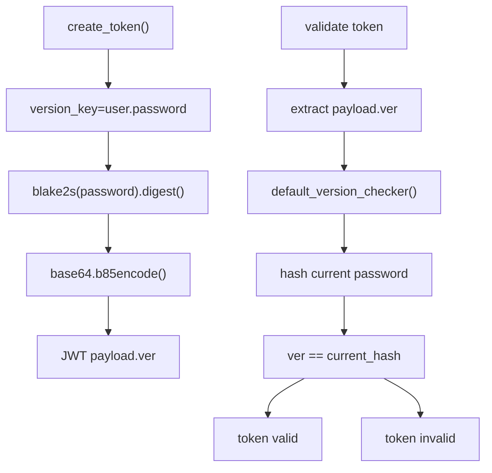
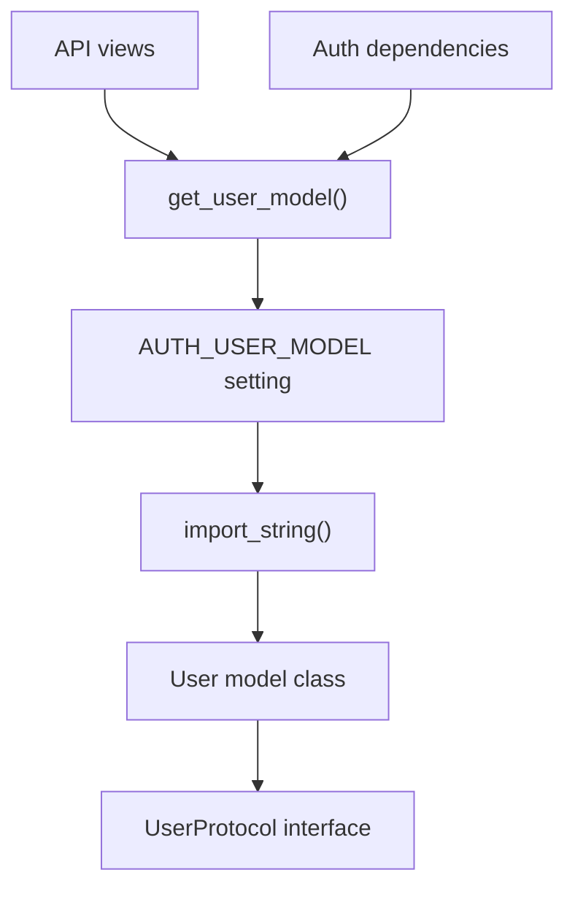
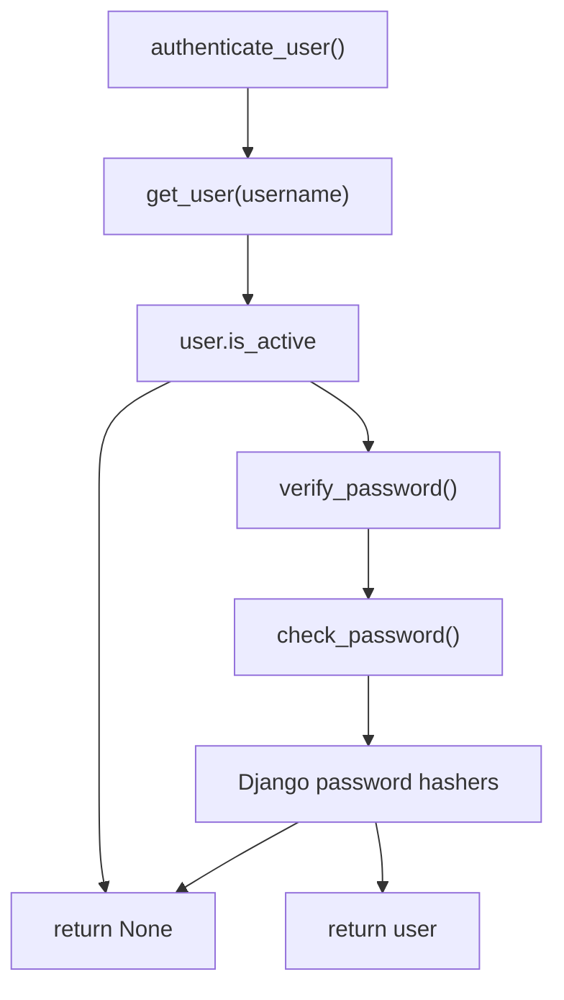
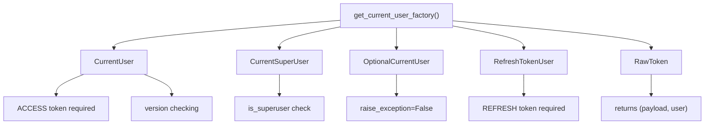
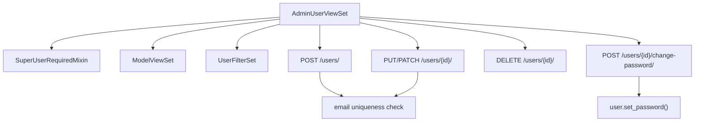
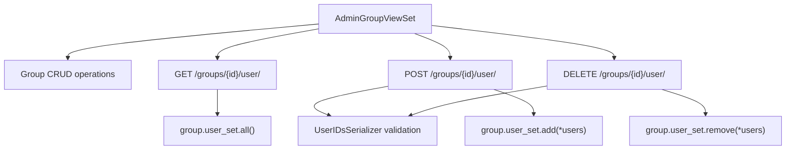
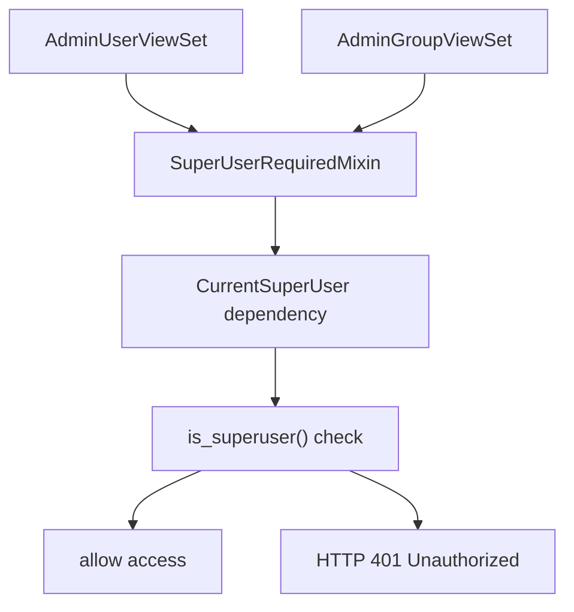
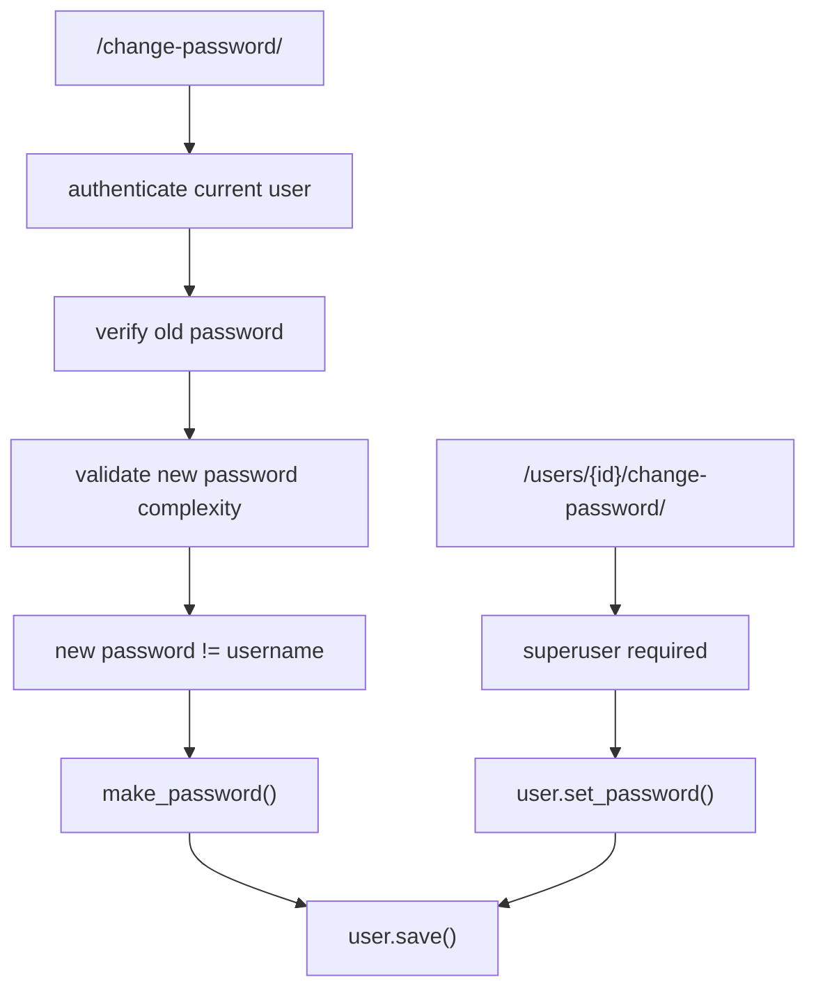
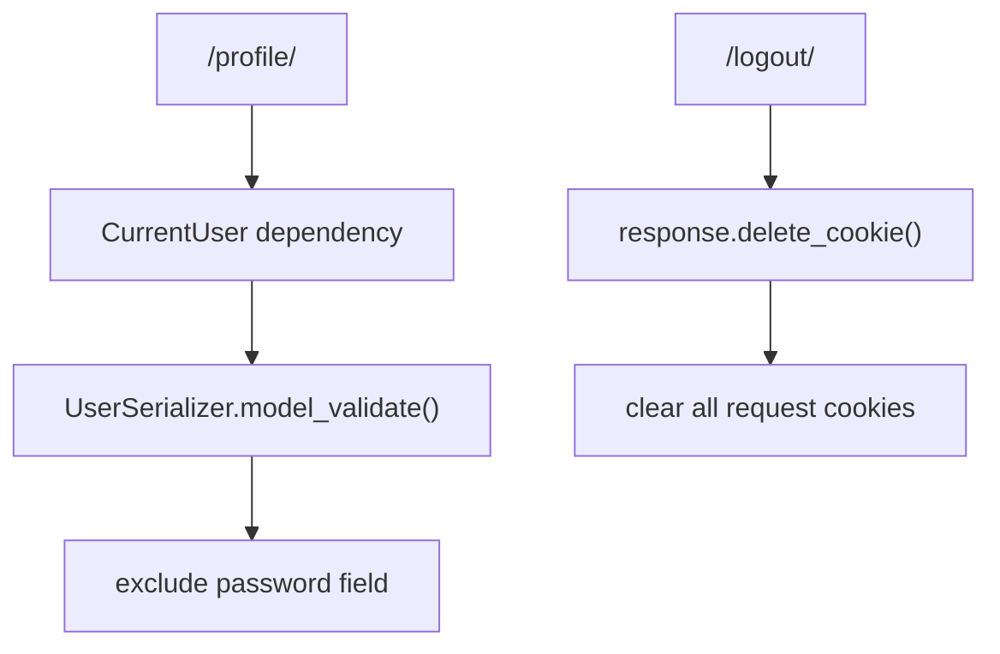

# Authentication and Authorization

> **Relevant source files**
> * [fastapp/contrib/auth/filters.py](/fastapp/contrib/auth/filters.py)
> * [fastapp/contrib/auth/serializers.py](/fastapp/contrib/auth/serializers.py)
> * [fastapp/contrib/auth/utils.py](/fastapp/contrib/auth/utils.py)
> * [fastapp/contrib/auth/validators.py](/fastapp/contrib/auth/validators.py)
> * [fastapp/contrib/auth/views.py](/fastapp/contrib/auth/views.py)

This document covers the JWT-based authentication system and role-based authorization mechanisms in QingKongFramework. The authentication system provides token-based user authentication with configurable user models, dependency injection for request authentication, and comprehensive admin interfaces for user and group management.

For information about API ViewSet permissions and pagination, see [Pagination and Permissions](Pagination-and-Permissions.md). For details on middleware and request processing, see [Framework Architecture](Framework-Architecture.md).

## JWT Token Authentication System

QingKongFramework implements a JWT-based authentication system with access and refresh token support. The token system uses version checking to invalidate tokens when user passwords change.

### Token Flow

Sources: [fastapp/contrib/auth/views.py L56-L91](/fastapp/contrib/auth/views.py#L56-L91)

 [fastapp/contrib/auth/views.py L94-L119](/fastapp/contrib/auth/views.py#L94-L119)

 [fastapp/contrib/auth/views.py L122-L138](/fastapp/contrib/auth/views.py#L122-L138)

### Token Types and Configuration

The system uses two token types defined in `TokenTypeEnum`:

| Token Type | Purpose | Lifetime Setting | Usage |
| --- | --- | --- | --- |
| `ACCESS` | API authentication | `ACCESS_TOKEN_LIFETIME` | Bearer token for API calls |
| `REFRESH` | Token renewal | `REFRESH_TOKEN_LIFETIME` | Renew access tokens |

Sources: [fastapp/contrib/auth/utils.py L20-L23](/fastapp/contrib/auth/utils.py#L20-L23)

### Version Checking

Tokens include a version hash based on the user's password to automatically invalidate all tokens when passwords change:

Sources: [fastapp/contrib/auth/views.py L78-L84](/fastapp/contrib/auth/views.py#L78-L84)

 [fastapp/contrib/auth/utils.py L129-L135](/fastapp/contrib/auth/utils.py#L129-L135)

## User Model and Configuration

### Configurable User Model

The framework supports configurable user models through the `AUTH_USER_MODEL` setting, similar to Django's approach:

Sources: [fastapp/contrib/auth/utils.py L28-L42](/fastapp/contrib/auth/utils.py#L28-L42)

### User Authentication

The authentication process validates username and password against the configured user model:

Sources: [fastapp/contrib/auth/utils.py L68-L79](/fastapp/contrib/auth/utils.py#L68-L79)

 [fastapp/contrib/auth/utils.py L61-L65](/fastapp/contrib/auth/utils.py#L61-L65)

## Authentication Dependencies

QingKongFramework provides FastAPI dependency injection for authentication using factory functions that generate dependencies:

### Dependency Types

Sources: [fastapp/contrib/auth/utils.py L156-L197](/fastapp/contrib/auth/utils.py#L156-L197)

### Dependency Factory Parameters

| Parameter | Type | Purpose |
| --- | --- | --- |
| `token_type` | `TokenTypeEnum` | Filter by ACCESS/REFRESH tokens |
| `raw` | `bool` | Return `(payload, user)` tuple |
| `raise_exception` | `bool` | Raise HTTP 401 on auth failure |
| `extra_action` | `Callable` | Additional validation (e.g., superuser check) |
| `version_checker` | `Callable` | Token version validation function |

Sources: [fastapp/contrib/auth/utils.py L82-L87](/fastapp/contrib/auth/utils.py#L82-L87)

## Admin User and Group Management

### Admin User ViewSet

The `AdminUserViewSet` provides comprehensive user management for superusers:

Sources: [fastapp/contrib/auth/views.py L246-L303](/fastapp/contrib/auth/views.py#L246-L303)

### Admin Group ViewSet

The `AdminGroupViewSet` manages groups and group membership:

Sources: [fastapp/contrib/auth/views.py L305-L406](/fastapp/contrib/auth/views.py#L305-L406)

## Permission System

### Superuser Required Mixin

The `SuperUserRequiredMixin` restricts access to superusers through the dependency injection system:

Sources: [fastapp/contrib/auth/views.py L246](/fastapp/contrib/auth/views.py#L246-L246)

 [fastapp/contrib/auth/views.py L305](/fastapp/contrib/auth/views.py#L305-L305)

 [fastapp/contrib/auth/utils.py L138-L154](/fastapp/contrib/auth/utils.py#L138-L154)

## Password Management and Validation

### User Password Change

The framework provides both user-initiated and admin password changes:

Sources: [fastapp/contrib/auth/views.py L195-L222](/fastapp/contrib/auth/views.py#L195-L222)

 [fastapp/contrib/auth/views.py L267-L279](/fastapp/contrib/auth/views.py#L267-L279)

### Password Validation

Password complexity is enforced through multiple validators:

| Validation Rule | Implementation |
| --- | --- |
| Minimum length | 8+ characters |
| Uppercase letter | At least one A-Z |
| Lowercase letter | At least one a-z |
| Digit | At least one 0-9 |
| Special character | `!@#$%^&*()-_=+[]{}` etc. |
| Username check | Cannot contain username |

Sources: [fastapp/contrib/auth/validators.py L18-L43](/fastapp/contrib/auth/validators.py#L18-L43)

 [fastapp/contrib/auth/views.py L167-L192](/fastapp/contrib/auth/views.py#L167-L192)

### User Profile and Session Management

The authentication system provides profile access and logout functionality:

Sources: [fastapp/contrib/auth/views.py L141-L152](/fastapp/contrib/auth/views.py#L141-L152)

 [fastapp/contrib/auth/views.py L225-L243](/fastapp/contrib/auth/views.py#L225-L243)

 [fastapp/contrib/auth/serializers.py L16-L25](/fastapp/contrib/auth/serializers.py#L16-L25)