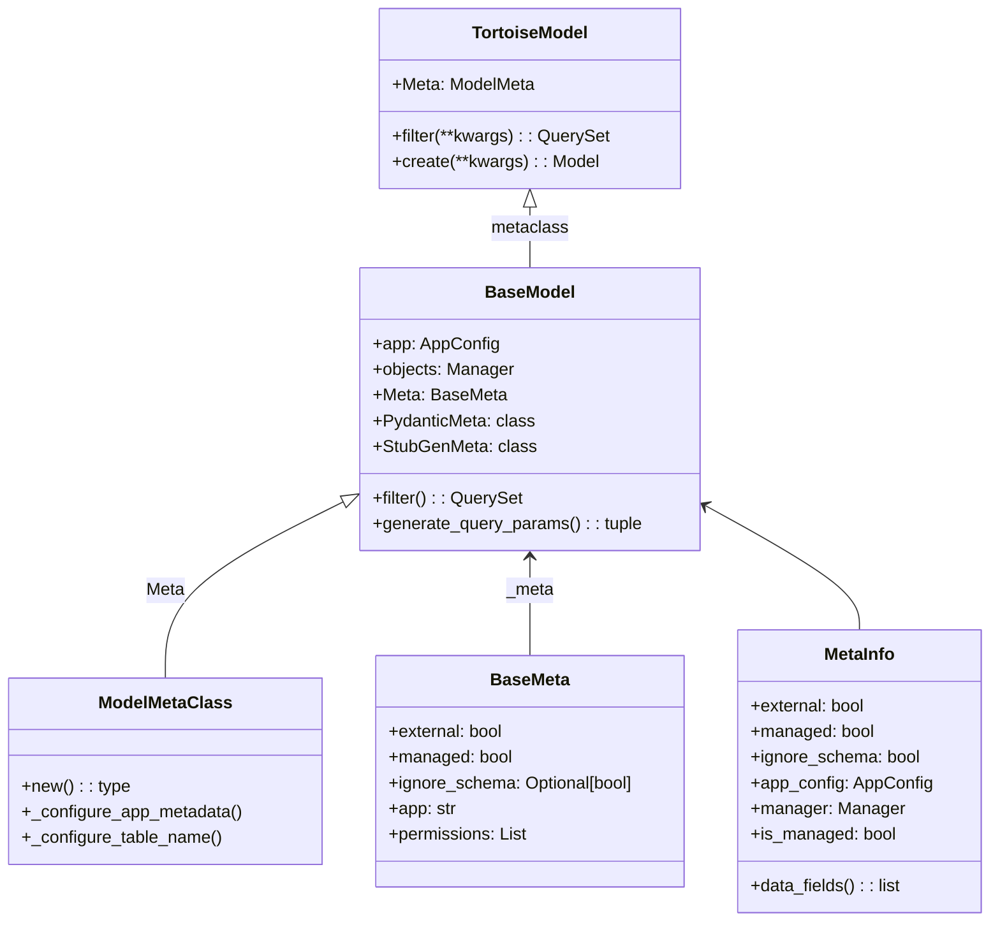
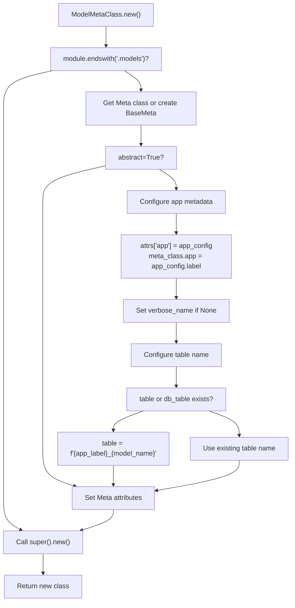
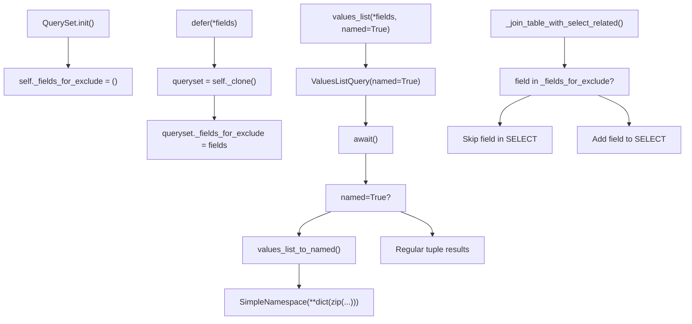
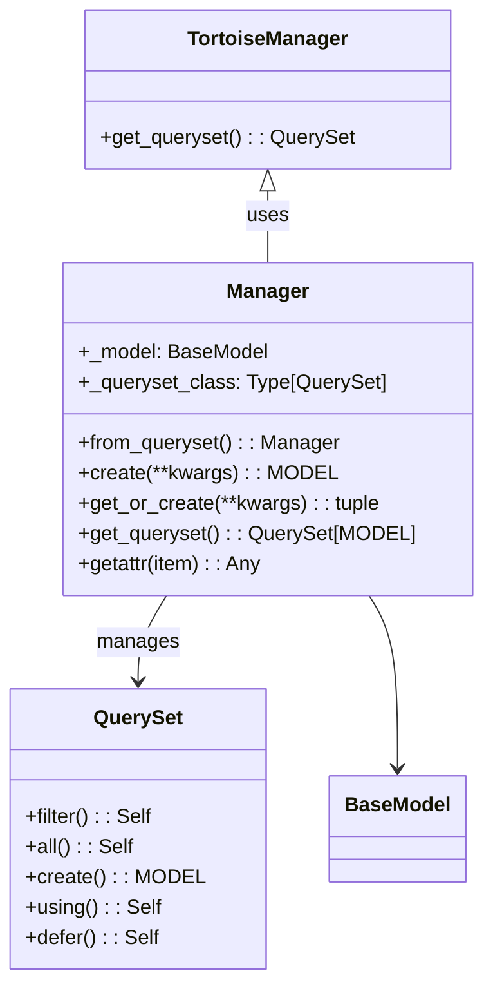
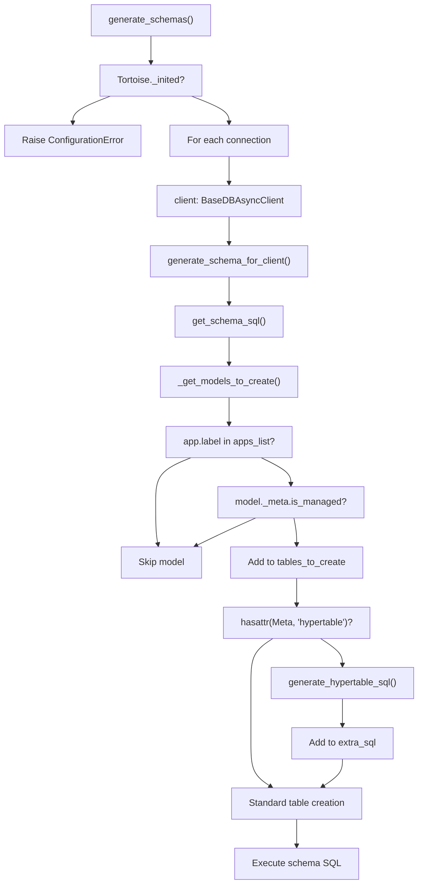
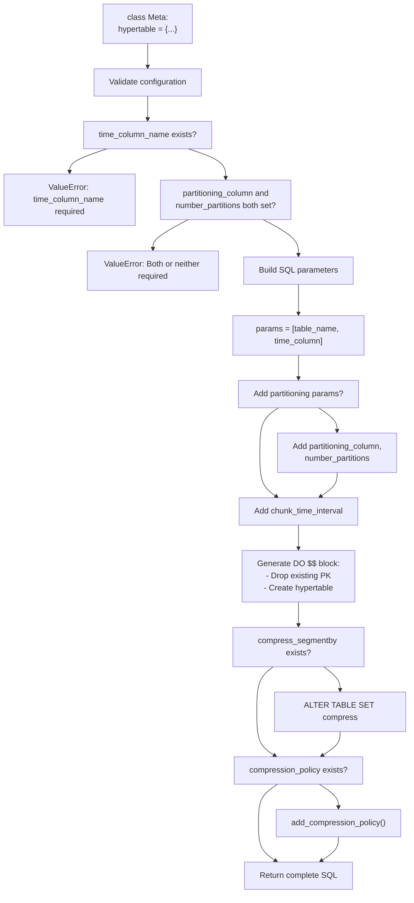
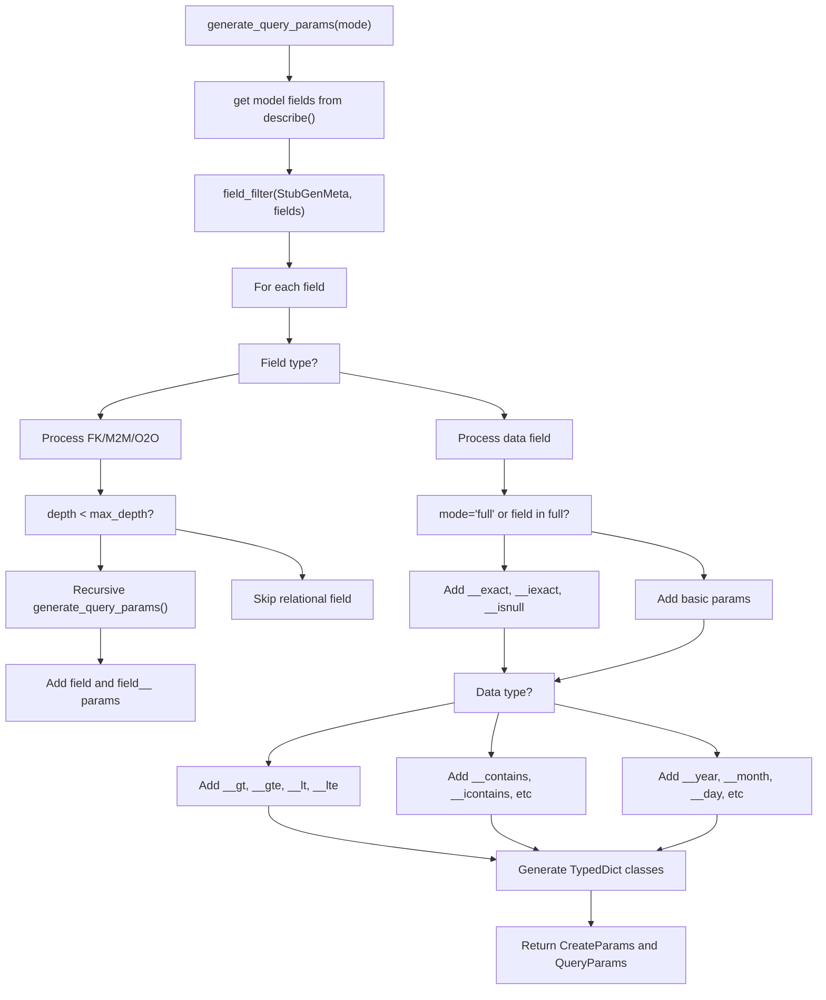

# BaseModel Extensions

> **Relevant source files**
> * [fastapp/db/backends/mixin.py](/fastapp/db/backends/mixin.py)
> * [fastapp/db/utils.py](/fastapp/db/utils.py)
> * [fastapp/models/base.py](/fastapp/models/base.py)
> * [fastapp/models/info.py](/fastapp/models/info.py)
> * [fastapp/models/manager.py](/fastapp/models/manager.py)
> * [fastapp/models/queryset.py](/fastapp/models/queryset.py)

The BaseModel Extensions system provides enhanced database model functionality built on top of Tortoise ORM. This system includes custom QuerySet implementations, Manager classes, schema generation utilities, and TimescaleDB integration. It serves as the foundation for the data layer in QingKongFramework, providing Django-like ORM patterns with async capabilities.

For dynamic query filtering with Pydantic validation, see [FilterSet System](FilterSet-System.md). For Tortoise ORM to Pydantic model conversion, see [ModelSerializer System](ModelSerializer-System.md). For custom database functions and indexing, see [Database Functions and Indexing](Database-Functions-and-Indexing.md).

## BaseModel Architecture

The `BaseModel` class extends Tortoise ORM's `Model` with enhanced metadata handling, custom QuerySet/Manager integration, and automatic application configuration.

### BaseModel Class Hierarchy

Sources: [fastapp/models/base.py L20-L297](/fastapp/models/base.py#L20-L297)

 [fastapp/models/info.py L12-L39](/fastapp/models/info.py#L12-L39)

### BaseModel Metaclass Processing

Sources: [fastapp/models/base.py L29-L66](/fastapp/models/base.py#L29-L66)

## QuerySet Enhancements

The custom `QuerySet` class extends Tortoise ORM's QuerySet with additional functionality including deferred field loading, named tuple results, and enhanced select_related support.

### QuerySet Feature Overview

| Feature | Method | Description |
| --- | --- | --- |
| Deferred Fields | `defer(*fields)` | Exclude specified fields from SELECT |
| Named Tuples | `values_list(named=True)` | Return named tuples instead of regular tuples |
| Database Selection | `using(db_name)` | Use specific database connection |
| Enhanced Join | `_join_table_with_select_related()` | Support deferred fields in joins |

### QuerySet Method Flow

Sources: [fastapp/models/queryset.py L88-L224](/fastapp/models/queryset.py#L88-L224)

## Manager System

The `Manager` class provides the query interface for models, extending Tortoise ORM's Manager with enhanced QuerySet integration and factory methods.

### Manager Class Structure

Sources: [fastapp/models/manager.py L19-L59](/fastapp/models/manager.py#L19-L59)

## Schema Generation and Database Utilities

The schema generation system provides enhanced database schema creation with application filtering, TimescaleDB support, and guided migration capabilities.

### Schema Generation Process

Sources: [fastapp/db/utils.py L241-L272](/fastapp/db/utils.py#L241-L272)

 [fastapp/db/utils.py L108-L177](/fastapp/db/utils.py#L108-L177)

## TimescaleDB Integration

The system provides native support for TimescaleDB hypertables through the `hypertable` Meta attribute and automatic SQL generation.

### Hypertable Configuration

Sources: [fastapp/db/utils.py L34-L106](/fastapp/db/utils.py#L34-L106)

### Hypertable SQL Generation Example

The `generate_hypertable_sql()` function creates complex PostgreSQL/TimescaleDB SQL:

| Configuration Key | Purpose | Required |
| --- | --- | --- |
| `time_column_name` | Primary time dimension | Yes |
| `partitioning_column` | Space partitioning field | No |
| `number_partitions` | Number of space partitions | No |
| `chunk_time_interval` | Time chunk size | No (default: '7 days') |
| `compress_segmentby` | Compression segment field | No |
| `compression_policy` | Auto-compression policy | No |

Sources: [fastapp/db/utils.py L34-L106](/fastapp/db/utils.py#L34-L106)

## Type Generation and Stub Support

The BaseModel system includes automatic type hint generation for query parameters and model creation parameters through the `generate_query_params()` method and `StubGenMeta` configuration.

### Query Parameter Generation

Sources: [fastapp/models/base.py L96-L243](/fastapp/models/base.py#L96-L243)

 [fastapp/models/base.py L272-L294](/fastapp/models/base.py#L272-L294)

### StubGenMeta Configuration

The `StubGenMeta` class controls which fields are included in generated type stubs:

| Attribute | Type | Purpose |
| --- | --- | --- |
| `include` | `str` or `tuple` | Fields to include (`"__all__"` or specific fields) |
| `exclude` | `tuple` | Fields to exclude from generation |
| `full` | `tuple` | Fields to generate full query params for |

Sources: [fastapp/models/base.py L303-L307](/fastapp/models/base.py#L303-L307)