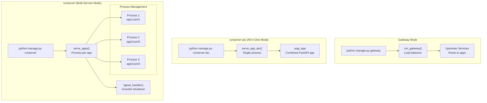
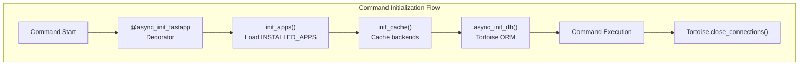
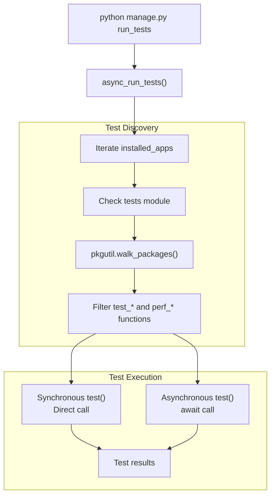
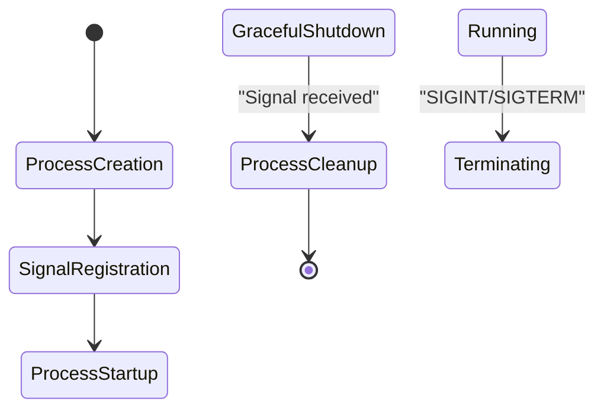

# Command Line Interface

> **Relevant source files**
> * [fastapp/commands/__init__.py](/fastapp/commands/__init__.py)
> * [fastapp/commands/decorators.py](/fastapp/commands/decorators.py)
> * [fastapp/commands/server.py](/fastapp/commands/server.py)
> * [fastapp/commands/tests.py](/fastapp/commands/tests.py)
> * [fastapp/misc/serve.py](/fastapp/misc/serve.py)
> * [fastapp/serve/aio.py](/fastapp/serve/aio.py)
> * [manage.py](/manage.py)

The QingKongFramework provides a comprehensive command-line interface (CLI) through the `manage.py` script that enables development, server management, database operations, and deployment workflows. The CLI system is modeled after Django's management commands but adapted for async FastAPI applications and multi-service architectures.

For information about database-specific CLI operations like migrations and schema management, see [Database Commands](Database-Commands.md). For server deployment and configuration details, see [Server Commands](Server-Commands.md).

## CLI Architecture

The CLI system is built around a central `Group` class that registers and organizes commands into functional categories. Commands are implemented as Click-based functions with decorators for framework initialization.

### Command Registration System

```mermaid
flowchart TD

manage["manage.py<br>Main Entry Point"]
cli_group["cli Group<br>Central Command Registry"]
runserver["runserver<br>Multi-service mode"]
runserver_aio["runserver-aio<br>Single process mode"]
gateway["gateway<br>API Gateway"]
serve_static["serve_static<br>Static file server"]
migrate["migrate<br>Apply migrations"]
auto_migrate["auto_migrate<br>Detect & apply diffs"]
reverse_gen["reverse_generation<br>Generate models from DB"]
startapp["startapp<br>Create app structure"]
loaddata["loaddata<br>Load fixture data"]
createsuperuser["createsuperuser<br>Create admin user"]
stubgen["stubgen<br>Generate type stubs"]
shell["shell<br>Interactive shell"]
run_tests["run_tests<br>Execute test cases"]
about["about<br>Framework info"]
check["check<br>Health checks"]

manage --> cli_group
cli_group --> runserver
cli_group --> runserver_aio
cli_group --> gateway
cli_group --> serve_static
cli_group --> migrate
cli_group --> auto_migrate
cli_group --> reverse_gen
cli_group --> startapp
cli_group --> loaddata
cli_group --> createsuperuser
cli_group --> stubgen
cli_group --> shell
cli_group --> run_tests
cli_group --> about
cli_group --> check

subgraph subGraph3 ["Testing & Utilities"]
    run_tests
    about
    check
end

subgraph subGraph2 ["Development Commands"]
    startapp
    loaddata
    createsuperuser
    stubgen
    shell
end

subgraph subGraph1 ["Database Commands"]
    migrate
    auto_migrate
    reverse_gen
end

subgraph subGraph0 ["Server Commands"]
    runserver
    runserver_aio
    gateway
    serve_static
end
```



**Sources:** [manage.py L1-L10](/manage.py#L1-L10)

 [fastapp/commands/__init__.py L1-L15](/fastapp/commands/__init__.py#L1-L15)

## Server Deployment Modes

The CLI provides multiple server deployment modes to support different development and production scenarios.

### Multi-Service vs Single Process Architecture



**Sources:** [fastapp/commands/server.py L15-L21](/fastapp/commands/server.py#L15-L21)

 [fastapp/misc/serve.py L80-L123](/fastapp/misc/serve.py#L80-L123)

 [fastapp/serve/aio.py L15-L36](/fastapp/serve/aio.py#L15-L36)

## Command Categories and Usage

### Server Management Commands

| Command | Purpose | Key Parameters | Implementation |
| --- | --- | --- | --- |
| `runserver` | Launch multi-service mode | `--host`, `--workers`, `--reload`, `--exclude` | [fastapp/commands/server.py L15-L21](/fastapp/commands/server.py#L15-L21) |
| `runserver-aio` | Launch single process mode | `--host`, `--port`, `--workers`, `--reload` | [fastapp/commands/server.py L27-L29](/fastapp/commands/server.py#L27-L29) |
| `gateway` | Start API gateway | `--upstream`, `--default-upstream`, `--debug` | [fastapp/commands/server.py L40-L42](/fastapp/commands/server.py#L40-L42) |
| `serve_static` | Serve static files | `--root`, `--api-prefix`, `--api-target` | [fastapp/commands/server.py L50-L52](/fastapp/commands/server.py#L50-L52) |

**Sources:** [fastapp/commands/server.py L1-L53](/fastapp/commands/server.py#L1-L53)

### Development Workflow Commands

The framework provides commands that support the complete application development lifecycle:

```mermaid
sequenceDiagram
  participant Developer
  participant manage.py CLI
  participant init_apps()
  participant Database
  participant uvicorn Server

  Developer->>manage.py CLI: "python manage.py startapp myapp"
  manage.py CLI->>init_apps(): "Create app structure"
  init_apps()-->>manage.py CLI: "App scaffolded"
  Developer->>manage.py CLI: "python manage.py migrate"
  manage.py CLI->>Database: "Apply schema changes"
  Database-->>manage.py CLI: "Migrations applied"
  Developer->>manage.py CLI: "python manage.py loaddata fixtures.json"
  manage.py CLI->>Database: "Load test data"
  Database-->>manage.py CLI: "Data loaded"
  Developer->>manage.py CLI: "python manage.py runserver --reload"
  manage.py CLI->>uvicorn Server: "Start with hot reload"
  uvicorn Server-->>manage.py CLI: "Server running"
  Developer->>manage.py CLI: "python manage.py run_tests --apps myapp"
  manage.py CLI->>init_apps(): "Execute test cases"
  init_apps()-->>manage.py CLI: "Tests completed"
```

**Sources:** [fastapp/commands/tests.py L11-L54](/fastapp/commands/tests.py#L11-L54)

 [fastapp/commands/decorators.py L10-L24](/fastapp/commands/decorators.py#L10-L24)

### Async Framework Integration

The CLI system uses the `async_init_fastapp` decorator to properly initialize the async framework components before command execution:



**Sources:** [fastapp/commands/decorators.py L10-L24](/fastapp/commands/decorators.py#L10-L24)

### Test Execution System

The testing framework provides flexible test discovery and execution:



**Sources:** [fastapp/commands/tests.py L11-L54](/fastapp/commands/tests.py#L11-L54)

## Process Management and Lifecycle

### Multi-Process Server Architecture

The `runserver` command manages multiple processes for different applications, each running on its own port:



**Sources:** [fastapp/misc/serve.py L65-L123](/fastapp/misc/serve.py#L65-L123)

### Application Port Management

The system enforces unique port allocation and validates configuration:

| Feature | Implementation | Location |
| --- | --- | --- |
| Port conflict detection | `Counter()` validation | [fastapp/misc/serve.py L94-L97](/fastapp/misc/serve.py#L94-L97) |
| App filtering | `NO_EXPORT_APPS` setting | [fastapp/misc/serve.py L88](/fastapp/misc/serve.py#L88-L88) |
| URL requirement | `has_module("urls")` check | [fastapp/misc/serve.py L87](/fastapp/misc/serve.py#L87-L87) |
| Reload directories | Dynamic path discovery | [fastapp/misc/serve.py L54-L58](/fastapp/misc/serve.py#L54-L58) |

**Sources:** [fastapp/misc/serve.py L80-L123](/fastapp/misc/serve.py#L80-L123)