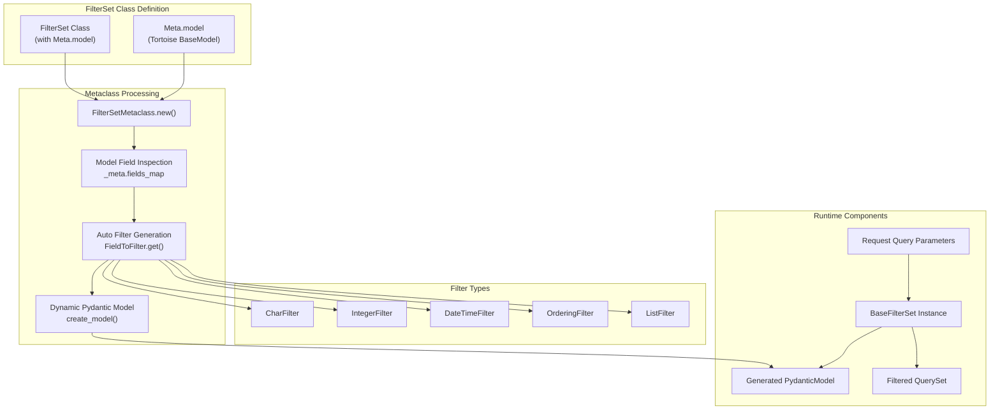
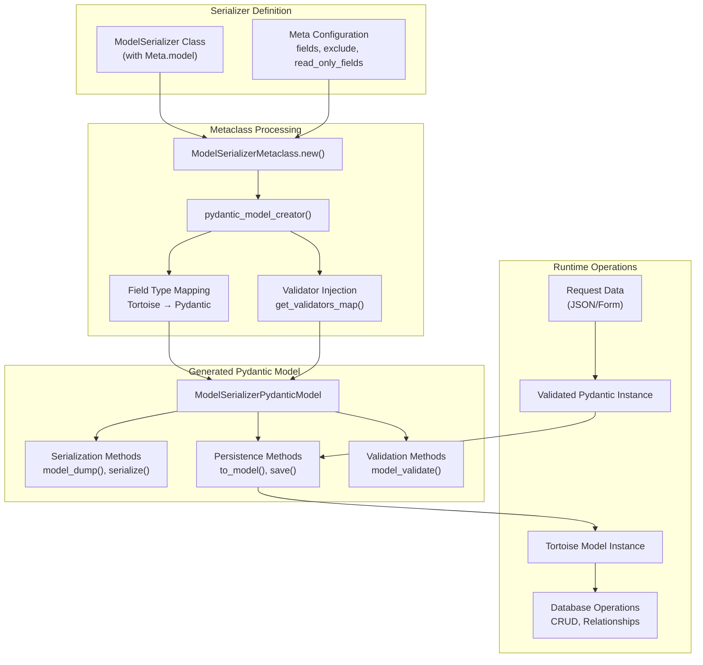
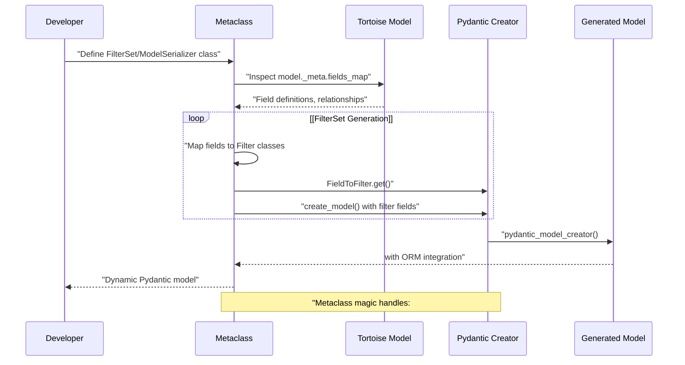
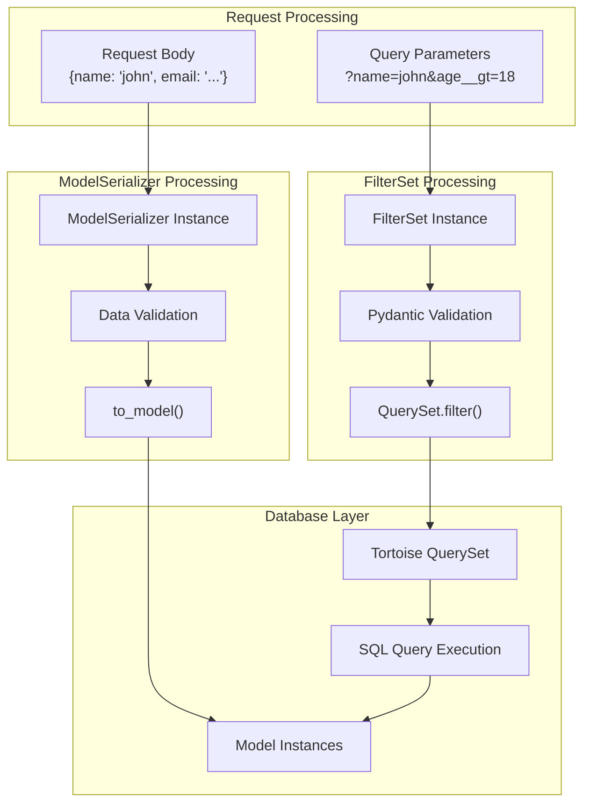

# Core Data Layer

> **Relevant source files**
> * [fastapp/filters/filters.py](/fastapp/filters/filters.py)
> * [fastapp/filters/filterset.py](/fastapp/filters/filterset.py)
> * [fastapp/serializers/creator.py](/fastapp/serializers/creator.py)
> * [fastapp/serializers/fields/__init__.py](/fastapp/serializers/fields/__init__.py)
> * [fastapp/serializers/model.py](/fastapp/serializers/model.py)

The Core Data Layer provides the foundational components for Django-like ORM integration in QingKongFramework, enabling dynamic query filtering and seamless data serialization between Tortoise ORM models and Pydantic schemas. This system consists of two primary components: the FilterSet system for query parameter validation and filtering, and the ModelSerializer system for ORM-to-Pydantic model conversion.

For API development patterns using these components, see [API Development](API-Development.md). For database schema management and migrations, see [Database Management](Database-Management.md).

## FilterSet System Architecture

The FilterSet system provides automatic query parameter validation and database filtering through dynamic Pydantic model generation. The `FilterSetMetaclass` analyzes Tortoise model definitions and automatically creates corresponding filter fields with appropriate lookup expressions.



The `FilterSetMetaclass` performs several key operations during class creation:

| Operation | Purpose | Code Location |
| --- | --- | --- |
| Model Field Analysis | Extracts field definitions from Tortoise model | [fastapp/filters/filterset.py L98-L109](/fastapp/filters/filterset.py#L98-L109) |
| Filter Field Mapping | Maps Tortoise fields to appropriate Filter classes | [fastapp/filters/filterset.py L111-L166](/fastapp/filters/filterset.py#L111-L166) |
| Lookup Expression Processing | Generates filters for different lookup types (exact, contains, etc.) | [fastapp/filters/filterset.py L141-L166](/fastapp/filters/filterset.py#L141-L166) |
| Pydantic Model Creation | Creates validation model with optional fields | [fastapp/filters/filterset.py L203-L211](/fastapp/filters/filterset.py#L203-L211) |

**Sources:** [fastapp/filters/filterset.py L58-L212](/fastapp/filters/filterset.py#L58-L212)

 [fastapp/filters/filters.py L67-L96](/fastapp/filters/filters.py#L67-L96)

## ModelSerializer System Architecture

The ModelSerializer system bridges Tortoise ORM models and Pydantic schemas, providing automatic serialization, validation, and database persistence. The `ModelSerializerMetaclass` uses the `pydantic_model_creator` function to generate Pydantic models with ORM integration capabilities.



The `ModelSerializerPydanticModel` extends the base Pydantic model with ORM-specific functionality:

| Method | Purpose | Key Features |
| --- | --- | --- |
| `to_model()` | Convert to Tortoise model instance | Handles nested relationships, partial updates |
| `save()` | Persist to database | Transaction support, M2M field handling |
| `from_tortoise_orm()` | Create from ORM instance | Automatic relation prefetching |
| `from_queryset()` | Bulk creation from QuerySet | Optimized batch processing |

**Sources:** [fastapp/serializers/model.py L79-L517](/fastapp/serializers/model.py#L79-L517)

 [fastapp/serializers/creator.py L69-L545](/fastapp/serializers/creator.py#L69-L545)

## Dynamic Model Generation Process

The core innovation of the data layer lies in the metaclass-driven dynamic model generation. Both FilterSet and ModelSerializer systems use metaclasses to introspect Tortoise models and automatically generate corresponding Pydantic schemas.



### Field Type Mapping

The system maintains mappings between Tortoise field types and their corresponding Filter or Serializer field types:

```css
# FilterSet field mapping (fastapp/filters/filterset.py:33-47)
FieldToFilter._dict = {
    PositiveIntegerField: filters.IntegerFilter,
    DecimalField: filters.DecimalFilter,
    JSONField: filters.JSONFilter,
    # ... other mappings
}
```

### Lookup Expression Handling

FilterSets support Django-style lookup expressions through the `LookupExprEnum`:

| Lookup Expression | Purpose | Example Usage |
| --- | --- | --- |
| `exact` | Exact match (default) | `?name=john` |
| `contains` | String contains | `?name__contains=jo` |
| `in_` | Value in list | `?id__in=1,2,3` |
| `gt`/`lt` | Numeric comparisons | `?age__gt=18` |
| `startswith` | String prefix | `?name__startswith=jo` |

**Sources:** [fastapp/filters/filters.py L26-L64](/fastapp/filters/filters.py#L26-L64)

 [fastapp/filters/filterset.py L141-L175](/fastapp/filters/filterset.py#L141-L175)

## Integration and Data Flow

The FilterSet and ModelSerializer systems work together to provide a complete data layer solution. ViewSets use FilterSets to process query parameters and ModelSerializers to handle request/response data.



### Key Integration Points

1. **Query Parameter Processing**: FilterSets validate and convert query parameters into QuerySet filters
2. **Data Serialization**: ModelSerializers handle bidirectional conversion between JSON and ORM models
3. **Relationship Handling**: Both systems support nested relationships and foreign key processing
4. **Validation Pipeline**: Pydantic validation occurs before database operations

**Sources:** [fastapp/filters/filterset.py L260-L304](/fastapp/filters/filterset.py#L260-L304)

 [fastapp/serializers/model.py L221-L264](/fastapp/serializers/model.py#L221-L264)

 [fastapp/serializers/fields/__init__.py L180-L221](/fastapp/serializers/fields/__init__.py#L180-L221)