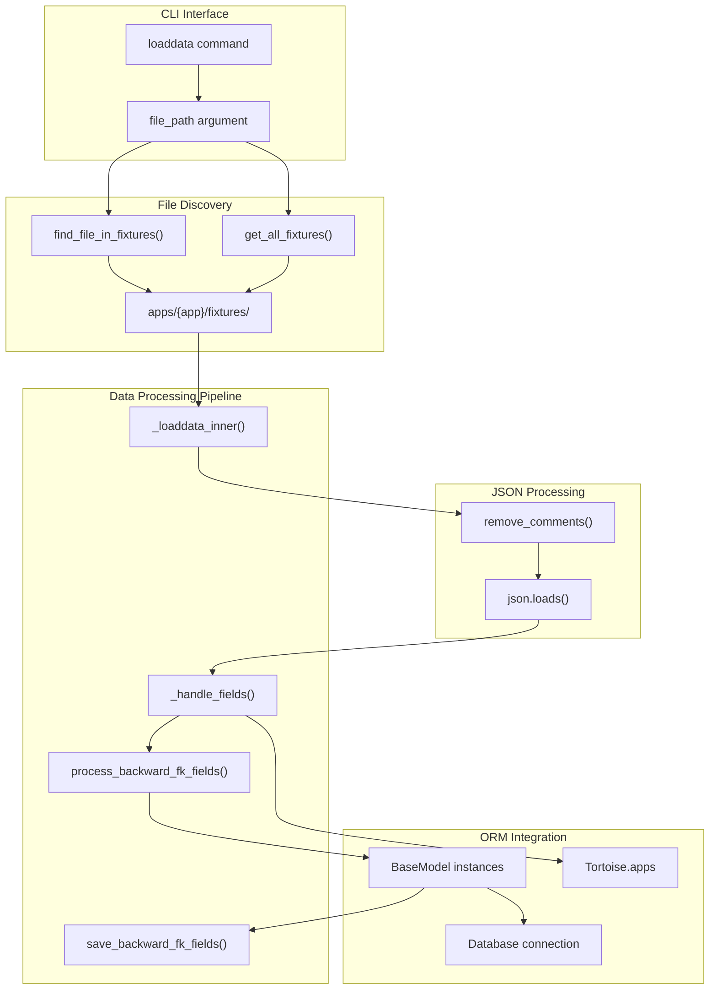
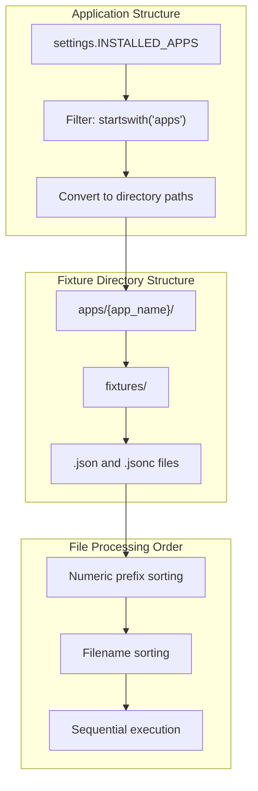
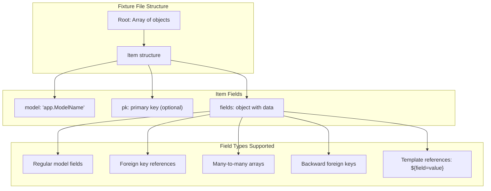
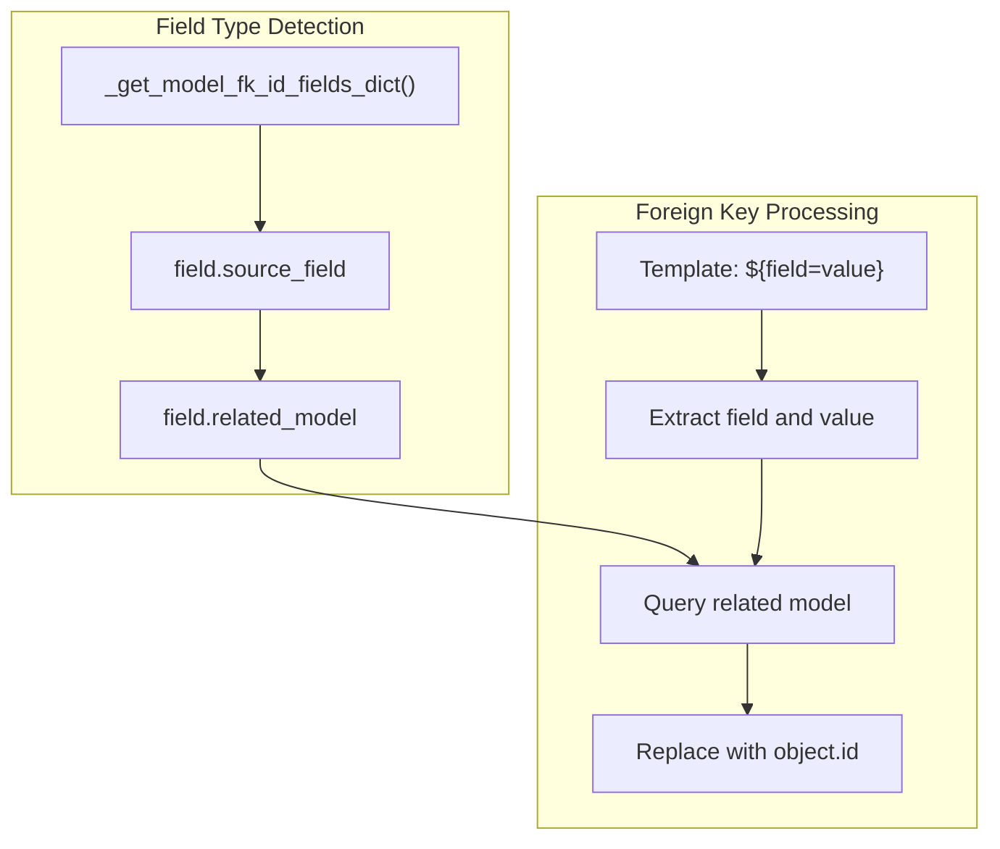
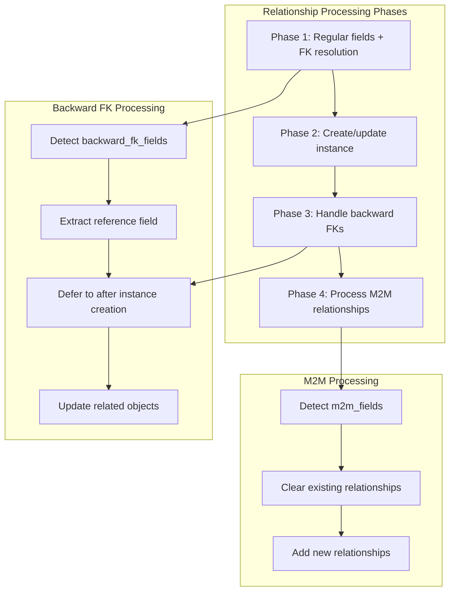
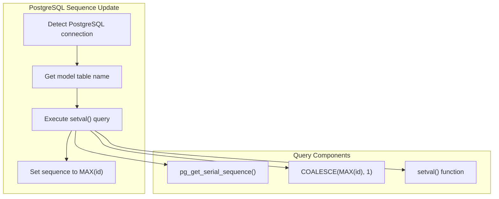
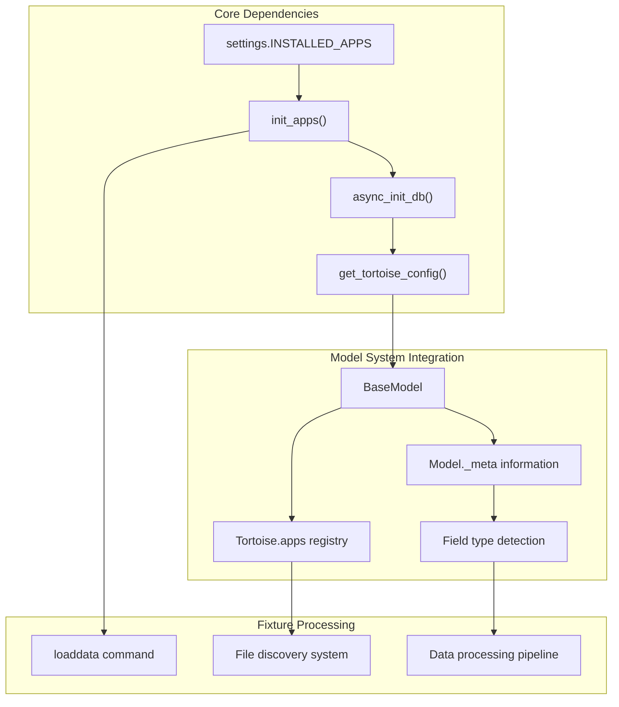

# Data Loading and Fixtures

> **Relevant source files**
> * [fastapp/commands/load_data.py](/fastapp/commands/load_data.py)
> * [fastapp/commands/user.py](/fastapp/commands/user.py)
> * [fastapp/misc/gateway.py](/fastapp/misc/gateway.py)
> * [fastapp/misc/serve_static.py](/fastapp/misc/serve_static.py)
> * [fastapp/utils/json.py](/fastapp/utils/json.py)
> * [pyproject.toml](/pyproject.toml)
> * [setup-pure.py](/setup-pure.py)

## Purpose and Scope

This document covers QingKongFramework's data loading and fixture system, which provides Django-like functionality for populating databases with initial or test data. The system supports JSON and JSONC (JSON with comments) fixture files and handles complex relationships including foreign keys, many-to-many fields, and reverse foreign key associations.

For database migration and schema management, see [Database Migrations and Schema](Database-Migrations-and-Schema.md). For CLI command overview, see [Command Line Interface](Command-Line-Interface.md).

## Fixture System Overview

QingKongFramework's fixture system is built around the `loaddata` command, which discovers and loads JSON fixture files from application directories. The system integrates with the BaseModel extensions and Tortoise ORM to handle complex data relationships automatically.

### Fixture Loading Architecture

Sources: [fastapp/commands/load_data.py L1-L225](/fastapp/commands/load_data.py#L1-L225)

 [fastapp/utils/json.py L8-L40](/fastapp/utils/json.py#L8-L40)

## The loaddata Command

The `loaddata` command provides the primary interface for loading fixture data. It supports both individual file loading and batch processing of all fixtures in an application.

### Command Interface and Discovery

| Parameter | Type | Description |
| --- | --- | --- |
| `file_path` | STRING | Path to fixture file or "all" for batch loading |

The command performs automatic file discovery in application fixture directories:

```mermaid
flowchart TD

all_option["file_path == 'all'"]
get_all_fixtures_call["get_all_fixtures()"]
sort_by_prefix["Sort by numeric prefix"]
input_path["Input: file_path"]
check_exists["Check if file exists"]
search_apps["Search in INSTALLED_APPS"]
apps_filter["Filter apps starting with 'apps'"]
fixtures_search["Search in fixtures/ subdirs"]
found_file["Return found file path"]

subgraph subGraph1 ["Batch Processing"]
    all_option
    get_all_fixtures_call
    sort_by_prefix
    all_option --> get_all_fixtures_call
    get_all_fixtures_call --> sort_by_prefix
end

subgraph subGraph0 ["File Discovery Logic"]
    input_path
    check_exists
    search_apps
    apps_filter
    fixtures_search
    found_file
    input_path --> check_exists
    check_exists --> search_apps
    search_apps --> apps_filter
    apps_filter --> fixtures_search
    fixtures_search --> found_file
    check_exists --> found_file
end
```

Sources: [fastapp/commands/load_data.py L122-L136](/fastapp/commands/load_data.py#L122-L136)

 [fastapp/commands/load_data.py L199-L217](/fastapp/commands/load_data.py#L199-L217)

### Application Integration

The system integrates with the application discovery mechanism by searching through `INSTALLED_APPS` that start with "apps":

Sources: [fastapp/commands/load_data.py L123-L128](/fastapp/commands/load_data.py#L123-L128)

 [fastapp/commands/load_data.py L200-L212](/fastapp/commands/load_data.py#L200-L212)

## Fixture File Format and Structure

Fixtures use JSON or JSONC (JSON with comments) format and follow a specific structure for defining model instances and their relationships.

### JSON Structure and Comment Support

The system supports JSONC format through the `remove_comments` utility, which strips both line comments (`//`) and block comments (`/* */`):

| Comment Type | Syntax | Processing |
| --- | --- | --- |
| Line comments | `// comment` | Removed from end of line |
| Block comments | `/* comment */` | Removed across multiple lines |

### Fixture Data Format

Sources: [fastapp/commands/load_data.py L137-L143](/fastapp/commands/load_data.py#L137-L143)

 [fastapp/utils/json.py L8-L40](/fastapp/utils/json.py#L8-L40)

## Data Processing and Relationships

The fixture system handles complex ORM relationships through a multi-stage processing pipeline that resolves foreign keys, processes many-to-many relationships, and handles reverse associations.

### Foreign Key Resolution

The system supports template-based foreign key resolution using the syntax `${field=value}`:

Sources: [fastapp/commands/load_data.py L60-L78](/fastapp/commands/load_data.py#L60-L78)

 [fastapp/commands/load_data.py L76-L77](/fastapp/commands/load_data.py#L76-L77)

### Many-to-Many and Backward Relationships

The system processes complex relationships in multiple phases to handle dependencies correctly:

Sources: [fastapp/commands/load_data.py L83-L102](/fastapp/commands/load_data.py#L83-L102)

 [fastapp/commands/load_data.py L105-L119](/fastapp/commands/load_data.py#L105-L119)

 [fastapp/commands/load_data.py L173-L184](/fastapp/commands/load_data.py#L173-L184)

### Instance Creation and Update Logic

The system handles different scenarios for instance creation based on primary key presence and existence:

| Scenario | Primary Key | Exists in DB | Action |
| --- | --- | --- | --- |
| New without PK | `None` | N/A | Create new instance |
| Update existing | Present | Yes | Update existing instance |
| Create with PK | Present | No | Create with specified PK |

Sources: [fastapp/commands/load_data.py L150-L170](/fastapp/commands/load_data.py#L150-L170)

## Database-Specific Features

The fixture loading system includes database-specific optimizations and features, particularly for PostgreSQL.

### PostgreSQL Sequence Management

For PostgreSQL databases, the system automatically updates sequence values after loading data to prevent primary key conflicts:

Sources: [fastapp/commands/load_data.py L186-L193](/fastapp/commands/load_data.py#L186-L193)

## Integration with Framework Architecture

The fixture system integrates deeply with QingKongFramework's core components, leveraging the application discovery, database initialization, and model systems.

### System Dependencies

Sources: [fastapp/commands/load_data.py L8-L14](/fastapp/commands/load_data.py#L8-L14)

 [fastapp/commands/load_data.py L196-L197](/fastapp/commands/load_data.py#L196-L197)