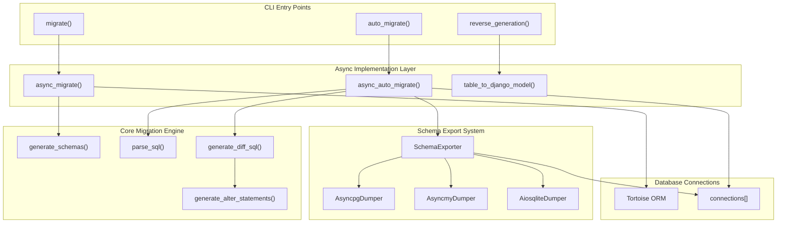
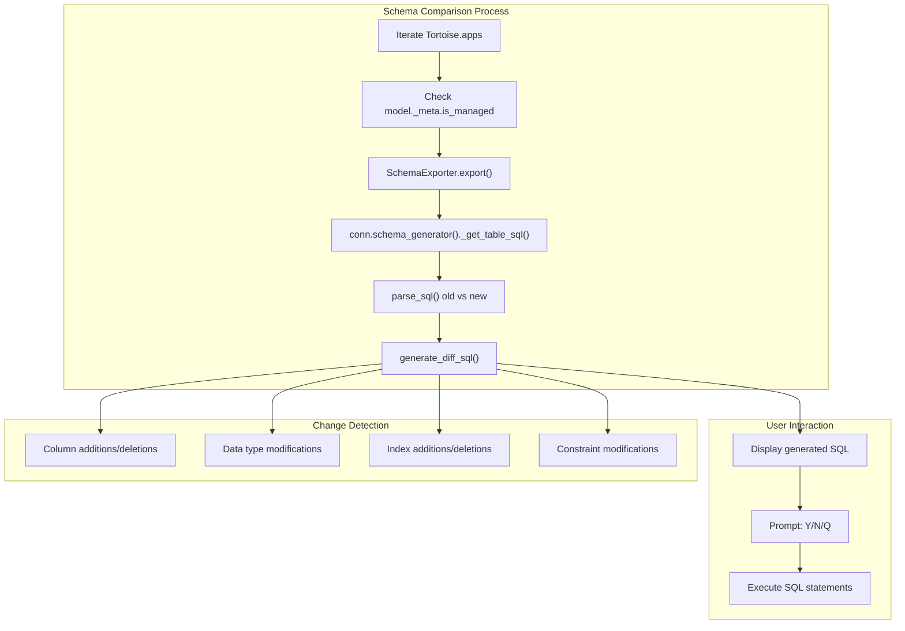
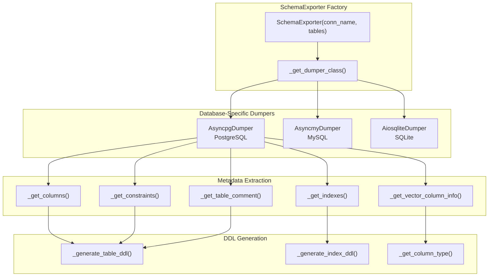
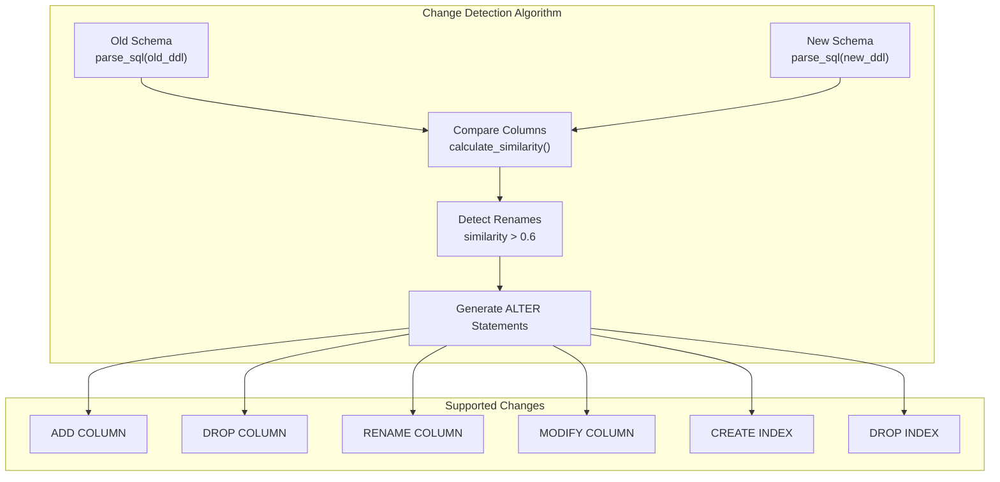

# Database Commands

> **Relevant source files**
> * [fastapp/commands/db.py](/fastapp/commands/db.py)
> * [fastapp/db/migrate.py](/fastapp/db/migrate.py)
> * [fastapp/tools/get_table_structure.py](/fastapp/tools/get_table_structure.py)

This document covers the command-line interface tools for database operations in QingKongFramework. These CLI commands provide database migration, schema generation, and reverse engineering capabilities through the `manage.py` interface.

For information about the underlying database migration system and schema management implementation, see [Database Migrations and Schema](Database-Migrations-and-Schema.md).

## Overview

The database commands module provides three primary CLI tools for database management:

* **migrate** - Execute database migrations with support for safe and guided operations
* **auto_migrate** - Automatically detect schema changes and generate migration scripts
* **reverse_generation** - Generate Django model definitions from existing database tables

These commands integrate with QingKongFramework's application system and support PostgreSQL, MySQL, and SQLite databases through the Tortoise ORM backend.

## Command Architecture



**Sources:** [fastapp/commands/db.py L1-L299](/fastapp/commands/db.py#L1-L299)

 [fastapp/db/migrate.py L1-L379](/fastapp/db/migrate.py#L1-L379)

 [fastapp/tools/get_table_structure.py L1-L295](/fastapp/tools/get_table_structure.py#L1-L295)

## Migration Commands

### migrate Command

The `migrate` command executes database schema migrations with support for application-specific and model-specific targeting.

| Option | Type | Default | Description |
| --- | --- | --- | --- |
| `--safe` | boolean | `True` | Enable safe migration mode |
| `--guided` | boolean | `True` | Enable interactive guided migration |
| `--apps` | multiple | `[]` | Target specific applications |
| `--models` | multiple | `[]` | Target specific models |

```markdown
# Basic migration
python manage.py migrate

# Migration with specific options
python manage.py migrate --safe=False --guided=False

# Target specific apps and models
python manage.py migrate --apps myapp --models MyModel
```

#### Migration Process Flow

```mermaid
sequenceDiagram
  participant migrate CLI
  participant async_migrate()
  participant init_apps()
  participant async_init_db()
  participant generate_schemas()
  participant ContentType Model
  participant Permission Model

  migrate CLI->>async_migrate(): "safe, guided, apps, models"
  async_migrate()->>async_migrate(): "Validate app dependencies"
  async_migrate()->>init_apps(): "settings.INSTALLED_APPS"
  async_migrate()->>async_init_db(): "get_tortoise_config()"
  async_migrate()->>generate_schemas(): "Tortoise, safe, guided, apps, models"
  loop ["Content types enabled"]
    async_migrate()->>ContentType Model: "get_or_create() for each model"
    async_migrate()->>Permission Model: "create default permissions"
  end
  async_migrate()->>async_migrate(): "Close database connections"
```

**Sources:** [fastapp/commands/db.py L37-L124](/fastapp/commands/db.py#L37-L124)

 [fastapp/commands/db.py L126-L144](/fastapp/commands/db.py#L126-L144)

### auto_migrate Command

The `auto_migrate` command automatically detects schema differences and generates migration SQL by comparing current database structure with model definitions.

| Option | Type | Default | Description |
| --- | --- | --- | --- |
| `--apps` | multiple | `[]` | Target specific applications |
| `--guided` | boolean | `True` | Enable interactive SQL execution |

```markdown
# Auto-migrate all apps
python manage.py auto_migrate

# Auto-migrate specific apps
python manage.py auto_migrate --apps myapp --apps anotherapp

# Non-interactive mode
python manage.py auto_migrate --guided=False
```

#### Auto-Migration Algorithm



**Sources:** [fastapp/commands/db.py L188-L285](/fastapp/commands/db.py#L188-L285)

 [fastapp/commands/db.py L287-L298](/fastapp/commands/db.py#L287-L298)

## Schema Generation and Reverse Engineering

### reverse_generation Command

The `reverse_generation` command generates Django model definitions from existing database tables.

| Argument | Type | Description |
| --- | --- | --- |
| `table` | string | Target table name |

| Option | Type | Default | Description |
| --- | --- | --- | --- |
| `--connection` | string | `"default"` | Database connection name |
| `--db` | string | `None` | Override database name |

```python
# Generate model from table
python manage.py reverse_generation users

# Use specific connection and database
python manage.py reverse_generation products --connection=secondary --db=inventory
```

#### Table Structure Export System



**Sources:** [fastapp/commands/db.py L159-L185](/fastapp/commands/db.py#L159-L185)

 [fastapp/tools/get_table_structure.py L240-L274](/fastapp/tools/get_table_structure.py#L240-L274)

## Schema Parsing and Diff Generation

### SQL Schema Parsing

The migration system uses `sqlglot` for parsing SQL schemas and detecting differences between database states.

#### Schema Parsing Process

| Component | Purpose | Key Operations |
| --- | --- | --- |
| `parse_sql()` | Parse SQL DDL statements | Extract tables, columns, indexes, constraints |
| `generate_diff_sql()` | Compare schema versions | Detect additions, deletions, modifications |
| `generate_alter_statements()` | Create migration SQL | Generate ALTER TABLE statements |

#### Column Change Detection



**Sources:** [fastapp/db/migrate.py L61-L210](/fastapp/db/migrate.py#L61-L210)

 [fastapp/db/migrate.py L217-L346](/fastapp/db/migrate.py#L217-L346)

 [fastapp/db/migrate.py L349-L366](/fastapp/db/migrate.py#L349-L366)

## Database Support Matrix

| Feature | PostgreSQL | MySQL | SQLite |
| --- | --- | --- | --- |
| Schema Export | ✓ | ✓ | ✓ |
| Migration Detection | ✓ | ✓ | ✓ |
| Reverse Generation | ✓ | ✓ | ✓ |
| Vector Columns | ✓ | ✗ | ✗ |
| Expression Indexes | ✓ | Limited | ✗ |
| Column Rename Detection | ✓ | ✓ | ✓ |

### Database-Specific Implementation

The framework automatically detects the database backend and uses appropriate SQL dialects and schema export mechanisms:

* **PostgreSQL**: Uses `information_schema` queries for metadata extraction
* **MySQL**: Uses `SHOW CREATE TABLE` and `SHOW INDEX` statements
* **SQLite**: Uses `sqlite_master` table queries

**Sources:** [fastapp/tools/get_table_structure.py L18-L179](/fastapp/tools/get_table_structure.py#L18-L179)

 [fastapp/tools/get_table_structure.py L181-L213](/fastapp/tools/get_table_structure.py#L181-L213)

 [fastapp/tools/get_table_structure.py L215-L238](/fastapp/tools/get_table_structure.py#L215-L238)