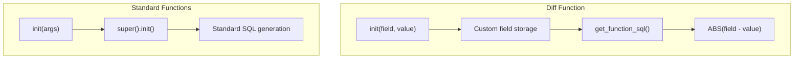
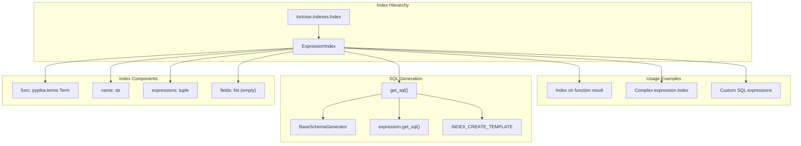

# Database Functions and Indexing

> **Relevant source files**
> * [fastapp/db/functions/__init__.py](/fastapp/db/functions/__init__.py)
> * [fastapp/db/functions/json.py](/fastapp/db/functions/json.py)
> * [fastapp/db/functions/number.py](/fastapp/db/functions/number.py)
> * [fastapp/db/functions/string.py](/fastapp/db/functions/string.py)
> * [fastapp/db/index.py](/fastapp/db/index.py)
> * [fastapp/models/__init__.py](/fastapp/models/__init__.py)
> * [fastapp/models/functions.py](/fastapp/models/functions.py)

This document covers QingKongFramework's custom database functions and advanced indexing capabilities. The framework extends Tortoise ORM with additional database functions for JSON manipulation, string operations, and numerical computations, as well as support for expression-based indexes.

For basic model definitions and ORM extensions, see [BaseModel Extensions](BaseModel-Extensions.md). For database schema management and migrations, see [Database Migrations and Schema](Database-Migrations-and-Schema.md).

## Overview

QingKongFramework provides two main database enhancement systems:

* **Custom Database Functions**: Extended function library for JSON, string, and number operations beyond Tortoise ORM's built-in functions
* **Expression Indexing**: Advanced indexing capabilities that support complex expressions and functions in database indexes

## Custom Database Functions Architecture

The framework implements a two-layer architecture for database functions, separating low-level pypika implementations from high-level Tortoise ORM integration.

```mermaid
flowchart TD

TortoiseFunction["tortoise.expressions.Function"]
ModelFunctions["fastapp.models.functions"]
JsonUnquoteTortoise["JsonUnquote(Function)"]
JsonExtractTortoise["JsonExtract(Function)"]
RightTortoise["Right(Function)"]
InstrTortoise["Instr(Function)"]
AbsTortoise["Abs(Function)"]
DiffTortoise["Diff(Function)"]
PyPikaFunction["pypika.terms.Function"]
DbFunctions["fastapp.db.functions"]
JsonModule["json.py"]
StringModule["string.py"]
NumberModule["number.py"]
JsonUnquotePyPika["JsonUnquote(Function)"]
JsonExtractPyPika["JsonExtract(Function)"]
RightPyPika["Right(Function)"]
InstrPyPika["Instr(Function)"]
AbsPyPika["Abs(Function)"]
DiffPyPika["Diff(Function)"]
BaseModel["BaseModel"]
QuerySet["QuerySet"]
Expressions["F() expressions"]

JsonUnquoteTortoise --> JsonUnquotePyPika
JsonExtractTortoise --> JsonExtractPyPika
RightTortoise --> RightPyPika
InstrTortoise --> InstrPyPika
AbsTortoise --> AbsPyPika
DiffTortoise --> DiffPyPika
Expressions --> JsonUnquoteTortoise
Expressions --> JsonExtractTortoise
Expressions --> RightTortoise
Expressions --> InstrTortoise
Expressions --> AbsTortoise
Expressions --> DiffTortoise

subgraph subGraph2 ["Model Usage"]
    BaseModel
    QuerySet
    Expressions
    BaseModel --> Expressions
    QuerySet --> Expressions
end

subgraph subGraph1 ["Low-Level PyPika Implementation"]
    PyPikaFunction
    DbFunctions
    JsonModule
    StringModule
    NumberModule
    JsonUnquotePyPika
    JsonExtractPyPika
    RightPyPika
    InstrPyPika
    AbsPyPika
    DiffPyPika
    PyPikaFunction --> JsonUnquotePyPika
    PyPikaFunction --> RightPyPika
    PyPikaFunction --> InstrPyPika
    PyPikaFunction --> AbsPyPika
    DbFunctions --> JsonModule
    DbFunctions --> StringModule
    DbFunctions --> NumberModule
    JsonModule --> JsonUnquotePyPika
    JsonModule --> JsonExtractPyPika
    StringModule --> RightPyPika
    StringModule --> InstrPyPika
    NumberModule --> AbsPyPika
    NumberModule --> DiffPyPika
end

subgraph subGraph0 ["High-Level Tortoise Integration"]
    TortoiseFunction
    ModelFunctions
    JsonUnquoteTortoise
    JsonExtractTortoise
    RightTortoise
    InstrTortoise
    AbsTortoise
    DiffTortoise
    TortoiseFunction --> JsonUnquoteTortoise
    TortoiseFunction --> JsonExtractTortoise
    TortoiseFunction --> RightTortoise
    TortoiseFunction --> InstrTortoise
    TortoiseFunction --> AbsTortoise
    TortoiseFunction --> DiffTortoise
end
```

**Sources:** [fastapp/models/functions.py L1-L59](/fastapp/models/functions.py#L1-L59)

 [fastapp/db/functions/__init__.py L1-L5](/fastapp/db/functions/__init__.py#L1-L5)

## JSON Functions

The framework provides specialized functions for JSON data manipulation in database queries.

### JsonUnquote Function

The `JsonUnquote` function removes quotes from JSON string values, equivalent to MySQL's `JSON_UNQUOTE()` function.

| Function | Purpose | Usage |
| --- | --- | --- |
| `JsonUnquote` | Remove quotes from JSON strings | `JsonUnquote(field_expression)` |

### JsonExtract Function

The `JsonExtract` function extracts data from JSON documents using JSONPath expressions.

| Function | Purpose | Usage |
| --- | --- | --- |
| `JsonExtract` | Extract JSON data by path | `JsonExtract(field_expression, path)` |

**Sources:** [fastapp/db/functions/json.py L1-L12](/fastapp/db/functions/json.py#L1-L12)

 [fastapp/models/functions.py L29-L42](/fastapp/models/functions.py#L29-L42)

## String Functions

The framework includes string manipulation functions for text processing in database queries.

### Available String Functions

| Function | Purpose | Parameters | Example Usage |
| --- | --- | --- | --- |
| `Right` | Extract rightmost characters | `string_expression, length` | `Right(F('name'), 5)` |
| `Instr` | Find substring position | `string_expression, substring` | `Instr(F('email'), '@')` |

**Note:** The `Instr` function includes a TODO comment indicating PostgreSQL compatibility issues, as PostgreSQL uses `STRPOS` instead of `INSTR`.

**Sources:** [fastapp/db/functions/string.py L1-L13](/fastapp/db/functions/string.py#L1-L13)

 [fastapp/models/functions.py L9-L26](/fastapp/models/functions.py#L9-L26)

## Number Functions

Mathematical functions for numerical computations in database queries.

### Available Number Functions

| Function | Purpose | Parameters | Implementation |
| --- | --- | --- | --- |
| `Abs` | Absolute value | `expression` | `ABS(expression)` |
| `Diff` | Absolute difference | `field, value` | `ABS(field - value)` |

### Diff Function Implementation

The `Diff` function has a custom implementation that differs from the standard pypika pattern:

**Sources:** [fastapp/db/functions/number.py L1-L23](/fastapp/db/functions/number.py#L1-L23)

 [fastapp/models/functions.py L45-L58](/fastapp/models/functions.py#L45-L58)

## Expression Index System

The `ExpressionIndex` class extends Tortoise ORM's indexing capabilities to support complex expressions and function calls in database indexes.

### ExpressionIndex Architecture

### ExpressionIndex Key Features

| Feature | Description | Implementation |
| --- | --- | --- |
| **Expression Support** | Index on function results or expressions | Stores `pypika.terms.Term` objects |
| **Empty Fields** | No traditional field-based indexing | `self.fields = []` in constructor |
| **Custom SQL Generation** | Generates SQL from expression objects | `expression.get_sql(quote_char=quote_char)` |
| **Safe Mode Support** | IF NOT EXISTS support | Uses `safe` parameter in `get_sql()` |

### SQL Generation Process

The `ExpressionIndex.get_sql()` method handles the conversion of pypika expressions to database-specific index creation SQL:

1. **Quote Character Detection**: Extracts quote character from schema generator
2. **Expression Processing**: Converts each expression to SQL with proper quoting
3. **Template Formatting**: Uses inherited `INDEX_CREATE_TEMPLATE` with expression fields
4. **Safe Mode Handling**: Adds `IF NOT EXISTS` when safe mode is enabled

**Sources:** [fastapp/db/index.py L1-L45](/fastapp/db/index.py#L1-L45)

## Integration with Models

The database functions and indexing system integrates seamlessly with the framework's BaseModel and QuerySet system.

### Function Usage in Queries

Database functions can be used in various QuerySet operations:

* **Filtering**: `queryset.filter(JsonExtract(F('data'), '$.key') == 'value')`
* **Annotations**: `queryset.annotate(name_suffix=Right(F('name'), 3))`
* **Ordering**: `queryset.order_by(Abs(F('score')))`

### Index Definition in Models

Expression indexes are typically defined in model Meta classes alongside traditional field indexes.

**Sources:** [fastapp/models/__init__.py L1-L18](/fastapp/models/__init__.py#L1-L18)

## Database Compatibility

The custom functions have varying levels of database compatibility:

| Function Category | MySQL | PostgreSQL | SQLite | Notes |
| --- | --- | --- | --- | --- |
| JSON Functions | ✅ Native | ✅ Native | ⚠️ Limited | JSON support varies |
| String Functions | ✅ Native | ⚠️ Different | ✅ Native | `INSTR` vs `STRPOS` |
| Number Functions | ✅ Native | ✅ Native | ✅ Native | Standard SQL |
| Expression Indexes | ✅ Supported | ✅ Supported | ✅ Supported | Database-specific syntax |

**Sources:** [fastapp/db/functions/string.py L10-L11](/fastapp/db/functions/string.py#L10-L11)