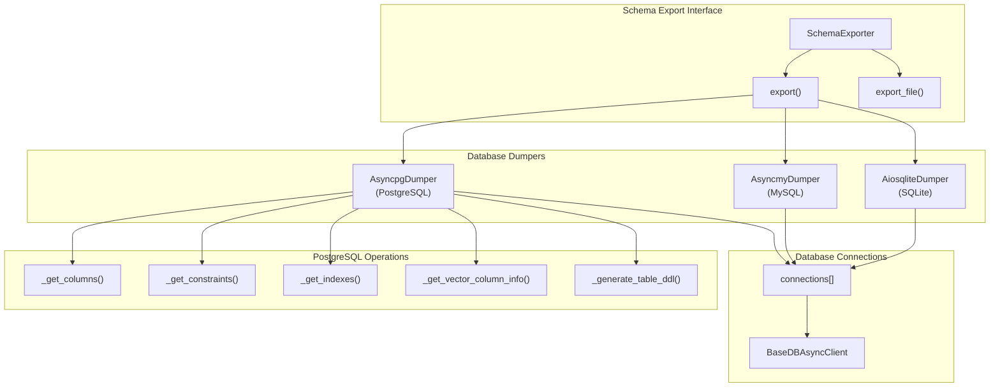
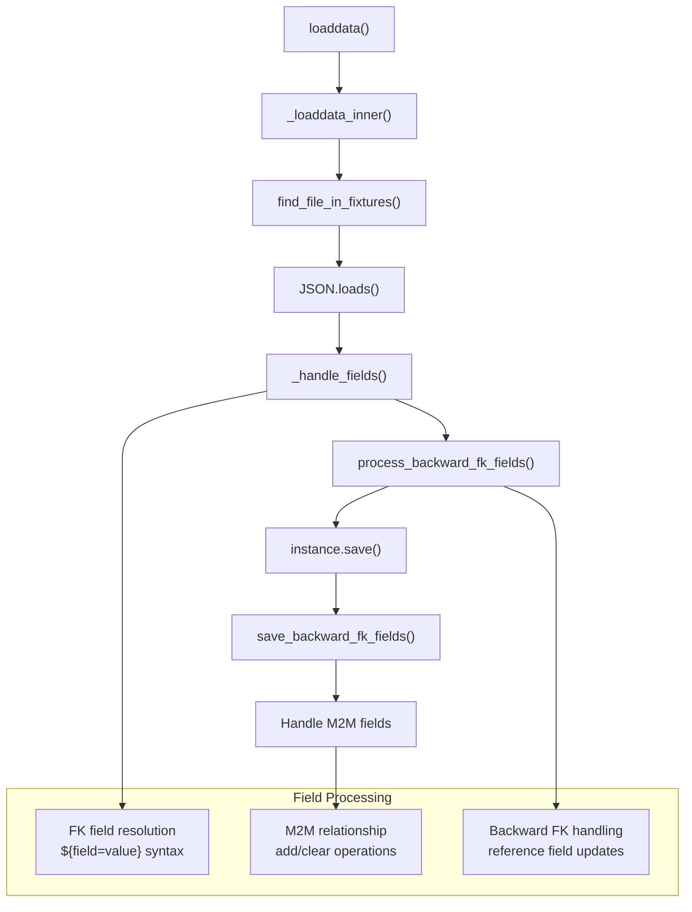

# Database Management

> **Relevant source files**
> * [fastapp/commands/db.py](/fastapp/commands/db.py)
> * [fastapp/commands/load_data.py](/fastapp/commands/load_data.py)
> * [fastapp/commands/user.py](/fastapp/commands/user.py)
> * [fastapp/db/migrate.py](/fastapp/db/migrate.py)
> * [fastapp/misc/gateway.py](/fastapp/misc/gateway.py)
> * [fastapp/misc/serve_static.py](/fastapp/misc/serve_static.py)
> * [fastapp/tools/get_table_structure.py](/fastapp/tools/get_table_structure.py)
> * [fastapp/utils/json.py](/fastapp/utils/json.py)
> * [pyproject.toml](/pyproject.toml)
> * [setup-pure.py](/setup-pure.py)

This document covers the database management utilities and commands provided by QingKongFramework. The system provides comprehensive database operation tools including schema migrations, data loading through fixtures, and schema export capabilities. All database management operations are built on top of Tortoise ORM and support multiple database backends (PostgreSQL, MySQL, SQLite).

For information about the BaseModel extensions and database functions, see [BaseModel Extensions](BaseModel-Extensions.md). For CLI command usage details, see [Database Commands](Database-Commands.md).

## System Architecture

The database management system consists of three primary subsystems: migration management, data loading, and schema utilities. These work together to provide a complete database lifecycle management solution.

### Database Management Components

```mermaid
flowchart TD

migrate_cmd["migrate()"]
auto_migrate_cmd["auto_migrate()"]
reverse_gen_cmd["reverse_generation()"]
loaddata_cmd["loaddata()"]
async_migrate["async_migrate()"]
parse_sql["parse_sql()"]
generate_diff_sql["generate_diff_sql()"]
generate_alter_statements["generate_alter_statements()"]
loaddata_inner["_loaddata_inner()"]
handle_fields["_handle_fields()"]
find_file_in_fixtures["find_file_in_fixtures()"]
SchemaExporter["SchemaExporter"]
AsyncpgDumper["AsyncpgDumper"]
AsyncmyDumper["AsyncmyDumper"]
AiosqliteDumper["AiosqliteDumper"]
generate_schemas["generate_schemas()"]
Tortoise["Tortoise"]
connections["connections"]
BaseModel["BaseModel"]
table_to_django_model["table_to_django_model()"]

migrate_cmd --> async_migrate
auto_migrate_cmd --> async_migrate
auto_migrate_cmd --> generate_diff_sql
reverse_gen_cmd --> table_to_django_model
async_migrate --> generate_schemas
async_migrate --> Tortoise
loaddata_cmd --> loaddata_inner
loaddata_inner --> BaseModel
SchemaExporter --> connections
async_migrate --> connections

subgraph subGraph4 ["Core Dependencies"]
    generate_schemas
    Tortoise
    connections
    BaseModel
    generate_schemas --> Tortoise
end

subgraph subGraph3 ["Schema Tools"]
    SchemaExporter
    AsyncpgDumper
    AsyncmyDumper
    AiosqliteDumper
    SchemaExporter --> AsyncpgDumper
    SchemaExporter --> AsyncmyDumper
    SchemaExporter --> AiosqliteDumper
end

subgraph subGraph2 ["Data Management"]
    loaddata_inner
    handle_fields
    find_file_in_fixtures
    loaddata_inner --> handle_fields
    loaddata_inner --> find_file_in_fixtures
end

subgraph subGraph1 ["Migration Engine"]
    async_migrate
    parse_sql
    generate_diff_sql
    generate_alter_statements
    generate_diff_sql --> parse_sql
    generate_diff_sql --> generate_alter_statements
end

subgraph subGraph0 ["CLI Commands"]
    migrate_cmd
    auto_migrate_cmd
    reverse_gen_cmd
    loaddata_cmd
end
```



Sources: [fastapp/commands/db.py L37-L124](/fastapp/commands/db.py#L37-L124)

 [fastapp/db/migrate.py L61-L367](/fastapp/db/migrate.py#L61-L367)

 [fastapp/commands/load_data.py L121-L224](/fastapp/commands/load_data.py#L121-L224)

 [fastapp/tools/get_table_structure.py L240-L263](/fastapp/tools/get_table_structure.py#L240-L263)

## Migration System

The migration system provides automated database schema management with support for both safe migrations and automatic difference detection. It handles table creation, column modifications, index management, and constraint changes across multiple database backends.

### Migration Process Flow

```mermaid
sequenceDiagram
  participant CLI Command
  participant async_migrate()
  participant async_init_db()
  participant generate_schemas()
  participant async_auto_migrate()
  participant parse_sql()
  participant generate_diff_sql()
  participant SchemaExporter
  participant Database Connection

  note over CLI Command,Database Connection: Standard Migration Flow
  CLI Command->>async_migrate(): migrate command
  async_migrate()->>async_init_db(): Initialize database
  async_init_db()->>Database Connection: Establish connections
  async_migrate()->>generate_schemas(): Apply schema changes
  generate_schemas()->>Database Connection: Execute DDL
  note over CLI Command,Database Connection: Auto Migration Flow
  CLI Command->>async_auto_migrate(): auto_migrate command
  async_auto_migrate()->>SchemaExporter: Export current schema
  SchemaExporter->>Database Connection: Query table structure
  async_auto_migrate()->>parse_sql(): Parse old schema
  async_auto_migrate()->>parse_sql(): Parse new schema
  async_auto_migrate()->>generate_diff_sql(): Generate differences
  generate_diff_sql()->>Database Connection: Execute ALTER statements
```

Sources: [fastapp/commands/db.py L37-L67](/fastapp/commands/db.py#L37-L67)

 [fastapp/commands/db.py L188-L285](/fastapp/commands/db.py#L188-L285)

 [fastapp/db/migrate.py L349-L379](/fastapp/db/migrate.py#L349-L379)

### Migration Command Options

The migration system supports several operational modes:

| Command | Function | Key Parameters |
| --- | --- | --- |
| `migrate` | Standard migration | `--safe`, `--guided`, `--apps`, `--models` |
| `auto_migrate` | Automatic diff detection | `--apps`, `--guided` |
| `reverse_generation` | Generate models from tables | `--connection`, `--db`, `table` |

The migration system automatically handles content types and permissions setup when the corresponding contrib apps are installed: `fastapp.contrib.contenttypes` and `fastapp.contrib.auth`.

Sources: [fastapp/commands/db.py L126-L145](/fastapp/commands/db.py#L126-L145)

 [fastapp/commands/db.py L287-L298](/fastapp/commands/db.py#L287-L298)

 [fastapp/commands/db.py L159-L185](/fastapp/commands/db.py#L159-L185)

## Schema Management

The schema management system provides database-agnostic table structure export capabilities through the `SchemaExporter` class and database-specific dumper implementations.

### Schema Export Architecture



Sources: [fastapp/tools/get_table_structure.py L240-L275](/fastapp/tools/get_table_structure.py#L240-L275)

 [fastapp/tools/get_table_structure.py L18-L178](/fastapp/tools/get_table_structure.py#L18-L178)

 [fastapp/tools/get_table_structure.py L181-L237](/fastapp/tools/get_table_structure.py#L181-L237)

## Data Loading System

The data loading system provides fixture-based data population with support for foreign key relationships, many-to-many fields, and complex field transformations. It uses JSON/JSONC format fixtures with automatic model resolution and relationship handling.

### Fixture Loading Process



Sources: [fastapp/commands/load_data.py L121-L193](/fastapp/commands/load_data.py#L121-L193)

 [fastapp/commands/load_data.py L70-L119](/fastapp/commands/load_data.py#L70-L119)

 [fastapp/commands/load_data.py L195-L224](/fastapp/commands/load_data.py#L195-L224)

### Fixture Format

The system supports JSONC format fixtures with the following structure:

```json
[
  {
    "model": "app.ModelName",
    "pk": 1,
    "fields": {
      "field_name": "value",
      "fk_field_id": "${field=value}",
      "m2m_field": [1, 2, 3]
    }
  }
]
```

Key features:

* `${field=value}` syntax for foreign key resolution
* Automatic M2M relationship handling
* Support for backward foreign key relationships
* PostgreSQL sequence reset after data loading
* Comment removal from JSONC files via `remove_comments()`

Sources: [fastapp/commands/load_data.py L70-L81](/fastapp/commands/load_data.py#L70-L81)

 [fastapp/commands/load_data.py L172-L184](/fastapp/commands/load_data.py#L172-L184)

 [fastapp/utils/json.py L8-L41](/fastapp/utils/json.py#L8-L41)

## Database Backend Support

The database management system provides comprehensive support for multiple database backends through Tortoise ORM integration:

| Backend | Connection Class | Migration Support | Schema Export | Special Features |
| --- | --- | --- | --- | --- |
| PostgreSQL | `PostgreSQLConnection` | Full | `AsyncpgDumper` | Vector columns, TimescaleDB |
| MySQL | `MySQLConnection` | Full | `AsyncmyDumper` | Index optimization |
| SQLite | `SqliteConnection` | Full | `AiosqliteDumper` | File-based storage |

Each backend supports:

* Automatic schema generation via `generate_schemas()`
* Diff-based migrations through `generate_diff_sql()`
* Data loading with sequence management
* Complete DDL export capabilities

Sources: [fastapp/commands/db.py L46-L67](/fastapp/commands/db.py#L46-L67)

 [fastapp/tools/get_table_structure.py L245-L256](/fastapp/tools/get_table_structure.py#L245-L256)

 [fastapp/commands/load_data.py L186-L192](/fastapp/commands/load_data.py#L186-L192)