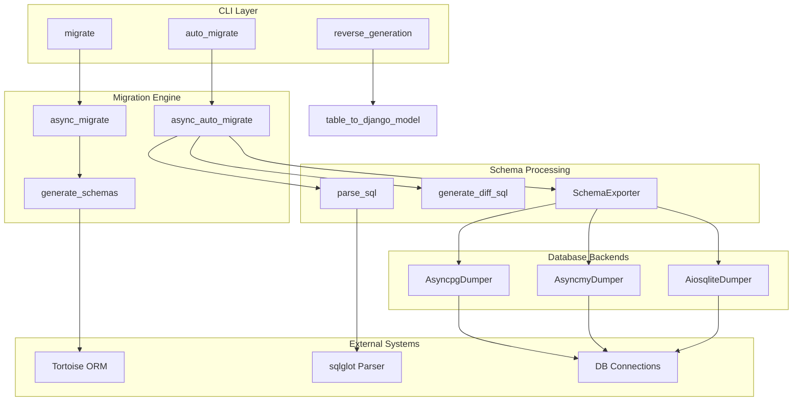
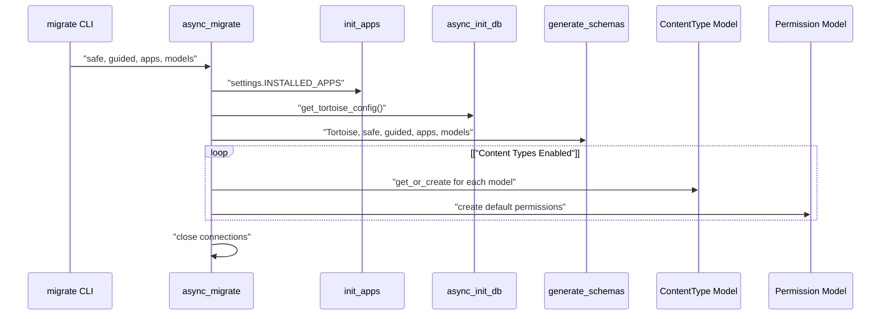
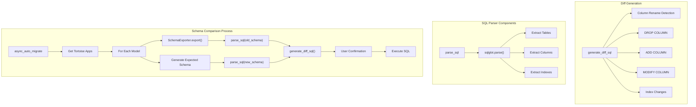
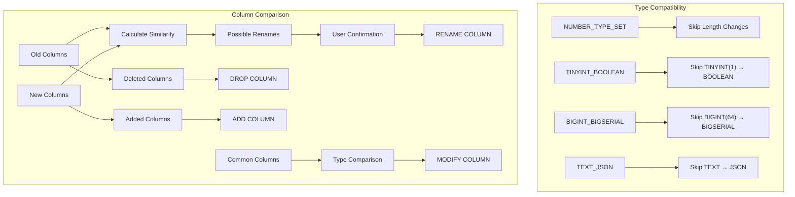
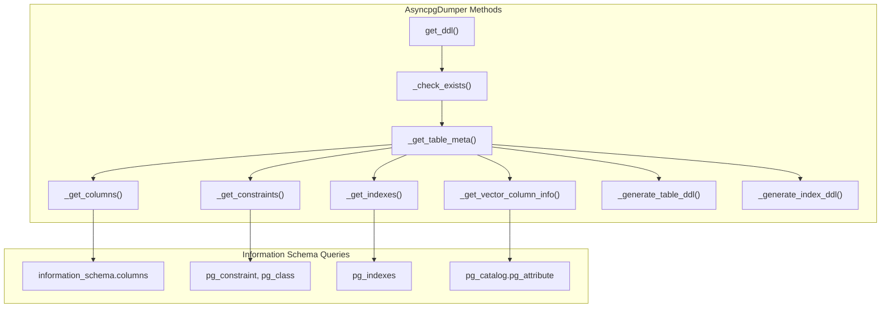
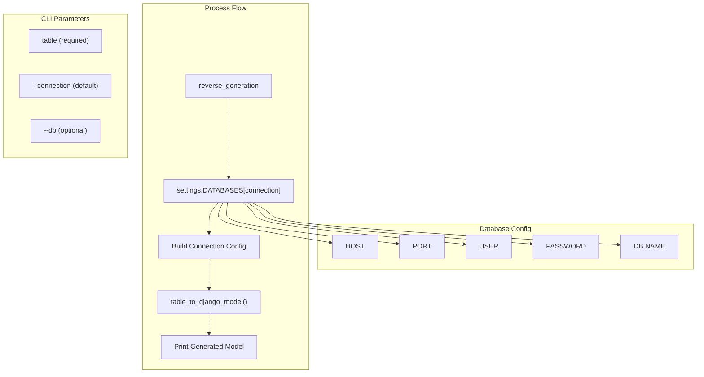

# Database Migrations and Schema

> **Relevant source files**
> * [fastapp/commands/db.py](/fastapp/commands/db.py)
> * [fastapp/db/migrate.py](/fastapp/db/migrate.py)
> * [fastapp/tools/get_table_structure.py](/fastapp/tools/get_table_structure.py)

This document covers QingKongFramework's database migration system, schema generation utilities, and automatic migration capabilities. The system provides Django-like migration functionality built on top of Tortoise ORM, with support for PostgreSQL, MySQL, and SQLite databases.

For information about data loading and fixtures, see [Data Loading and Fixtures](Data-Loading-and-Fixtures.md). For database CLI commands, see [Database Commands](Database-Commands.md).

## Migration System Overview

QingKongFramework provides a comprehensive migration system that handles schema changes, automatic migration detection, and reverse engineering from existing databases. The system is built around three core components: the CLI interface, migration engine, and schema exporters.

**Migration Architecture**



Sources: [fastapp/commands/db.py L37-L124](/fastapp/commands/db.py#L37-L124)

 [fastapp/db/migrate.py L369-L379](/fastapp/db/migrate.py#L369-L379)

 [fastapp/tools/get_table_structure.py L240-L263](/fastapp/tools/get_table_structure.py#L240-L263)

## Schema Generation and Management

The framework uses `generate_schemas` from `fastapp.db.utils` to create and modify database schemas based on Tortoise ORM models. This process integrates with the application discovery system and handles content types and permissions for built-in apps.

**Schema Generation Process**



The migration system validates app dependencies, ensuring that `fastapp.contrib.auth` requires `fastapp.contrib.contenttypes`, and `fastapp.contrib.guardian` requires `fastapp.contrib.auth`.

Sources: [fastapp/commands/db.py L46-L66](/fastapp/commands/db.py#L46-L66)

 [fastapp/commands/db.py L73-L123](/fastapp/commands/db.py#L73-L123)

## Auto-Migration with Diff Detection

The `auto_migrate` command provides automatic schema comparison and migration generation. It compares the current database schema with the expected schema from Tortoise models and generates SQL statements for any differences.

**Auto-Migration Workflow**



Sources: [fastapp/commands/db.py L188-L298](/fastapp/commands/db.py#L188-L298)

 [fastapp/db/migrate.py L349-L367](/fastapp/db/migrate.py#L349-L367)

## SQL Parsing and Schema Analysis

The migration system uses `sqlglot` to parse SQL statements and extract schema information. The `parse_sql` function handles CREATE TABLE and CREATE INDEX statements across different database dialects.

| SQL Element | Extraction Method | Supported Dialects |
| --- | --- | --- |
| Table Definition | `exp.Create` + `exp.Schema` | PostgreSQL, MySQL, SQLite |
| Column Definitions | `exp.ColumnDef` | All |
| Constraints | `exp.Constraint`, `exp.UniqueColumnConstraint` | All |
| Indexes | `exp.IndexColumnConstraint`, `exp.Create` + `exp.Index` | All |
| Data Types | `generator.datatype_sql()` | Dialect-specific |

**Column Change Detection Logic**



Sources: [fastapp/db/migrate.py L61-L210](/fastapp/db/migrate.py#L61-L210)

 [fastapp/db/migrate.py L213-L215](/fastapp/db/migrate.py#L213-L215)

 [fastapp/db/migrate.py L217-L346](/fastapp/db/migrate.py#L217-L346)

## Multi-Database Schema Export

The `SchemaExporter` class provides database-agnostic schema extraction using specialized dumper classes for each database backend. Each dumper handles the specific DDL syntax and metadata queries for its respective database.

**Database-Specific Schema Extraction**

| Database | Dumper Class | Key Features |
| --- | --- | --- |
| PostgreSQL | `AsyncpgDumper` | Full constraint support, vector column handling, pg_catalog queries |
| MySQL | `AsyncmyDumper` | SHOW CREATE TABLE, index filtering |
| SQLite | `AiosqliteDumper` | sqlite_master queries, index extraction |

**PostgreSQL Schema Extraction Process**



The PostgreSQL dumper includes special handling for vector columns (pgvector extension) and extracts dimension information from `pg_catalog` system tables.

Sources: [fastapp/tools/get_table_structure.py L18-L179](/fastapp/tools/get_table_structure.py#L18-L179)

 [fastapp/tools/get_table_structure.py L181-L213](/fastapp/tools/get_table_structure.py#L181-L213)

 [fastapp/tools/get_table_structure.py L215-L237](/fastapp/tools/get_table_structure.py#L215-L237)

## Reverse Engineering and Model Generation

The `reverse_generation` command allows developers to generate Django/Tortoise model definitions from existing database tables. This is particularly useful when working with legacy databases or when starting a new project with an existing schema.

**Reverse Generation Command Structure**



Sources: [fastapp/commands/db.py L159-L185](/fastapp/commands/db.py#L159-L185)

 [fastapp/commands/db.py L147-L156](/fastapp/commands/db.py#L147-L156)

## Migration Safety and Validation

The migration system includes several safety mechanisms to prevent data loss and ensure migration integrity:

### Safety Features

* **Guided Mode**: Interactive confirmation for each SQL statement during auto-migration
* **Safe Mode**: Default enabled for all migration operations
* **Dependency Validation**: Ensures required apps are installed before migration
* **Connection Management**: Proper cleanup of database connections after operations
* **PostgreSQL Sequence Reset**: Automatic sequence adjustment for auto-increment fields

### App Dependency Checks

```markdown
# From fastapp/commands/db.py:46-62
INTERNAL_CONTENTTYPES_APP_LABEL = "fastapp.contrib.contenttypes"
INTERNAL_AUTH_APP_LABEL = "fastapp.contrib.auth" 
INTERNAL_GUARDIAN_APP_LABEL = "fastapp.contrib.guardian"

# Auth app requires contenttypes
if auth_app_enabled and not content_type_app_enabled:
    click.echo("ERROR fastapp.contrib.auth required fastapp.contrib.contenttypes")
    
# Guardian app requires auth
if guardian_app_enabled and not auth_app_enabled:
    click.echo("ERROR fastapp.contrib.guardian required fastapp.contrib.auth")
```

Sources: [fastapp/commands/db.py L32-L62](/fastapp/commands/db.py#L32-L62)

 [fastapp/commands/db.py L115-L123](/fastapp/commands/db.py#L115-L123)

 [fastapp/commands/db.py L254-L284](/fastapp/commands/db.py#L254-L284)