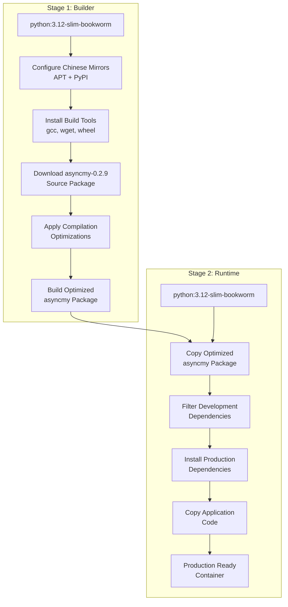
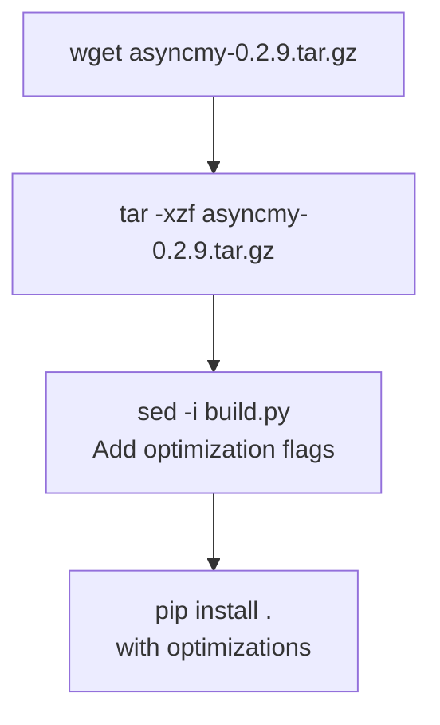
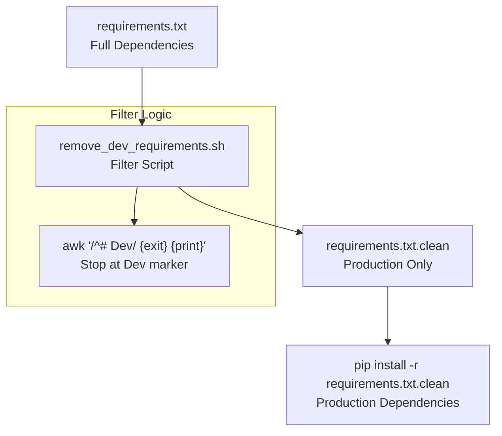
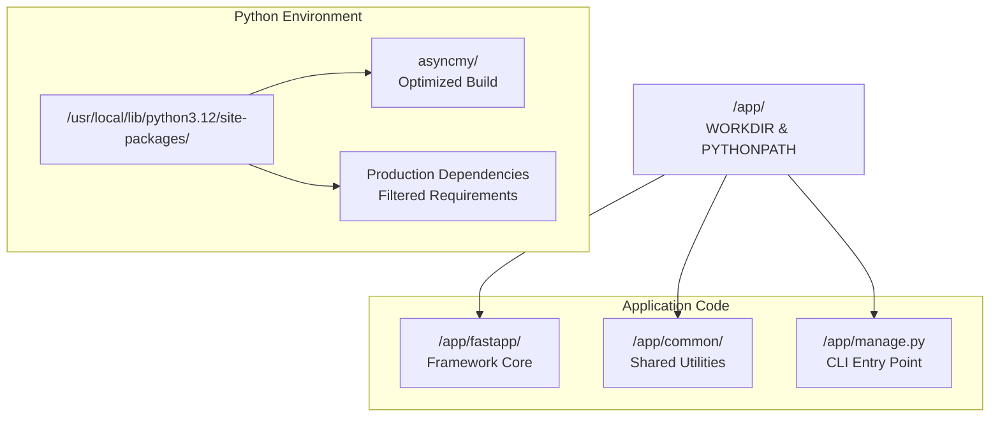
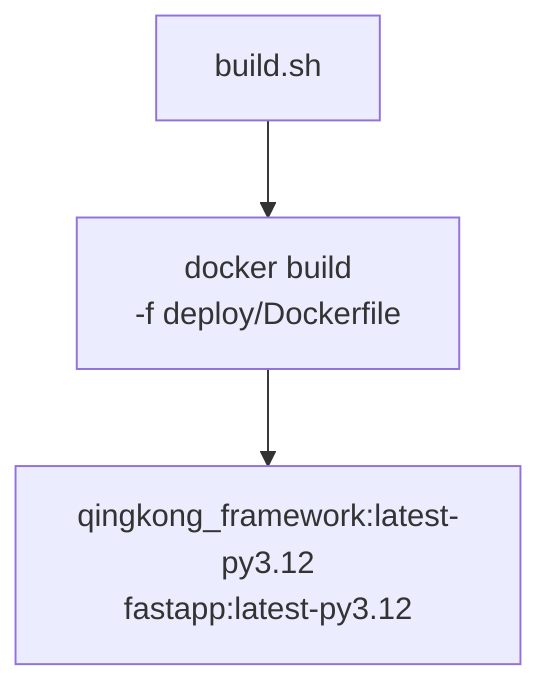

# Deployment with Docker

> **Relevant source files**
> * [deploy/Dockerfile](/deploy/Dockerfile)
> * [deploy/build.sh](/deploy/build.sh)
> * [deploy/remove_dev_requirements.sh](/deploy/remove_dev_requirements.sh)

This document covers the Docker containerization system for QingKongFramework, including multi-stage build optimization, dependency management, and production deployment configuration. The system provides optimized container builds with asyncmy performance tuning and production-ready dependency filtering.

For server command management, see [Server Commands](Server-Commands.md). For general infrastructure configuration, see [Infrastructure](Infrastructure.md).

## Multi-Stage Build Architecture

The Docker deployment uses a sophisticated multi-stage build process to optimize both build time and final image size while providing performance optimizations for database connectivity.

### Build Pipeline Overview

Sources: [deploy/Dockerfile L1-L62](/deploy/Dockerfile#L1-L62)

### AsyncMy Performance Optimization

The build process includes specialized compilation optimizations for the `asyncmy` MySQL driver to improve database performance:

| Optimization Flag | Purpose | Stage |
| --- | --- | --- |
| `-Os` | Size optimization | Compile |
| `-flto` | Link-time optimization | Compile & Link |
| `-ffast-math` | Fast math operations | Compile |
| `-s` | Strip symbols | Link |

The optimization process modifies the asyncmy build configuration dynamically:

Sources: [deploy/Dockerfile L16-L28](/deploy/Dockerfile#L16-L28)

## Dependency Management

### Development Dependency Filtering

The build process uses a custom script to separate production dependencies from development dependencies, reducing final image size and potential security surface.

The filtering script uses a simple marker-based approach where development dependencies are separated by a `# Dev` comment line.

Sources: [deploy/remove_dev_requirements.sh L1-L21](/deploy/remove_dev_requirements.sh#L1-L21)

 [deploy/Dockerfile L48-L54](/deploy/Dockerfile#L48-L54)

### Production Package Installation

The production stage installs only filtered dependencies with cache optimization:

| Step | Command | Purpose |
| --- | --- | --- |
| Filter | `remove-dev-requirements` | Extract production deps |
| Install | `pip install --no-cache-dir` | Install without cache |
| Cleanup | `find ... -name '__pycache__' -exec rm -r {} +` | Remove Python cache |

Sources: [deploy/Dockerfile L51-L54](/deploy/Dockerfile#L51-L54)

## Container Structure

### Application Layout

The final container follows a standardized directory structure:

Sources: [deploy/Dockerfile L42-L59](/deploy/Dockerfile#L42-L59)

### Runtime Configuration

The container is configured for production deployment with:

* **Working Directory**: `/app/` with `PYTHONPATH=/app`
* **Timezone**: Asia/Shanghai (`/usr/share/zoneinfo/Asia/Shanghai`)
* **Exposed Port**: 8000
* **Default Command**: `python manage.py about`

Sources: [deploy/Dockerfile L33-L62](/deploy/Dockerfile#L33-L62)

## Build Process

### Build Script Integration

The build process is orchestrated through a simple shell script that provides consistent tagging:

The build script creates two tags for the same image, providing flexibility for different naming conventions.

Sources: [deploy/build.sh L1](/deploy/build.sh#L1-L1)

### Image Optimization Features

The Docker build includes several optimization strategies:

| Feature | Implementation | Benefit |
| --- | --- | --- |
| Multi-stage build | Separate builder/runtime stages | Smaller final image |
| asyncmy optimization | Custom compilation flags | Better DB performance |
| Cache cleanup | Remove `__pycache__` directories | Reduced image size |
| Dev dependency filtering | Custom script filtering | Security & size reduction |
| Chinese mirror configuration | APT & PyPI mirror setup | Faster builds in China |

Sources: [deploy/Dockerfile L1-L62](/deploy/Dockerfile#L1-L62)

 [deploy/remove_dev_requirements.sh L1-L21](/deploy/remove_dev_requirements.sh#L1-L21)

## Deployment Configuration

The container is designed for production deployment with the QingKongFramework CLI system. The default command runs `manage.py about`, but in production environments, this would typically be overridden with server commands like:

* `python manage.py runserver-aio` for single-process deployment
* `python manage.py runserver` for multi-service deployment
* `python manage.py gateway` for API gateway functionality

The optimized asyncmy driver provides enhanced performance for database operations, particularly beneficial for high-throughput async workloads typical in QingKongFramework applications.

Sources: [deploy/Dockerfile L60-L62](/deploy/Dockerfile#L60-L62)