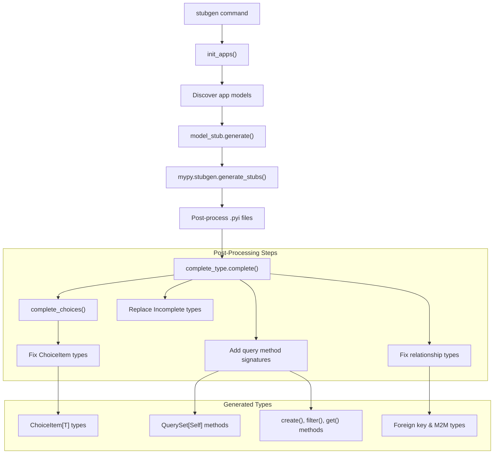
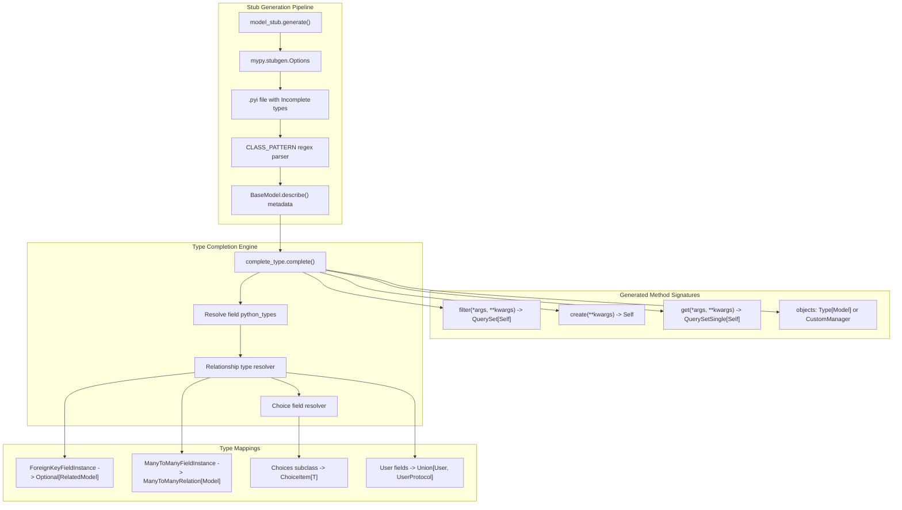
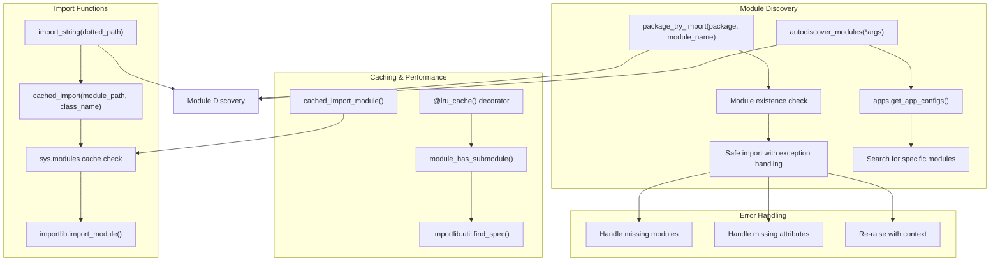
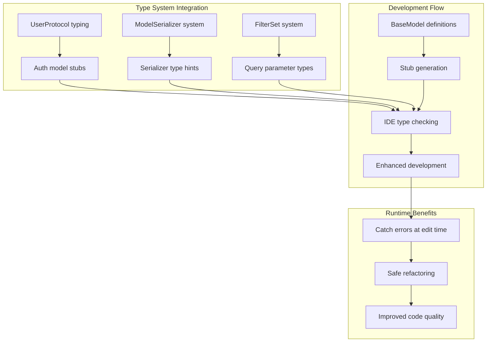

# Development Tools

> **Relevant source files**
> * [Readme.md](/Readme.md)
> * [fastapp/commands/misc.py](/fastapp/commands/misc.py)
> * [fastapp/contrib/auth/typing.py](/fastapp/contrib/auth/typing.py)
> * [fastapp/misc/complete_type.py](/fastapp/misc/complete_type.py)
> * [fastapp/misc/model_stub.py](/fastapp/misc/model_stub.py)
> * [fastapp/serializers/base.py](/fastapp/serializers/base.py)
> * [fastapp/utils/module_loading.py](/fastapp/utils/module_loading.py)

This document covers the development tools and utilities provided by QingKongFramework to enhance the developer experience. These tools include type stub generation for improved IDE support, module loading utilities for dynamic importing, and build process optimizations.

The development tools focus primarily on Python type safety and IDE integration, particularly for Tortoise ORM models. For database migration and schema management tools, see [Database Management](Database-Management.md). For CLI commands related to server operations, see [Command Line Interface](Command-Line-Interface.md).

## Type Stub Generation System

QingKongFramework provides an automated type stub generation system that creates `.pyi` files for Tortoise ORM models. This system enhances IDE support by providing accurate type hints for model fields, relationships, and query methods.

### Stub Generation Workflow



Sources: [fastapp/commands/misc.py L16-L44](/fastapp/commands/misc.py#L16-L44)

 [fastapp/misc/model_stub.py L11-L128](/fastapp/misc/model_stub.py#L11-L128)

 [fastapp/misc/complete_type.py L57-L149](/fastapp/misc/complete_type.py#L57-L149)

### Type Stub Generator Architecture

The stub generation process operates through several coordinated components that transform basic mypy-generated stubs into comprehensive type definitions for Tortoise ORM models.



Sources: [fastapp/misc/model_stub.py L66-L115](/fastapp/misc/model_stub.py#L66-L115)

 [fastapp/misc/complete_type.py L99-L149](/fastapp/misc/complete_type.py#L99-L149)

 [fastapp/misc/complete_type.py L161-L193](/fastapp/misc/complete_type.py#L161-L193)

### Key Components

| Component | Purpose | Key Methods |
| --- | --- | --- |
| `model_stub.generate()` | Main entry point for stub generation | Uses mypy stubgen with custom post-processing |
| `complete_type.complete()` | Completes Incomplete type annotations | Resolves field types from model descriptions |
| `complete_type.complete_choices()` | Handles Choice field type completion | Maps Choice subclasses to ChoiceItem types |
| `CLASS_PATTERN` | Regex for parsing class definitions | Matches class declarations in .pyi files |
| `INCOMPLETE_PATTERN` | Regex for finding incomplete types | Identifies fields needing type completion |

The system generates comprehensive type stubs that include:

* Properly typed model fields based on Tortoise field descriptions
* Query method signatures with generic return types
* Relationship field types (ForeignKey, ManyToMany, OneToOne)
* Choice field mappings to `ChoiceItem` types
* Custom manager type annotations

Sources: [fastapp/misc/model_stub.py L83-L115](/fastapp/misc/model_stub.py#L83-L115)

 [fastapp/misc/complete_type.py L12-L16](/fastapp/misc/complete_type.py#L12-L16)

 [fastapp/misc/complete_type.py L109-L140](/fastapp/misc/complete_type.py#L109-L140)

## Module Loading Utilities

The framework provides sophisticated module loading utilities that support dynamic importing, caching, and module discovery patterns essential for the pluggable application architecture.

### Module Loading Architecture



Sources: [fastapp/utils/module_loading.py L9-L50](/fastapp/utils/module_loading.py#L9-L50)

 [fastapp/utils/module_loading.py L52-L86](/fastapp/utils/module_loading.py#L52-L86)

 [fastapp/utils/module_loading.py L107-L123](/fastapp/utils/module_loading.py#L107-L123)

### Import and Discovery Functions

| Function | Purpose | Return Type | Error Handling |
| --- | --- | --- | --- |
| `import_string(dotted_path)` | Import class/function from dotted path | Any | Raises ImportError with context |
| `cached_import(module_path, class_name)` | Import with module initialization check | Any | Handles module loading states |
| `package_try_import(package, module_name)` | Safe module import from package | Module or Exception | Returns exception instead of raising |
| `module_has_submodule(package, module_name)` | Check if module exists in package | bool | Cached with @lru_cache |
| `autodiscover_modules(*args)` | Discover modules in all apps | None | Silently handles missing modules |

The module loading system provides several key features:

* **Caching**: Uses `sys.modules` cache and `@lru_cache` for performance
* **Safe Importing**: `package_try_import()` returns exceptions instead of raising them
* **Module State Checking**: Verifies module initialization before accessing attributes
* **Flexible Discovery**: `autodiscover_modules()` searches across all installed apps

Sources: [fastapp/utils/module_loading.py L20-L36](/fastapp/utils/module_loading.py#L20-L36)

 [fastapp/utils/module_loading.py L88-L104](/fastapp/utils/module_loading.py#L88-L104)

 [fastapp/utils/module_loading.py L107-L123](/fastapp/utils/module_loading.py#L107-L123)

## CLI Integration

The development tools integrate with the framework's CLI system through the `stubgen` command, which orchestrates the entire type stub generation process.

### Stubgen Command Flow

```mermaid
sequenceDiagram
  participant manage.py stubgen
  participant init_apps()
  participant init_models()
  participant app_configs
  participant model_stub.generate()
  participant complete_type functions

  manage.py stubgen->>init_apps(): Initialize installed apps
  init_apps()-->>manage.py stubgen: Return app registry
  manage.py stubgen->>init_models(): Initialize Tortoise models
  init_models()-->>manage.py stubgen: Models ready
  loop [Models module exists]
    manage.py stubgen->>app_configs: Check app.label in args
    manage.py stubgen->>app_configs: package_try_import(models)
    app_configs-->>manage.py stubgen: Models module or exception
    manage.py stubgen->>model_stub.generate(): generate(models.__name__, mode)
    model_stub.generate()-->>manage.py stubgen: .pyi file created
    manage.py stubgen->>complete_type functions: complete(models.__name__)
    complete_type functions-->>manage.py stubgen: Types completed
    manage.py stubgen->>complete_type functions: complete_choices(models.__name__)
    complete_type functions-->>manage.py stubgen: Choice types completed
    manage.py stubgen->>manage.py stubgen: Raise exception
  end
```

Sources: [fastapp/commands/misc.py L16-L44](/fastapp/commands/misc.py#L16-L44)

### Command Options

| Option | Type | Default | Purpose |
| --- | --- | --- | --- |
| `--mode` | STRING | "lite" | Controls stub generation detail level |
| `--apps` | Multiple | None | Filter specific apps for stub generation |

The `stubgen` command:

1. Initializes the application registry and model system
2. Filters to non-contrib apps by default (excludes `fastapp.contrib.*`)
3. Generates stubs only for apps containing a `models` module
4. Processes each app through the full stub generation pipeline
5. Supports selective app processing via the `--apps` option

Sources: [fastapp/commands/misc.py L23-L43](/fastapp/commands/misc.py#L23-L43)

## Build and Performance Tools

The framework includes build optimization tools and performance enhancements for production deployment.

### Build System Overview

Based on the repository structure, the framework supports multiple build approaches:

| Build Type | Command | Purpose |
| --- | --- | --- |
| Standard Python | `python -m build` | Creates standard wheel distribution |
| Pure Python | `python setup-pure.py bdist_wheel` | Creates pure Python wheel without compiled extensions |
| Nuitka Compilation | Build tools with nuitka | Compiled Python for performance |

The build system includes optimizations for:

* **JSON Processing**: Uses `orjson==3.10.15` for accelerated JSON operations
* **Async MySQL**: Optimized `asyncmy` builds for database performance
* **Docker Multi-stage**: Optimized container builds with dependency filtering

Sources: [Readme.md L1-L15](/Readme.md#L1-L15)

### Type Safety Integration

The development tools integrate with the broader framework type system:



Sources: [fastapp/contrib/auth/typing.py L8-L49](/fastapp/contrib/auth/typing.py#L8-L49)

 [fastapp/misc/model_stub.py L53-L56](/fastapp/misc/model_stub.py#L53-L56)

The development tools provide a comprehensive foundation for maintaining code quality and developer productivity in QingKongFramework applications, with particular emphasis on type safety and IDE integration for the complex ORM and serialization systems that form the framework's core.