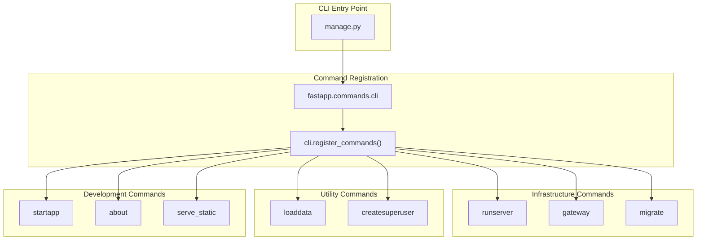
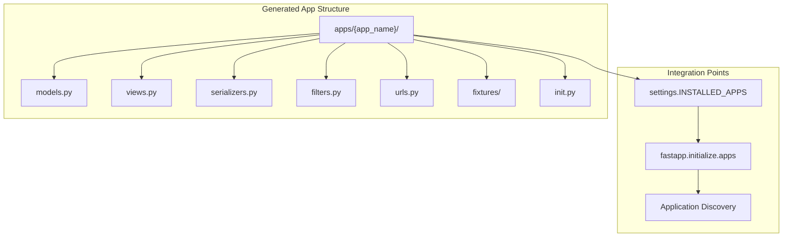
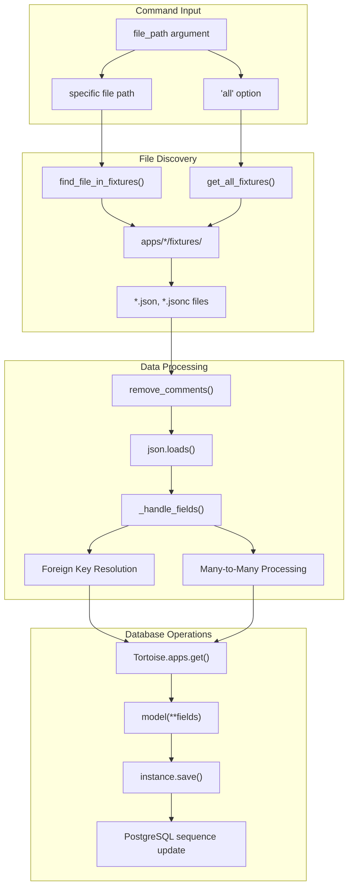
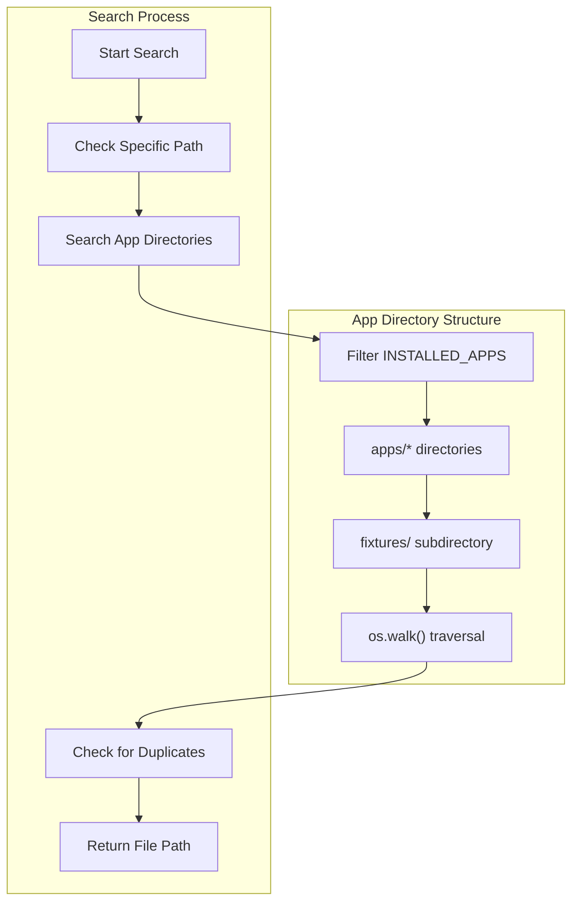
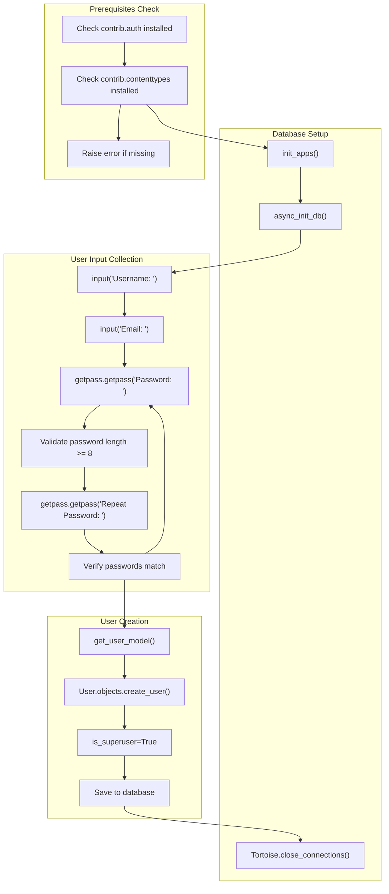
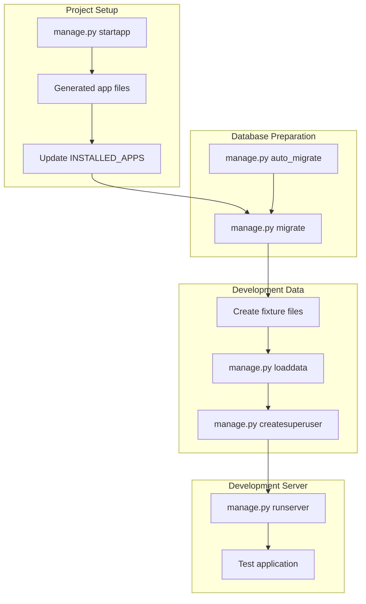

# Development and Utility Commands

> **Relevant source files**
> * [fastapp/commands/load_data.py](/fastapp/commands/load_data.py)
> * [fastapp/commands/user.py](/fastapp/commands/user.py)
> * [fastapp/misc/gateway.py](/fastapp/misc/gateway.py)
> * [fastapp/misc/serve_static.py](/fastapp/misc/serve_static.py)
> * [fastapp/utils/json.py](/fastapp/utils/json.py)
> * [manage.py](/manage.py)
> * [pyproject.toml](/pyproject.toml)
> * [setup-pure.py](/setup-pure.py)

This document covers the development and utility commands in QingKongFramework's CLI system. These commands support the development workflow by providing application scaffolding, user management, data loading, and system information utilities.

For server management commands like `runserver` and `gateway`, see [Server Commands](Server-Commands.md). For database management commands like `migrate` and `auto_migrate`, see [Database Commands](Database-Commands.md).

## Command Overview

QingKongFramework provides several development-focused commands that streamline the application development process:

| Command | Purpose | Primary Use Case |
| --- | --- | --- |
| `startapp` | Application scaffolding | Creating new app modules |
| `loaddata` | Fixture data loading | Populating databases with test/initial data |
| `createsuperuser` | Admin user creation | Setting up administrative access |
| `about` | System information | Displaying framework and environment info |

### Command Registration Architecture



Sources: [manage.py L3-L5](/manage.py#L3-L5)

## Application Scaffolding

### startapp Command

The `startapp` command creates the directory structure for new applications within the QingKongFramework project. While the implementation file is not visible in the provided sources, this command follows Django-like conventions for creating modular applications.

Expected application structure created by `startapp`:



Sources: [manage.py L3-L5](/manage.py#L3-L5)

## Data Management Commands

### loaddata Command

The `loaddata` command loads fixture data from JSON or JSONC files into the database. It provides sophisticated handling of relationships and supports bulk loading operations.



Sources: [fastapp/commands/load_data.py L17-L224](/fastapp/commands/load_data.py#L17-L224)

#### Fixture File Format

The `loaddata` command supports JSON and JSONC (JSON with comments) fixture files with the following structure:

```json
[
  {
    "model": "app_name.ModelName",
    "pk": 1,
    "fields": {
      "field_name": "value",
      "foreign_key_field": "${field=value}",
      "many_to_many_field": [1, 2, 3]
    }
  }
]
```

Key features:

| Feature | Syntax | Purpose |
| --- | --- | --- |
| Foreign Key Reference | `"${field=value}"` | Reference related objects by field values |
| Many-to-Many Relations | `[1, 2, 3]` | List of related object IDs |
| JSONC Comments | `//` or `/* */` | Documentation within fixture files |
| Sequence Updates | Automatic | PostgreSQL sequence synchronization |

### File Discovery Logic

The command searches for fixture files using a hierarchical approach:



Sources: [fastapp/commands/load_data.py L17-L40](/fastapp/commands/load_data.py#L17-L40)

 [fastapp/commands/load_data.py L42-L57](/fastapp/commands/load_data.py#L42-L57)

## User Management Commands

### createsuperuser Command

The `createsuperuser` command creates administrative users for the application. It integrates with the authentication system to create users with superuser privileges.



Sources: [fastapp/commands/user.py L13-L49](/fastapp/commands/user.py#L13-L49)

### Password Validation

The command implements basic password validation:

| Validation Rule | Implementation | Error Message |
| --- | --- | --- |
| Minimum Length | `len(password) < 8` | "Password must be at least 8 characters long" |
| Password Match | `password != repeat_password` | Reprompt for password entry |
| Required Fields | Username, email, password | Interactive prompts |

Sources: [fastapp/commands/user.py L30-L37](/fastapp/commands/user.py#L30-L37)

## Development Workflow Integration

### Command Dependencies and Flow



Sources: [manage.py L3-L9](/manage.py#L3-L9)

 [fastapp/commands/load_data.py L196-L197](/fastapp/commands/load_data.py#L196-L197)

 [fastapp/commands/user.py L21-L22](/fastapp/commands/user.py#L21-L22)

### Integration with Framework Components

The development commands integrate with several framework systems:

| Command | Framework Integration | Key Dependencies |
| --- | --- | --- |
| `startapp` | Application discovery system | `settings.INSTALLED_APPS` |
| `loaddata` | ORM and model system | `BaseModel`, `Tortoise.apps` |
| `createsuperuser` | Authentication system | `contrib.auth`, `get_user_model()` |
| `about` | System information | Framework version, environment |

Sources: [fastapp/commands/load_data.py L125-L127](/fastapp/commands/load_data.py#L125-L127)

 [fastapp/commands/user.py L15-L17](/fastapp/commands/user.py#L15-L17)