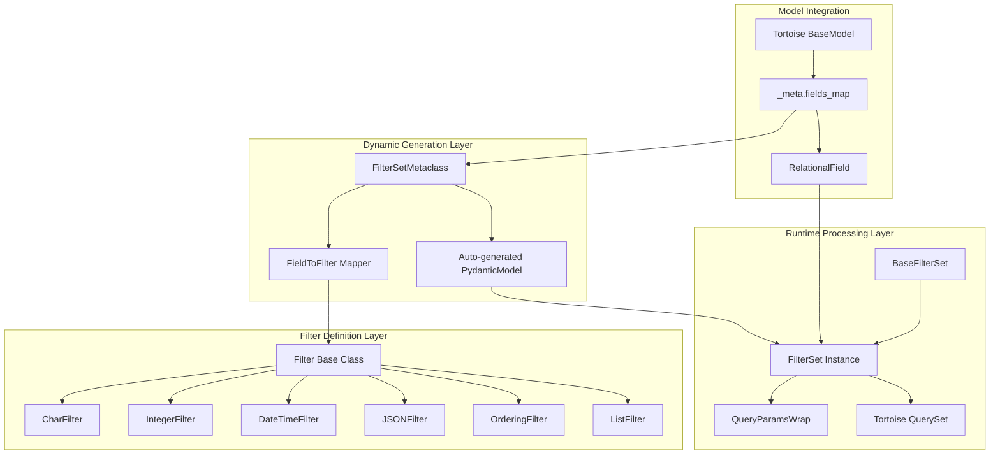
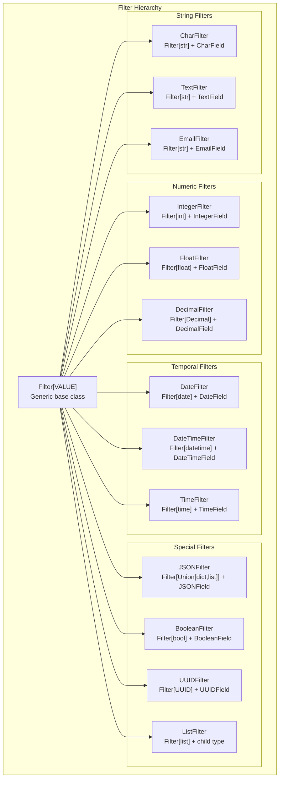
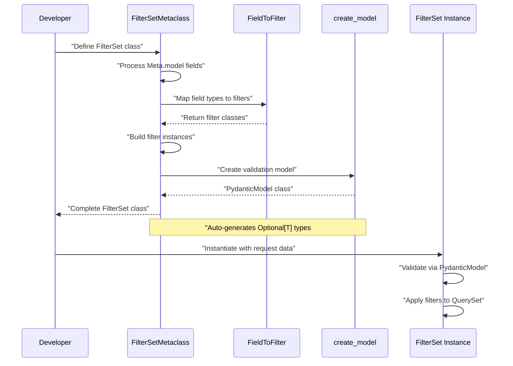
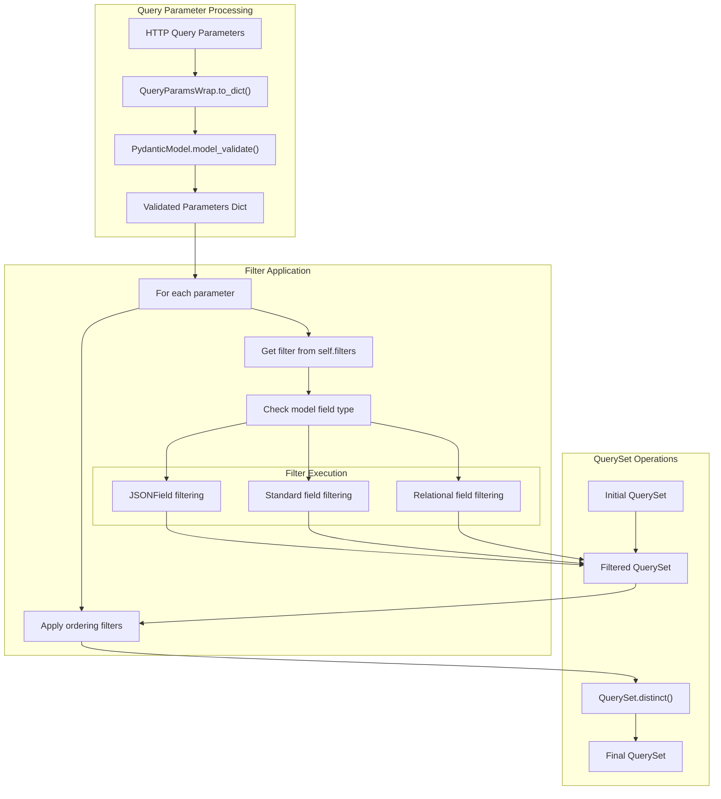
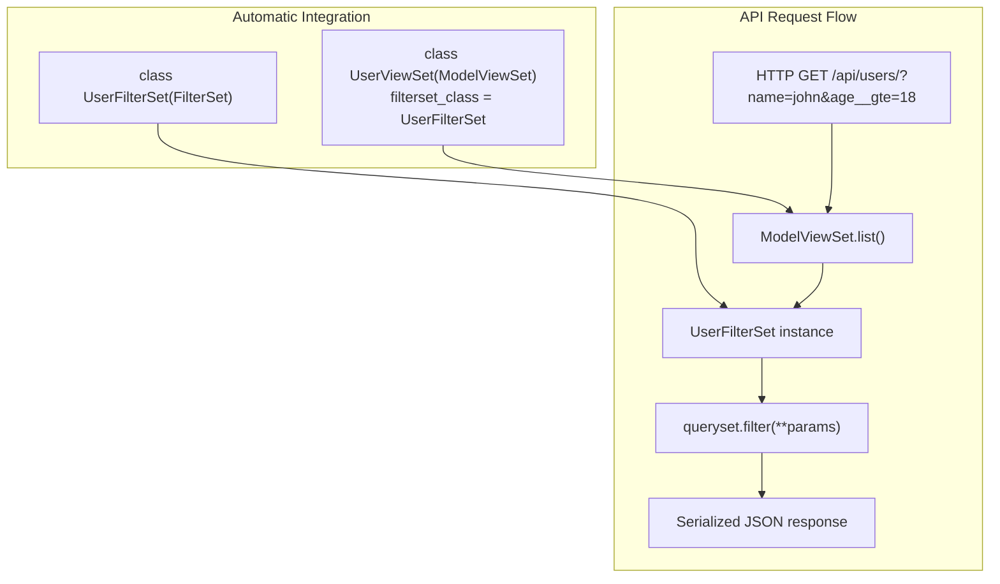

# FilterSet System

> **Relevant source files**
> * [fastapp/filters/filters.py](/fastapp/filters/filters.py)
> * [fastapp/filters/filterset.py](/fastapp/filters/filterset.py)
> * [fastapp/serializers/creator.py](/fastapp/serializers/creator.py)
> * [fastapp/serializers/fields/__init__.py](/fastapp/serializers/fields/__init__.py)
> * [fastapp/serializers/model.py](/fastapp/serializers/model.py)

The FilterSet System provides dynamic query parameter filtering with automatic Pydantic validation for FastAPI endpoints. It automatically generates filter fields based on Tortoise ORM model definitions and converts HTTP query parameters into database queries through a declarative interface.

For information about the ModelSerializer system that works closely with FilterSets, see [ModelSerializer System](ModelSerializer-System.md). For details about BaseModel extensions and QuerySet operations, see [BaseModel Extensions](BaseModel-Extensions.md).

## Architecture Overview

The FilterSet system consists of three main layers: metaclass-driven dynamic generation, filter field definitions, and runtime query processing.



**Sources:** [fastapp/filters/filterset.py L58-L212](/fastapp/filters/filterset.py#L58-L212)

 [fastapp/filters/filters.py L67-L319](/fastapp/filters/filters.py#L67-L319)

## Core Components

### FilterSetMetaclass

The `FilterSetMetaclass` is responsible for automatic filter generation and Pydantic model creation. It analyzes Tortoise model fields and creates corresponding filter instances.

| Component | Purpose | Key Methods |
| --- | --- | --- |
| `FilterSetMetaclass.__new__` | Auto-generates filter fields from model Meta | Processes `Meta.model`, `Meta.fields`, `Meta.exclude` |
| `FieldToFilter.get` | Maps Tortoise fields to filter classes | Returns appropriate filter class for field type |
| Dynamic Pydantic Model | Validates query parameters | Created via `create_model()` with Optional typing |

The metaclass processes the `Meta` class to determine which fields to include:

```python
class ExampleFilterSet(FilterSet):
    class Meta:
        model = MyModel
        fields = ['name', 'created_at', 'status']
        # or fields = {'name': ['exact', 'contains'], 'created_at': ['gte', 'lte']}
        exclude = ['sensitive_field']
```

**Sources:** [fastapp/filters/filterset.py L58-L212](/fastapp/filters/filterset.py#L58-L212)

 [fastapp/filters/filterset.py L27-L48](/fastapp/filters/filterset.py#L27-L48)

### Filter Base Classes

Individual filter classes inherit from `Filter[VALUE]` and specific Tortoise field types to provide type-safe filtering with appropriate validation.



**Sources:** [fastapp/filters/filters.py L187-L319](/fastapp/filters/filters.py#L187-L319)

### Lookup Expressions

The system supports extensive lookup expressions through the `LookupExprEnum`:

| Category | Expressions | Usage Example |
| --- | --- | --- |
| **Exact Matching** | `exact`, `iexact` | `name=john`, `name__iexact=JOHN` |
| **Text Search** | `contains`, `icontains`, `startswith`, `endswith` | `title__contains=python` |
| **Comparisons** | `gt`, `gte`, `lt`, `lte`, `range` | `age__gte=18`, `price__range=[10,100]` |
| **List Operations** | `in`, `not` | `status__in=[active,pending]` |
| **Null Checks** | `isnull` | `deleted_at__isnull=true` |
| **Date/Time** | `date`, `year`, `month`, `day`, `hour` | `created_at__year=2024` |
| **PostgreSQL** | `contained_by`, `overlap`, `has_key` | `tags__has_key=important` |
| **Regex** | `regex`, `iregex` | `code__regex=^[A-Z]+` |

**Sources:** [fastapp/filters/filters.py L26-L64](/fastapp/filters/filters.py#L26-L64)

## Dynamic Pydantic Model Generation

The metaclass creates Pydantic models with proper typing and validation for each FilterSet:



**Sources:** [fastapp/filters/filterset.py L182-L212](/fastapp/filters/filterset.py#L182-L212)

## Runtime Query Processing

### Filter Application Process

The `filter_queryset` method processes validated parameters and applies them to the QuerySet:



**Sources:** [fastapp/filters/filterset.py L260-L304](/fastapp/filters/filterset.py#L260-L304)

### JSON Field Filtering

JSON fields receive special handling with nested field access and PostgreSQL-specific operations:

```python
# Example JSON field filtering
def jsonfield_filter(self, queryset, value, source_field=None, nested_field=None):
    if self.lookup_expr in ('contains', 'icontains'):
        params = {f"{source_field}__contains": {nested_field: value}}
    else:
        params = {f"{source_field}__filter": {
            f"{nested_field}{f'__{lookup_expr}' if lookup_expr else ''}": value
        }}
```

**Sources:** [fastapp/filters/filters.py L158-L184](/fastapp/filters/filters.py#L158-L184)

## Integration with ViewSets

FilterSets integrate seamlessly with the ViewSet system to provide automatic API filtering:



**Sources:** [fastapp/filters/filterset.py L215-L311](/fastapp/filters/filterset.py#L215-L311)

## Advanced Features

### Nested FilterSets

FilterSets support composition through nested FilterSet instances:

```python
class AddressFilterSet(BaseFilterSet):
    city = CharFilter()
    country = CharFilter()

class UserFilterSet(FilterSet):
    address = AddressFilterSet()  # Creates address__city, address__country filters
    
    class Meta:
        model = User
        fields = ['name', 'email']
```

**Sources:** [fastapp/filters/filterset.py L79-L95](/fastapp/filters/filterset.py#L79-L95)

### Custom Filter Methods

Filters support custom filtering logic through the `method` parameter and callable field access:

```python
def filter_by_age_range(queryset, name, value):
    return queryset.filter(age__range=[value-5, value+5])

class UserFilterSet(FilterSet):
    age_range = IntegerFilter(method=filter_by_age_range)
```

**Sources:** [fastapp/filters/filters.py L67-L96](/fastapp/filters/filters.py#L67-L96)

### OrderingFilter Integration

The system automatically adds ordering capabilities with field validation:

```markdown
# Auto-generated ordering filter
new_attrs["o"] = OrderingFilter(fields=[("id", "id"), ("name", "name")])

# Usage: ?o=name or ?o=-created_at
```

**Sources:** [fastapp/filters/filterset.py L175-L176](/fastapp/filters/filterset.py#L175-L176)

 [fastapp/filters/filters.py L310-L319](/fastapp/filters/filters.py#L310-L319)