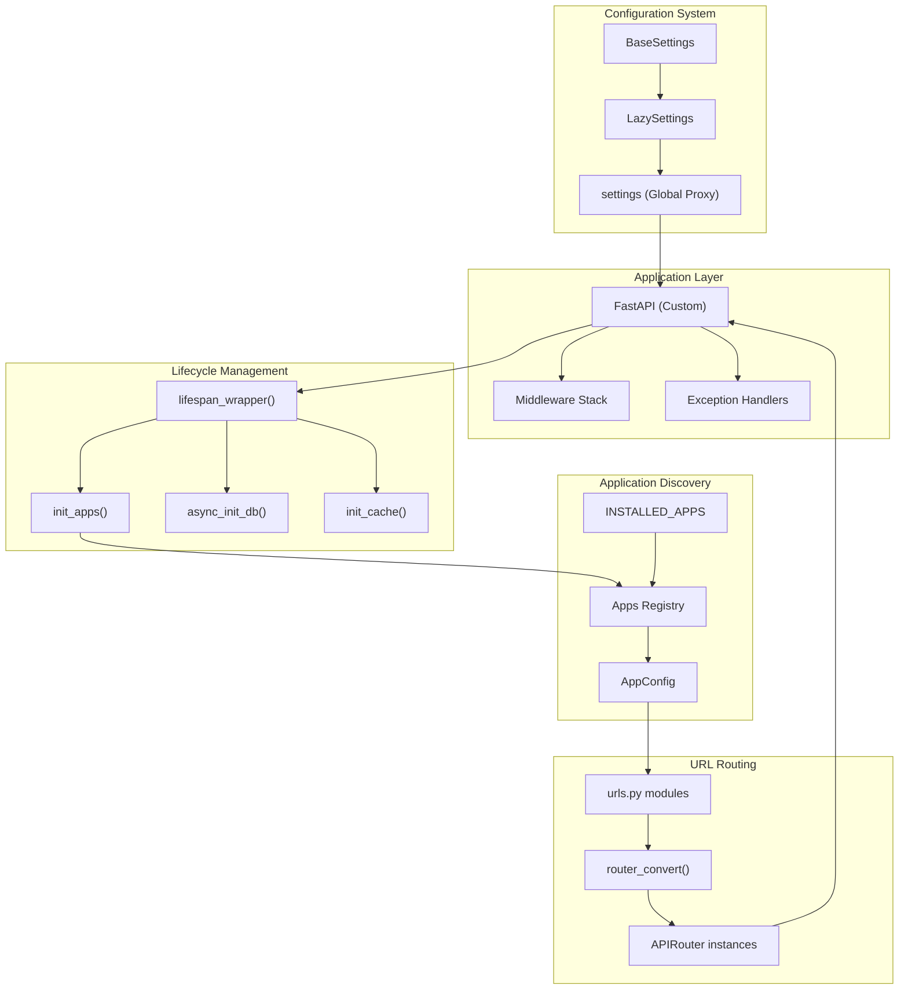
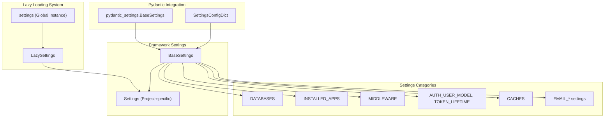
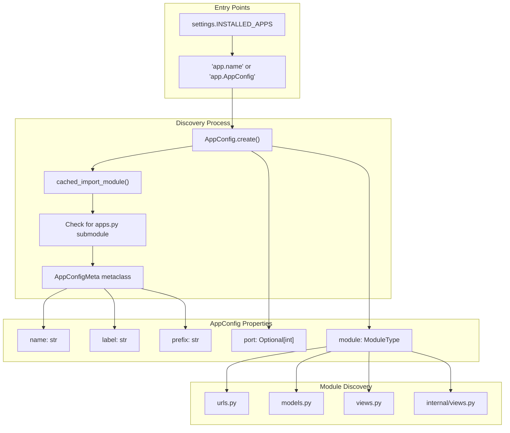

# Framework Architecture

> **Relevant source files**
> * [fastapp/apps/config.py](/fastapp/apps/config.py)
> * [fastapp/conf.py](/fastapp/conf.py)
> * [fastapp/exception_handlers.py](/fastapp/exception_handlers.py)
> * [fastapp/fastapi.py](/fastapp/fastapi.py)
> * [fastapp/misc/ascii_art.py](/fastapp/misc/ascii_art.py)

This document covers the core architecture of QingKongFramework's application framework layer, including the custom FastAPI application class, configuration management system, and modular application discovery mechanism. This layer provides Django-like application structure and settings management on top of FastAPI's async web framework.

For detailed information about the data layer components (FilterSet and ModelSerializer systems), see [Core Data Layer](Core-Data-Layer.md). For API development patterns and ViewSet implementation, see [API Development](API-Development.md). For CLI commands and development tools, see [Command Line Interface](Command-Line-Interface.md).

## Framework Overview

The QingKongFramework architecture extends FastAPI with Django-inspired patterns for configuration, application discovery, and middleware management.

**Framework Architecture Overview**



Sources: [fastapp/fastapi.py L1-L150](/fastapp/fastapi.py#L1-L150)

 [fastapp/conf.py L1-L133](/fastapp/conf.py#L1-L133)

 [fastapp/apps/config.py L1-L184](/fastapp/apps/config.py#L1-L184)

## FastAPI Application Class

The framework provides a custom `FastAPI` class that extends the base FastAPI application with configuration-driven initialization, automatic application discovery, and built-in middleware setup.

**FastAPI Application Initialization Process**

```mermaid
sequenceDiagram
  participant Application Startup
  participant FastAPI.__init__()
  participant init_apps()
  participant AppConfig.create()
  participant init_models() / async_init_db()
  participant Middleware Setup
  participant load_url_module()

  Application Startup->>FastAPI.__init__(): "FastAPI()"
  FastAPI.__init__()->>init_apps(): "init_apps(settings.INSTALLED_APPS)"
  init_apps()->>AppConfig.create(): "AppConfig.create() for each app"
  AppConfig.create()-->>init_apps(): "Configured AppConfig instances"
  FastAPI.__init__()->>init_models() / async_init_db(): "init_models() + async_init_db()"
  FastAPI.__init__()->>Middleware Setup: "Load middleware from settings.MIDDLEWARE"
  Middleware Setup-->>FastAPI.__init__(): "Middleware stack configured"
  FastAPI.__init__()->>load_url_module(): "load_url_module() for each app"
  load_url_module()-->>FastAPI.__init__(): "Routers included"
  note over FastAPI.__init__(): "Lifespan wrapper handles cleanup"
```

The `FastAPI` class performs several key initialization steps:

1. **Application Discovery**: Calls `init_apps(settings.INSTALLED_APPS)` to discover and configure modular applications
2. **Database Setup**: Initializes Tortoise ORM models and establishes database connections
3. **Middleware Configuration**: Loads middleware classes from `settings.MIDDLEWARE` with automatic configuration
4. **URL Pattern Loading**: Automatically imports and includes URL routers from each application's `urls.py` module
5. **Exception Handler Setup**: Configures comprehensive exception handling for HTTP, validation, and database errors

Sources: [fastapp/fastapi.py L67-L150](/fastapp/fastapi.py#L67-L150)

 [fastapp/fastapi.py L79-L84](/fastapp/fastapi.py#L79-L84)

 [fastapp/fastapi.py L90-L98](/fastapp/fastapi.py#L90-L98)

## Configuration Architecture

The configuration system provides Django-style settings management with environment variable integration and lazy loading capabilities.

**Configuration Class Hierarchy**



### BaseSettings Class

The `BaseSettings` class extends Pydantic's settings management with QingKongFramework-specific configuration:

* **Environment Prefix**: Uses `QK_` prefix for environment variables
* **Application Configuration**: Manages `INSTALLED_APPS`, `MIDDLEWARE`, and routing settings
* **Database Configuration**: Handles multiple database connections through `DATABASES` dict
* **Authentication Settings**: Configures JWT tokens, user models, and permission backends
* **Infrastructure Settings**: Manages caching, rate limiting, and external service integration

Key configuration fields include:

| Setting | Type | Purpose |
| --- | --- | --- |
| `INSTALLED_APPS` | `List[str]` | Modular applications to load |
| `MIDDLEWARE` | `List[str]` | Middleware stack configuration |
| `DATABASES` | `dict[str, dict[str, Any]]` | Database connection settings |
| `AUTH_USER_MODEL` | `str` | User model for authentication |
| `RATE_LIMITER_CLASS` | `str` | Rate limiting implementation |

Sources: [fastapp/conf.py L11-L94](/fastapp/conf.py#L11-L94)

### LazySettings System

The `LazySettings` class implements deferred configuration loading to avoid circular imports and improve startup performance:

```yaml
settings: "Settings" = LazySettings()  # Global settings proxy
```

The lazy loading mechanism:

1. **Deferred Import**: Settings are imported from `common.settings` only when first accessed
2. **Attribute Proxy**: `__getattr__` forwards all attribute access to the loaded settings instance
3. **Caching**: Once loaded, the settings instance is cached for subsequent access

Sources: [fastapp/conf.py L95-L132](/fastapp/conf.py#L95-L132)

## Application Discovery System

The application discovery system enables modular Django-style application structure with automatic configuration and port management.

**AppConfig Creation and Registration**



### AppConfig Class

The `AppConfig` class manages individual application configuration with automatic metadata generation:

**Automatic Attribute Generation** (via `AppConfigMeta` metaclass):

* `name`: Full module path (e.g., `"apps.users"`)
* `label`: Last component of module path (e.g., `"users"`)
* `prefix`: Label with dots replaced by underscores (e.g., `"users"`)

**Port Management**: For applications with URL routing, the system automatically assigns and persists port numbers for service deployment:

* **Port Discovery**: Uses `find_free_port()` to assign unused ports
* **Port Persistence**: Stores port assignments in JSON files with file locking
* **Port Exclusion**: Respects `NO_EXPORT_APPS` setting for internal services

**Module Discovery**: The `import_module()` and `has_module()` methods enable dynamic loading of application components:

* URL patterns from `urls.py`
* Database models from `models.py`
* Internal service endpoints from `internal/views.py`

Sources: [fastapp/apps/config.py L19-L184](/fastapp/apps/config.py#L19-L184)

 [fastapp/apps/config.py L42-L65](/fastapp/apps/config.py#L42-L65)

 [fastapp/apps/config.py L177-L183](/fastapp/apps/config.py#L177-L183)

## Exception Handling System

The framework provides comprehensive exception handling that converts various error types into consistent JSON responses.

**Exception Handler Mapping**

| Exception Type | HTTP Status | Handler Function |
| --- | --- | --- |
| `HTTPException` | Variable | `http_exception_handler` |
| `RequestValidationError` | 422 | `request_validation_exception_handler` |
| `OperationalError` | 500 | `tortoise_operation_exception_handler` |
| `DoesNotExist` | 404 | `tortoise_doesnotexist_exception_handler` |
| `TortoiseValidationError` | 422 | `tortoise_validation_exception_handler` |
| `PydanticValidationError` | 422 | `pydantic_validation_exception_handler` |
| `ValueError` | 422 | `valueerror_exception_handler` |

All exception handlers return standardized JSON responses with:

* `error`: Exception class name
* `message`: Human-readable error message
* `detail`: Detailed error information (validation errors, etc.)

Sources: [fastapp/exception_handlers.py L113-L123](/fastapp/exception_handlers.py#L113-L123)

 [fastapp/exception_handlers.py L18-L31](/fastapp/exception_handlers.py#L18-L31)

## Lifecycle Management

The framework manages application lifecycle through a lifespan wrapper that handles initialization and cleanup of external resources.

**Lifespan Management Process**

```mermaid
sequenceDiagram
  participant FastAPI Application
  participant lifespan_wrapper()
  participant Rate Limiter
  participant XCaptcha Service
  participant Tortoise ORM
  participant Cache Connections

  FastAPI Application->>lifespan_wrapper(): "Application startup"
  loop [Rate Limiter Configured]
    lifespan_wrapper()->>Rate Limiter: "import_string(RATE_LIMITER_CLASS).init()"
    lifespan_wrapper()->>XCaptcha Service: "import_string(XCAPTCHA_LIMITER_CLASS).init()"
  end
  note over lifespan_wrapper(): "Application running..."
  FastAPI Application->>lifespan_wrapper(): "Application shutdown"
  lifespan_wrapper()->>Tortoise ORM: "Tortoise.close_connections()"
  lifespan_wrapper()->>Cache Connections: "conn.close() for all connections"
```

The `lifespan_wrapper` function:

1. **Startup Phase**: Initializes rate limiters and captcha services based on settings
2. **Application Context**: Yields control to the main application
3. **Shutdown Phase**: Cleanly closes all database and cache connections to prevent resource leaks

This ensures proper resource management across the application lifecycle, particularly important for async applications with persistent connections.

Sources: [fastapp/fastapi.py L38-L58](/fastapp/fastapi.py#L38-L58)

 [fastapp/fastapi.py L43-L56](/fastapp/fastapi.py#L43-L56)