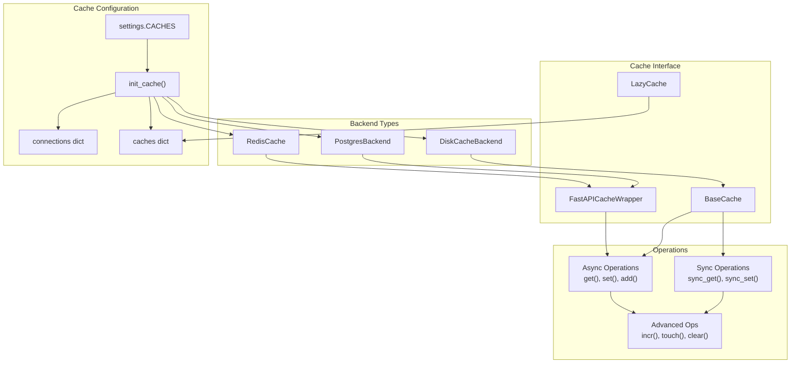
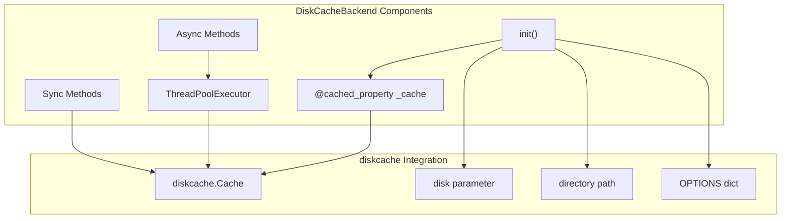
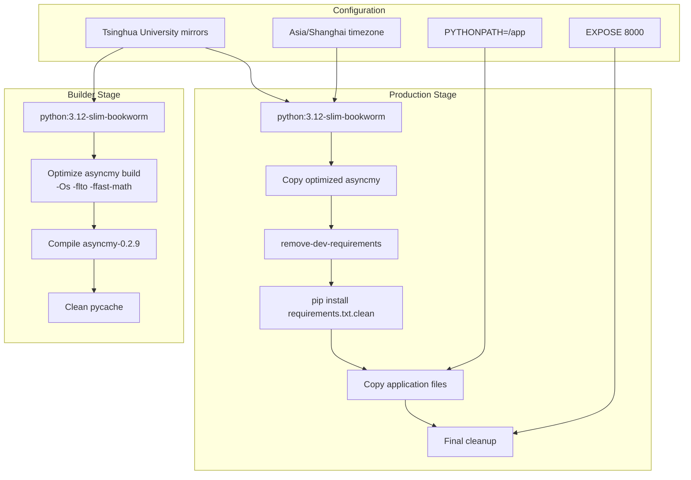
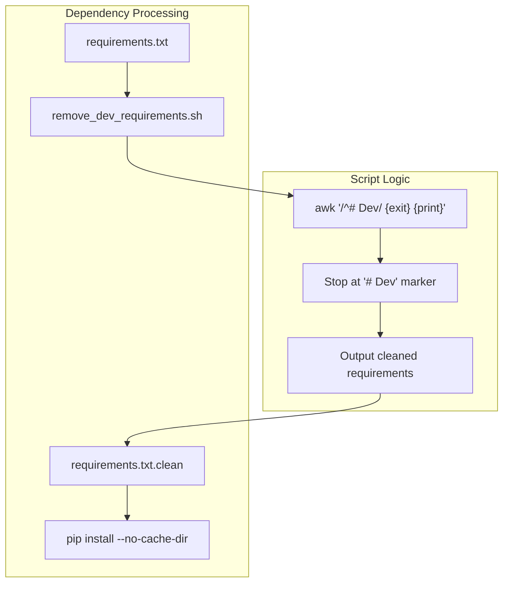
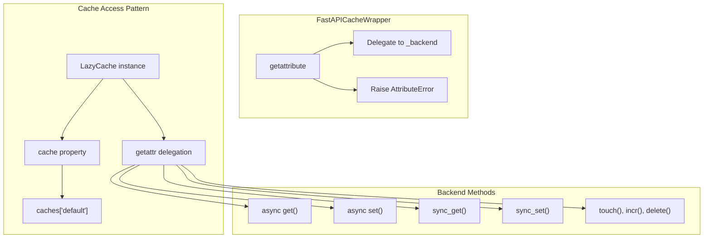

# Infrastructure

> **Relevant source files**
> * [deploy/Dockerfile](/deploy/Dockerfile)
> * [deploy/build.sh](/deploy/build.sh)
> * [deploy/remove_dev_requirements.sh](/deploy/remove_dev_requirements.sh)
> * [fastapp/cache/__init__.py](/fastapp/cache/__init__.py)
> * [fastapp/cache/base.py](/fastapp/cache/base.py)
> * [fastapp/cache/disk.py](/fastapp/cache/disk.py)
> * [fastapp/cache/states.py](/fastapp/cache/states.py)
> * [fastapp/initialize/cache.py](/fastapp/initialize/cache.py)

The Infrastructure layer provides the foundational systems that support QingKongFramework applications in production and development environments. This includes a multi-backend caching system, Docker containerization with optimized builds, and deployment configuration management. The infrastructure components are designed to be pluggable and configurable, allowing applications to scale from development to production environments.

For API development patterns and ViewSet operations, see [API Development](API-Development.md). For database management and schema operations, see [Database Management](Database-Management.md).

## Caching Architecture

QingKongFramework implements a sophisticated multi-backend caching system that supports Redis, disk-based storage, and PostgreSQL as cache backends. The system provides both asynchronous and synchronous interfaces, with automatic connection management and configurable cache aliases.

### Cache Backend System

**Sources:** [fastapp/initialize/cache.py L16-L61](/fastapp/initialize/cache.py#L16-L61)

 [fastapp/cache/base.py L44-L277](/fastapp/cache/base.py#L44-L277)

 [fastapp/cache/states.py L1-L22](/fastapp/cache/states.py#L1-L22)

### Cache Backend Configuration

The cache system supports multiple named cache configurations through the `settings.CACHES` dictionary. Each backend is initialized with specific connection parameters and operational settings:

| Backend Type | Connection Method | Configuration |
| --- | --- | --- |
| `RedisCache` | `aioredis.from_url()` | Location URL, connection pooling |
| `DiskCacheBackend` | Local filesystem | Directory path, disk class, timeout |
| `PostgresBackend` | `asyncpg.connect()` | Database DSN, connection settings |

The `init_cache()` function in [fastapp/initialize/cache.py L16-L41](/fastapp/initialize/cache.py#L16-L41)

 dynamically imports and configures each backend based on the backend class name. The system maintains two global dictionaries: `connections` for raw backend connections and `caches` for wrapped cache instances.

**Sources:** [fastapp/initialize/cache.py L17-L40](/fastapp/initialize/cache.py#L17-L40)

 [fastapp/cache/states.py L8-L9](/fastapp/cache/states.py#L8-L9)

### DiskCache Implementation

The `DiskCacheBackend` provides a local filesystem-based caching solution using the `diskcache` library. It implements both asynchronous and synchronous interfaces by using `asyncio.get_running_loop().run_in_executor()` to wrap synchronous disk operations:

The implementation provides key methods including `get()`, `set()`, `add()`, `delete()`, `touch()`, and `incr()`, each with both async and sync variants. The `@cached_property` decorator ensures the underlying `diskcache.Cache` instance is created lazily and reused across operations.

**Sources:** [fastapp/cache/disk.py L10-L72](/fastapp/cache/disk.py#L10-L72)

 [fastapp/cache/base.py L44-L106](/fastapp/cache/base.py#L44-L106)

## Docker Containerization

QingKongFramework uses a sophisticated multi-stage Docker build process optimized for production deployment. The containerization strategy focuses on minimizing image size while maximizing performance through optimized compilation of asyncmy and careful dependency management.

### Multi-Stage Build Process

**Sources:** [deploy/Dockerfile L1-L63](/deploy/Dockerfile#L1-L63)

 [deploy/build.sh L1](/deploy/build.sh#L1-L1)

### Asyncmy Optimization Strategy

The Dockerfile implements a sophisticated optimization strategy for the `asyncmy` MySQL driver. The builder stage downloads the source code directly and applies compile-time optimizations:

* **Compile flags**: `-Os -flto -ffast-math` for size and speed optimization
* **Link flags**: `-flto -s` for link-time optimization and symbol stripping
* **Cython directives**: Custom compilation environment variables
* **Source modification**: Dynamic injection of optimization parameters into `build.py`

The optimized asyncmy installation is then copied to the production stage, eliminating the need for compilation tools in the final image.

**Sources:** [deploy/Dockerfile L16-L28](/deploy/Dockerfile#L16-L28)

 [deploy/Dockerfile L45-L46](/deploy/Dockerfile#L45-L46)

### Dependency Management

The build process uses a custom shell script to filter development dependencies from production builds:

The `remove_dev_requirements.sh` script uses `awk` to process the requirements file, stopping when it encounters a line beginning with `# Dev`. This allows developers to maintain both production and development dependencies in a single file while ensuring only production dependencies are installed in Docker images.

**Sources:** [deploy/remove_dev_requirements.sh L1-L21](/deploy/remove_dev_requirements.sh#L1-L21)

 [deploy/Dockerfile L51-L54](/deploy/Dockerfile#L51-L54)

### Application File Structure

The final container includes only the essential application files:

| Directory/File | Purpose | Source |
| --- | --- | --- |
| `/app/fastapp/` | Core framework code | `COPY ./fastapp /app/fastapp` |
| `/app/common/` | Shared utilities | `COPY ./common /app/common` |
| `/app/manage.py` | CLI entry point | `COPY ./manage.py /app/` |

The container exposes port 8000 and defaults to running `python manage.py about`, though this is typically overridden in production deployments with specific server commands.

**Sources:** [deploy/Dockerfile L56-L62](/deploy/Dockerfile#L56-L62)

## Cache Interface Design

The caching system provides a unified interface through the `LazyCache` class and `FastAPICacheWrapper`, allowing applications to use caching without knowing the specific backend implementation.

### Lazy Cache Access Pattern

The `LazyCache` class provides a convenient proxy that automatically resolves to the default cache backend at runtime. This allows application code to import `cache` from `fastapp.cache` and use it immediately without explicit initialization.

**Sources:** [fastapp/cache/states.py L12-L21](/fastapp/cache/states.py#L12-L21)

 [fastapp/initialize/cache.py L8-L14](/fastapp/initialize/cache.py#L8-L14)