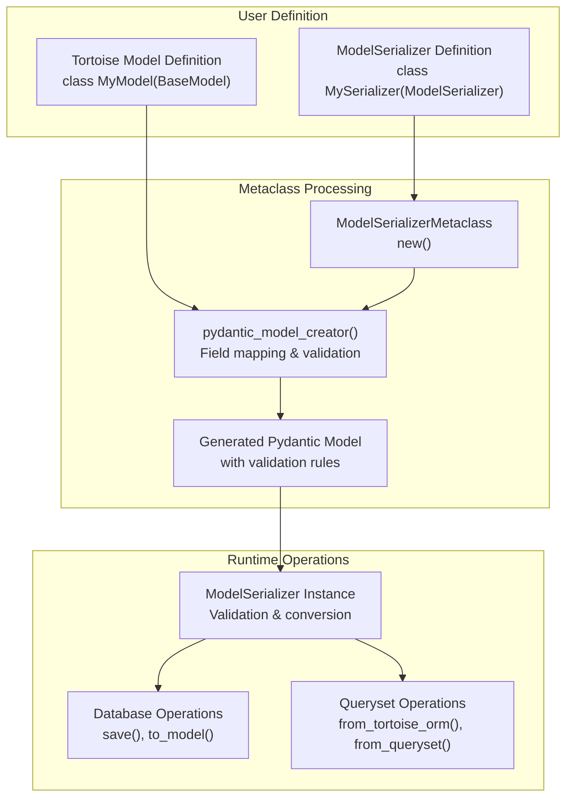
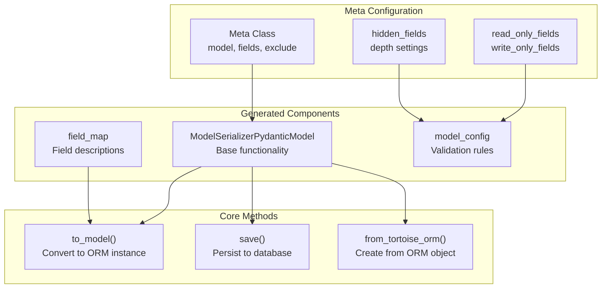
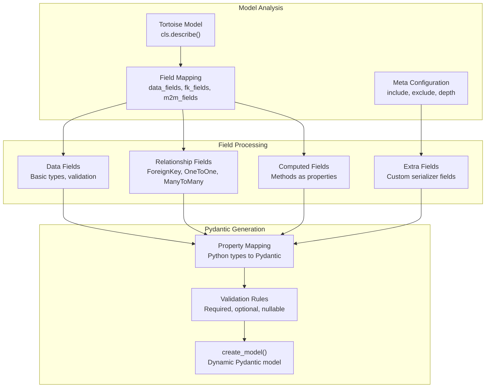
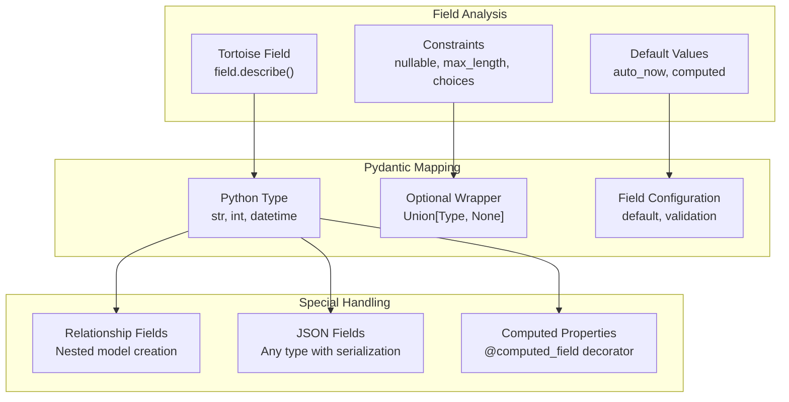
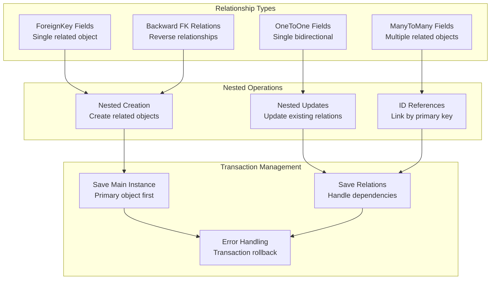
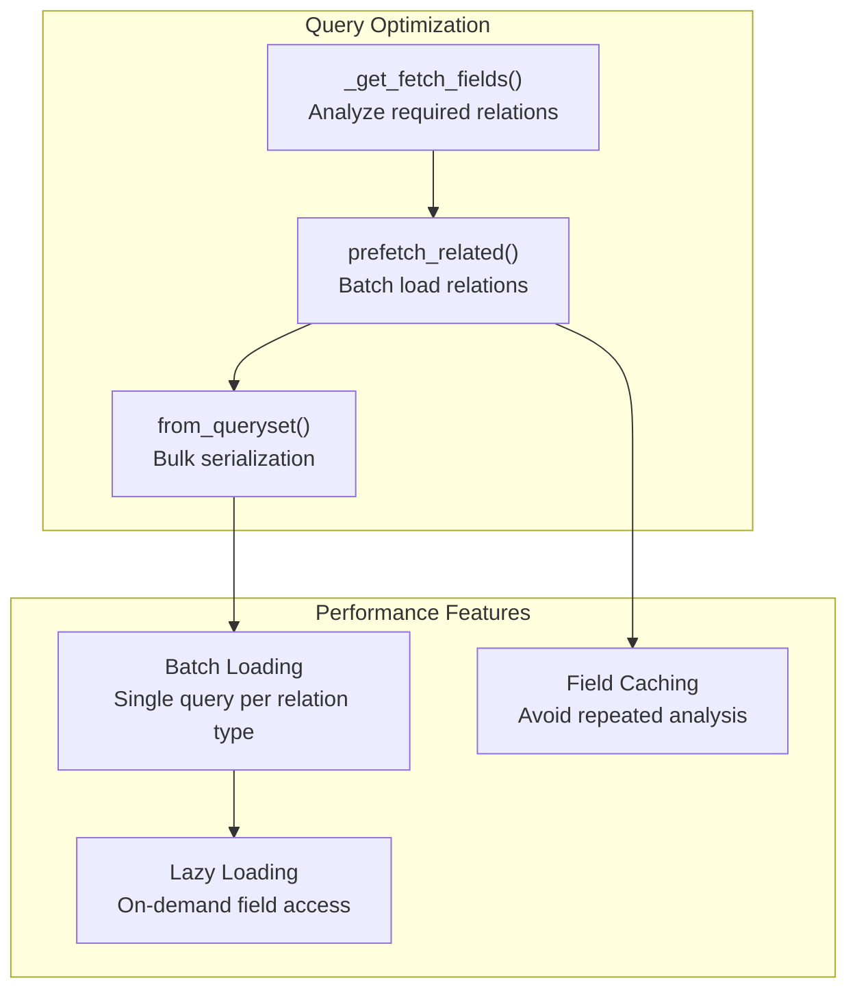
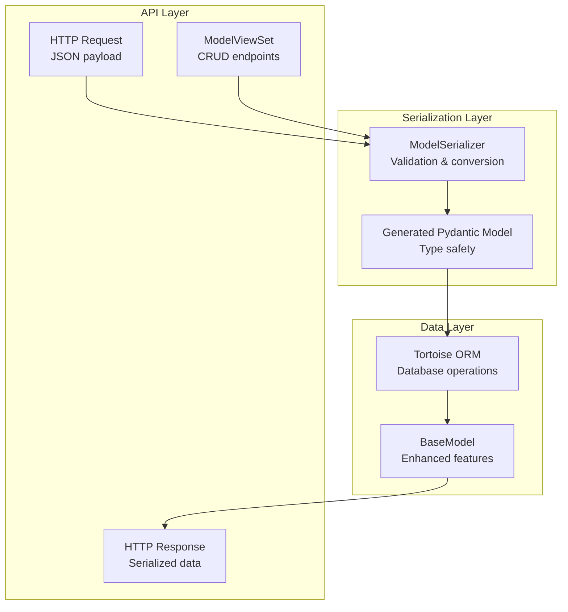

# ModelSerializer System

> **Relevant source files**
> * [fastapp/filters/filters.py](/fastapp/filters/filters.py)
> * [fastapp/filters/filterset.py](/fastapp/filters/filterset.py)
> * [fastapp/serializers/creator.py](/fastapp/serializers/creator.py)
> * [fastapp/serializers/fields/__init__.py](/fastapp/serializers/fields/__init__.py)
> * [fastapp/serializers/model.py](/fastapp/serializers/model.py)

The ModelSerializer system provides automatic Pydantic model generation from Tortoise ORM models, enabling seamless serialization, validation, and data conversion between database models and API representations. This system is the core bridge between QingKongFramework's data layer and API responses, automatically handling complex relationships, field validation, and database operations.

For information about query parameter filtering with Pydantic validation, see [FilterSet System](FilterSet-System.md). For database model extensions and QuerySet functionality, see [BaseModel Extensions](BaseModel-Extensions.md).

## Overview and Architecture

The ModelSerializer system consists of three primary components: a metaclass that generates Pydantic models, a base model class that handles database operations, and a creator function that bridges Tortoise ORM fields to Pydantic field types.



**Sources:** [fastapp/serializers/model.py L431-L517](/fastapp/serializers/model.py#L431-L517)

 [fastapp/serializers/creator.py L69-L545](/fastapp/serializers/creator.py#L69-L545)

## ModelSerializer Class Definition

The `ModelSerializer` class uses a metaclass pattern to automatically generate Pydantic models from Tortoise ORM models. Users define a simple class with a `Meta` inner class specifying the model and field configuration.



**Sources:** [fastapp/serializers/model.py L501-L517](/fastapp/serializers/model.py#L501-L517)

 [fastapp/serializers/model.py L431-L497](/fastapp/serializers/model.py#L431-L497)

## Pydantic Model Creation Process

The `pydantic_model_creator` function performs the complex task of analyzing a Tortoise model and generating a corresponding Pydantic model with appropriate field types, validation rules, and relationship handling.



**Sources:** [fastapp/serializers/creator.py L69-L123](/fastapp/serializers/creator.py#L69-L123)

 [fastapp/serializers/creator.py L301-L545](/fastapp/serializers/creator.py#L301-L545)

## Field Type Mapping and Validation

The system maps Tortoise ORM field types to corresponding Pydantic field types, handling validation constraints, nullable fields, and default values automatically.

| Tortoise Field | Pydantic Type | Validation Features |
| --- | --- | --- |
| `CharField` | `constr(max_length=...)` | Length validation |
| `IntField` | `int` | Type validation |
| `DateTimeField` | `datetime` | Format validation, auto_now handling |
| `JSONField` | `Any` | JSON serialization |
| `ForeignKeyField` | `Optional[SubModel]` | Nested model validation |
| `ManyToManyField` | `List[SubModel]` | List of nested models |



**Sources:** [fastapp/serializers/creator.py L431-L479](/fastapp/serializers/creator.py#L431-L479)

 [fastapp/serializers/creator.py L60-L66](/fastapp/serializers/creator.py#L60-L66)

## Database Operations and Model Conversion

The ModelSerializer provides methods for converting between Pydantic models and Tortoise ORM instances, handling complex relationships and database transactions.

```mermaid
sequenceDiagram
  participant Client
  participant ModelSerializer
  participant to_model()
  participant Tortoise ORM
  participant Transaction Manager

  Client->>ModelSerializer: Create with data
  ModelSerializer->>ModelSerializer: Validate with Pydantic
  Client->>ModelSerializer: save()
  ModelSerializer->>to_model(): Convert to ORM instance
  to_model()->>Transaction Manager: Begin transaction
  to_model()->>Tortoise ORM: Save main instance
  to_model()->>Tortoise ORM: Handle M2M relations
  to_model()->>Tortoise ORM: Handle backward FK relations
  Transaction Manager->>to_model(): Commit transaction
  to_model()->>Client: Return saved instance
```

**Sources:** [fastapp/serializers/model.py L221-L264](/fastapp/serializers/model.py#L221-L264)

 [fastapp/serializers/model.py L155-L219](/fastapp/serializers/model.py#L155-L219)

## Relationship Handling

The system automatically handles complex relationships between models, supporting nested creation, updates, and validation of related objects.



**Sources:** [fastapp/serializers/model.py L266-L340](/fastapp/serializers/model.py#L266-L340)

 [fastapp/serializers/model.py L170-L182](/fastapp/serializers/model.py#L170-L182)

## Read-Only, Write-Only, and Hidden Fields

The system supports sophisticated field visibility and access control through configuration options in the Meta class.

| Field Type | API Input | API Output | Database | Use Case |
| --- | --- | --- | --- | --- |
| Normal | ✓ | ✓ | ✓ | Standard fields |
| Read-Only | ✗ | ✓ | - | Computed values, timestamps |
| Write-Only | ✓ | ✗ | ✓ | Passwords, sensitive data |
| Hidden | ✗ | ✗ | ✓ | Internal system fields |

**Sources:** [fastapp/serializers/model.py L124-L133](/fastapp/serializers/model.py#L124-L133)

 [fastapp/serializers/creator.py L174-L198](/fastapp/serializers/creator.py#L174-L198)

## Advanced Features

### Prefetching and Performance Optimization

The system includes automatic relationship prefetching to avoid N+1 query problems when serializing multiple objects.



**Sources:** [fastapp/serializers/model.py L44-L76](/fastapp/serializers/model.py#L44-L76)

 [fastapp/serializers/model.py L378-L392](/fastapp/serializers/model.py#L378-L392)

### Custom Field Serialization

The system supports custom field types through the serializer fields module, allowing for specialized validation and serialization logic.

**Sources:** [fastapp/serializers/fields/__init__.py L180-L221](/fastapp/serializers/fields/__init__.py#L180-L221)

 [fastapp/serializers/creator.py L386-L407](/fastapp/serializers/creator.py#L386-L407)

## Integration with ViewSets

ModelSerializers integrate seamlessly with the ViewSet system to provide automatic CRUD API endpoints with validation and error handling.



**Sources:** [fastapp/serializers/model.py L1-L42](/fastapp/serializers/model.py#L1-L42)

 Integration details referenced from system architecture overview.