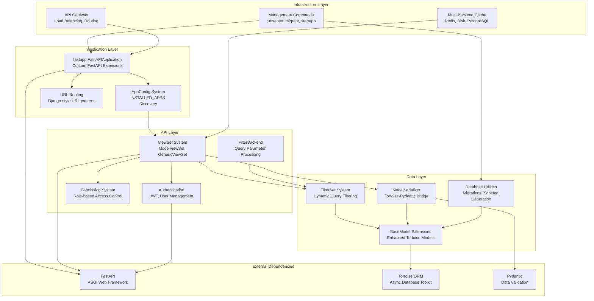
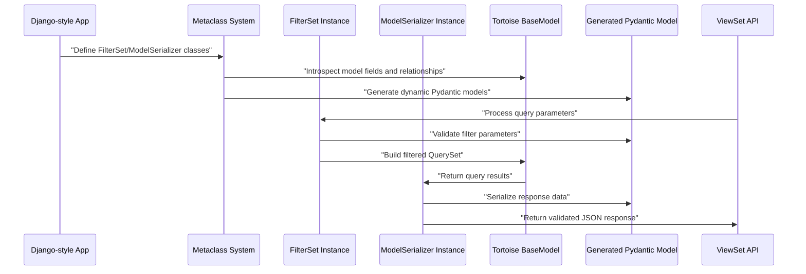
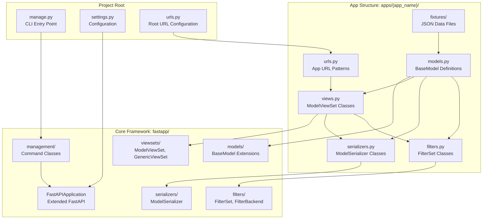
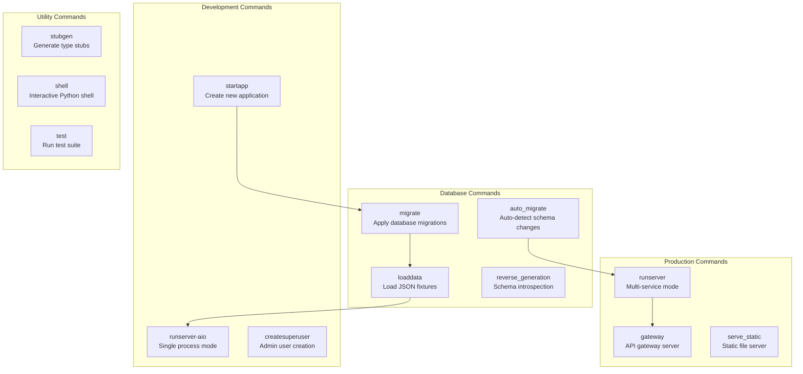

# Overview

> **Relevant source files**
> * [.trae/rules/project_rules.md](/.trae/rules/project_rules.md)
> * [.vscode/settings.json](/.vscode/settings.json)
> * [requirements.txt](/requirements.txt)

## Purpose and Scope

QingKongFramework is a comprehensive async web framework that provides a Django-like development experience built on top of FastAPI and Tortoise ORM. The framework enables developers to write fully asynchronous applications without the complexity typically associated with async Python development, eliminating the need for decorators like `sync_to_async` or async-specific ORM methods like `aget` or `afilter`.

This document provides a high-level overview of the entire framework architecture, its core innovations, and development patterns. For detailed information about specific subsystems, see:

* Core data operations: [FilterSet System](FilterSet-System.md) and [ModelSerializer System](ModelSerializer-System.md)
* API development patterns: [ViewSets and CRUD Operations](ViewSets-and-CRUD-Operations.md)
* Database management: [Database Migrations and Schema](Database-Migrations-and-Schema.md)
* Command-line tools: [Command Line Interface](Command-Line-Interface.md)

Sources: [.trae/rules/project_rules.md L1-L5](/.trae/rules/project_rules.md#L1-L5)

 [requirements.txt L1-L65](/requirements.txt#L1-L65)

## Framework Architecture

QingKongFramework follows a layered architecture that bridges Django's familiar patterns with FastAPI's performance and async capabilities. The framework is structured around four primary layers that work together to provide a complete web development platform.

### High-Level System Architecture

Sources: [.trae/rules/project_rules.md L8-L41](/.trae/rules/project_rules.md#L8-L41)

 [requirements.txt L5-L24](/requirements.txt#L5-L24)

## Core Innovations

The framework's primary innovation lies in its dynamic model generation system that automatically creates Pydantic models from Tortoise ORM definitions. This system consists of two interconnected components that work through Python metaclasses to provide seamless integration between the ORM layer and API serialization.

### Dynamic Model Generation Flow

The `FilterSet` system automatically generates Pydantic models for query parameter validation, while `ModelSerializer` creates models for request/response serialization. Both systems eliminate the need for manual Pydantic model definitions while maintaining full type safety and validation.

Sources: [.trae/rules/project_rules.md L116-L154](/.trae/rules/project_rules.md#L116-L154)

## Framework Structure

QingKongFramework organizes code using Django's familiar app-based structure, where each application contains models, views, serializers, filters, and URL configurations. This modular approach supports both monolithic and microservice architectures.

### Application Structure and Component Relationships

Each app follows the Model-View-Serializer-Filter pattern, where models define data structures, views handle HTTP requests, serializers manage data transformation, and filters provide query parameter processing.

Sources: [.trae/rules/project_rules.md L44-L54](/.trae/rules/project_rules.md#L44-L54)

 [.trae/rules/project_rules.md L76-L114](/.trae/rules/project_rules.md#L76-L114)

 [.trae/rules/project_rules.md L236-L247](/.trae/rules/project_rules.md#L236-L247)

## Key Technologies and Dependencies

The framework builds upon a carefully selected stack of modern Python libraries optimized for async performance and developer productivity. The dependency structure emphasizes async-first libraries and avoids synchronous bottlenecks.

| Category | Technology | Version | Purpose |
| --- | --- | --- | --- |
| Web Framework | `fastapi` | 0.115.4 | ASGI web framework and API routing |
| ORM | `tortoise-orm` | 0.21.7 | Async database toolkit and query builder |
| Validation | `pydantic` | 2.11.7 | Data validation and serialization |
| Server | `uvicorn` | 0.32.0 | ASGI server with uvloop acceleration |
| Database | `asyncmy`, `aiosqlite` | 0.2.9, 0.20.0 | Async MySQL and SQLite drivers |
| Caching | `redis`, `diskcache` | 4.6.0, 5.6.3 | Multi-backend caching system |
| Authentication | `pyjwt`, `bcrypt` | 2.10.1, 4.2.1 | JWT tokens and password hashing |
| CLI | `click`, `colorama` | 8.1.7, 0.4.6 | Command-line interface and colored output |
| JSON | `orjson` | 3.10.15 | High-performance JSON serialization |
| Pagination | `fastapi-pagination` | 0.12.31 | API pagination with multiple backends |

The framework avoids traditional Django dependencies like `django` and `djangorestframework`, instead providing equivalent functionality through FastAPI-native implementations.

Sources: [requirements.txt L5-L65](/requirements.txt#L5-L65)

## Development Workflow

QingKongFramework provides a comprehensive command-line interface that mirrors Django's `manage.py` system while adding FastAPI-specific functionality. The CLI supports both single-process development mode and production microservice deployment.

### CLI Commands Overview

The development workflow typically follows: create app → define models → run migrations → load fixtures → start development server. For production deployment, the framework supports containerized microservice architecture with API gateway routing.

Sources: [.trae/rules/project_rules.md L206-L216](/.trae/rules/project_rules.md#L206-L216)

 [.trae/rules/project_rules.md L155-L203](/.trae/rules/project_rules.md#L155-L203)

## Framework Philosophy

QingKongFramework bridges the gap between Django's developer-friendly patterns and FastAPI's async performance by providing:

* **Familiar Django Patterns**: Models, views, serializers, and URL routing that Django developers recognize
* **Async-First Design**: No need for `sync_to_async` decorators or async-specific ORM methods
* **Automatic Code Generation**: Dynamic Pydantic model creation eliminates boilerplate
* **Type Safety**: Full mypy compatibility with automatic type stub generation
* **Microservice Ready**: Built-in API gateway and service discovery support
* **Production Focused**: Docker containerization and multi-backend caching out of the box

This approach allows teams to leverage Django's proven architectural patterns while achieving FastAPI's performance characteristics in fully asynchronous applications.

Sources: [.trae/rules/project_rules.md L1-L6](/.trae/rules/project_rules.md#L1-L6)

 [.vscode/settings.json L1-L16](/.vscode/settings.json#L1-L16)