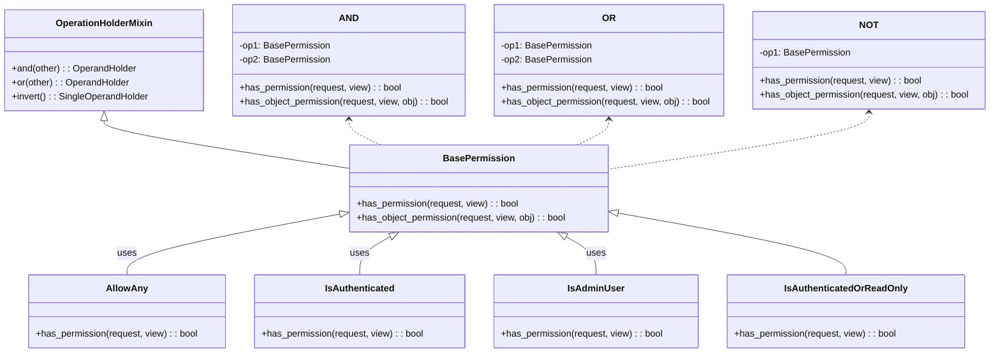
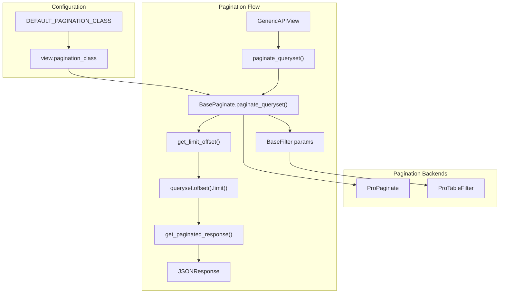
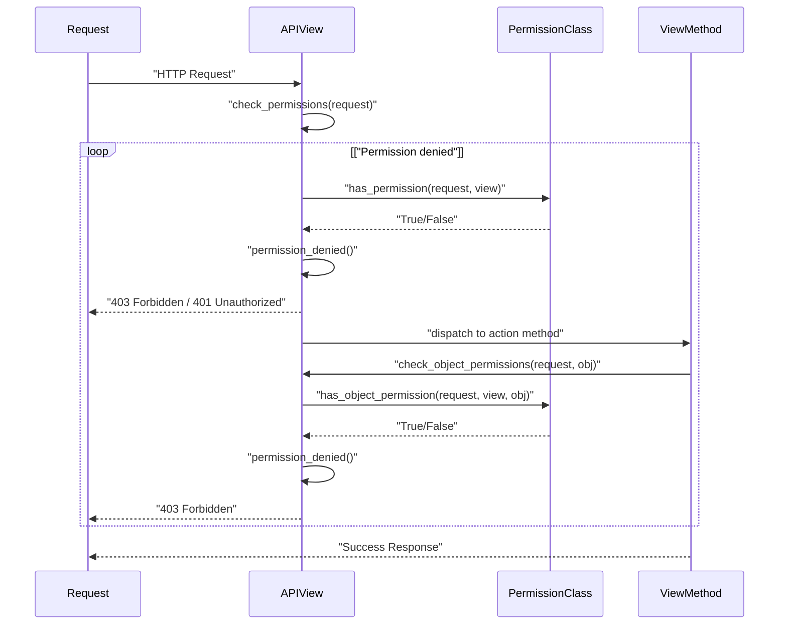
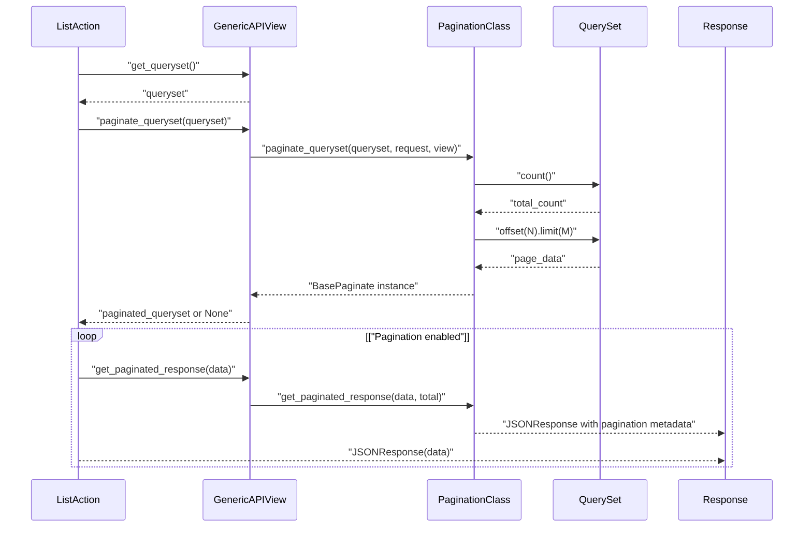

# Pagination and Permissions

> **Relevant source files**
> * [fastapp/paginate/base.py](/fastapp/paginate/base.py)
> * [fastapp/paginate/pro.py](/fastapp/paginate/pro.py)
> * [fastapp/permissions/base.py](/fastapp/permissions/base.py)
> * [fastapp/permissions/role.py](/fastapp/permissions/role.py)
> * [fastapp/views/viewsets.py](/fastapp/views/viewsets.py)

This document covers the pagination and permission systems used by ViewSets in QingKongFramework. These systems provide essential functionality for controlling access to API endpoints and managing large dataset responses.

For information about ViewSet CRUD operations, see [ViewSets and CRUD Operations](ViewSets-and-CRUD-Operations.md). For authentication mechanisms and user management, see [Authentication and Authorization](Authentication-and-Authorization.md).

## Permission System

The framework provides a flexible permission system that allows fine-grained access control at both the view level and object level. The system supports logical operations and composable permission classes.

### Permission Class Hierarchy



Sources: [fastapp/permissions/base.py L107-L123](/fastapp/permissions/base.py#L107-L123)

 [fastapp/permissions/role.py L5-L51](/fastapp/permissions/role.py#L5-L51)

### Built-in Permission Classes

| Permission Class | Description | Usage |
| --- | --- | --- |
| `AllowAny` | Grants access to all requests | Public endpoints |
| `IsAuthenticated` | Requires authenticated user with active status | Protected endpoints |
| `IsAdminUser` | Requires authenticated superuser | Admin-only endpoints |
| `IsAuthenticatedOrReadOnly` | Allows read access to all, write access to authenticated users | Mixed access endpoints |

Sources: [fastapp/permissions/role.py L5-L51](/fastapp/permissions/role.py#L5-L51)

### Permission Composition

The framework supports logical composition of permissions using Python operators:

* **AND (`&`)**: Both permissions must pass
* **OR (`|`)**: Either permission must pass
* **NOT (`~`)**: Permission must fail

```markdown
# Example: Admin or authenticated read-only access
permission = IsAdminUser | (IsAuthenticated & IsReadOnly)
```

Sources: [fastapp/permissions/base.py L6-L21](/fastapp/permissions/base.py#L6-L21)

 [fastapp/permissions/base.py L56-L101](/fastapp/permissions/base.py#L56-L101)

## Pagination System

The pagination system provides multiple backends for handling large datasets with consistent response formats and configurable parameters.

### Pagination Architecture



Sources: [fastapp/views/viewsets.py L449-L475](/fastapp/views/viewsets.py#L449-L475)

 [fastapp/paginate/base.py L14-L32](/fastapp/paginate/base.py#L14-L32)

 [fastapp/paginate/pro.py L30-L36](/fastapp/paginate/pro.py#L30-L36)

### Pagination Parameters

| Backend | Parameters | Default Values | Response Format |
| --- | --- | --- | --- |
| `BasePaginate` | `page_size`, `current` | 20, 1 | `{"data": [...], "total": N}` |
| `ProPaginate` | `pageSize`, `current` | 20, 1 | `{"data": [...], "total": N, "success": true}` |

Sources: [fastapp/paginate/base.py L9-L12](/fastapp/paginate/base.py#L9-L12)

 [fastapp/paginate/pro.py L8-L11](/fastapp/paginate/pro.py#L8-L11)

### Custom Pagination Backend

To create a custom pagination backend, extend `BasePaginate` and implement the required methods:

```python
class CustomPaginate(BasePaginate):
    params_model = CustomFilter
    
    @classmethod
    async def paginate_queryset(cls, queryset, request, view):
        # Custom pagination logic
        pass
    
    @classmethod
    def get_paginated_response(cls, data, total=None):
        # Custom response format
        pass
```

Sources: [fastapp/paginate/base.py L14-L32](/fastapp/paginate/base.py#L14-L32)

## ViewSet Integration

ViewSets integrate both permission and pagination systems through the `GenericAPIView` base class, providing a unified interface for API endpoints.

### Permission Flow in ViewSets



Sources: [fastapp/views/viewsets.py L197-L239](/fastapp/views/viewsets.py#L197-L239)

### Pagination Flow in ViewSets



Sources: [fastapp/views/viewsets.py L456-L475](/fastapp/views/viewsets.py#L456-L475)

### ViewSet Configuration

ViewSets can configure permissions and pagination through class attributes:

| Attribute | Purpose | Default Value |
| --- | --- | --- |
| `permission_classes` | List of permission class references | `["fastapp.permissions.AllowAny"]` |
| `pagination_class` | Pagination backend class reference | `settings.DEFAULT_PAGINATION_CLASS` |

Sources: [fastapp/views/viewsets.py L44-L49](/fastapp/views/viewsets.py#L44-L49)

 [fastapp/views/viewsets.py L198](/fastapp/views/viewsets.py#L198-L198)

 [fastapp/views/viewsets.py L276](/fastapp/views/viewsets.py#L276-L276)

## Configuration and Defaults

### Global Configuration

The framework provides global defaults that can be overridden at the application level:

```
DEFAULTS = {
    "DEFAULT_PERMISSION_CLASSES": [
        "fastapp.permissions.AllowAny",
    ],
    "DEFAULT_PAGINATION_CLASS": settings.DEFAULT_PAGINATION_CLASS,
}
```

Sources: [fastapp/views/viewsets.py L44-L49](/fastapp/views/viewsets.py#L44-L49)

### ViewSet-Level Overrides

Individual ViewSets can override the global defaults:

```python
class MyViewSet(ModelViewSet):
    permission_classes = [IsAuthenticated, IsAdminUser]
    pagination_class = ProPaginate
    
    # Custom permission logic
    def get_permissions(self):
        if self.action == 'list':
            return [AllowAny()]
        return super().get_permissions()
```

Sources: [fastapp/views/viewsets.py L208-L212](/fastapp/views/viewsets.py#L208-L212)

### Dynamic Configuration

ViewSets support dynamic configuration based on request context through method overrides:

* `get_permissions()` - Dynamically determine permission classes
* `get_paginated_response()` - Customize pagination response format
* `paginate_queryset()` - Override pagination behavior

Sources: [fastapp/views/viewsets.py L208-L212](/fastapp/views/viewsets.py#L208-L212)

 [fastapp/views/viewsets.py L456-L475](/fastapp/views/viewsets.py#L456-L475)