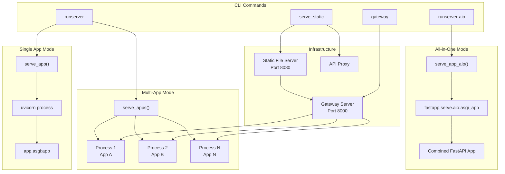
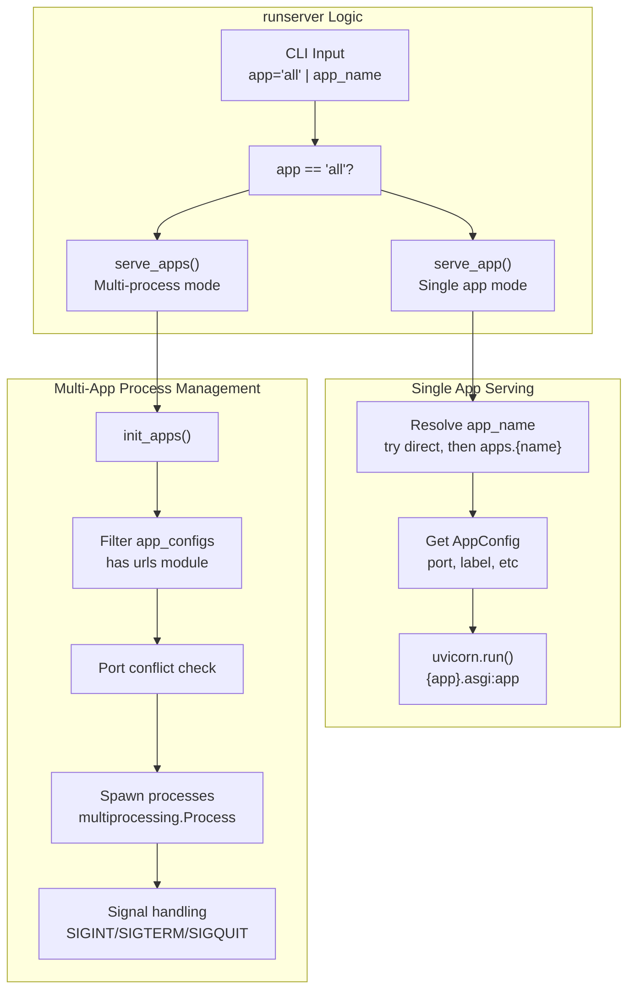
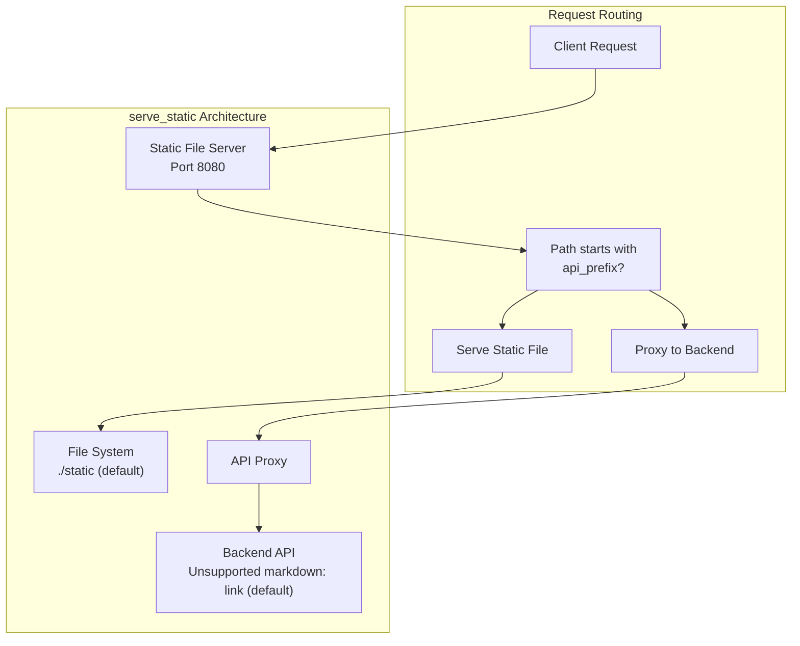
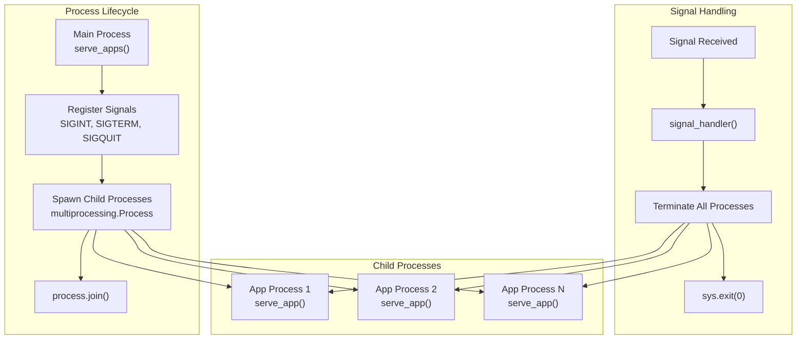

# Server Commands

> **Relevant source files**
> * [fastapp/commands/__init__.py](/fastapp/commands/__init__.py)
> * [fastapp/commands/decorators.py](/fastapp/commands/decorators.py)
> * [fastapp/commands/server.py](/fastapp/commands/server.py)
> * [fastapp/commands/tests.py](/fastapp/commands/tests.py)
> * [fastapp/misc/serve.py](/fastapp/misc/serve.py)
> * [fastapp/serve/aio.py](/fastapp/serve/aio.py)

## Purpose and Scope

The Server Commands system provides CLI tools for running QingKongFramework applications in development and production environments. This system supports multiple deployment modes including single-app serving, multi-app serving with process isolation, all-in-one serving, API gateway routing, and static file serving.

For database-related CLI tools, see [Database Commands](Database-Commands.md). For other development utilities, see [Development and Utility Commands](Development-and-Utility-Commands.md).

## Server Architecture Overview

QingKongFramework supports three distinct server deployment modes, each optimized for different use cases:



**Sources:** [fastapp/commands/server.py L1-L53](/fastapp/commands/server.py#L1-L53)

 [fastapp/misc/serve.py L29-L136](/fastapp/misc/serve.py#L29-L136)

## Command Reference

### runserver Command

The `runserver` command is the primary development server that supports both single-app and multi-app deployment modes.



#### Usage Examples

| Command | Description |
| --- | --- |
| `python manage.py runserver` | Run all apps with URL modules in separate processes |
| `python manage.py runserver myapp` | Run single app named "myapp" |
| `python manage.py runserver --host 0.0.0.0` | Bind to all interfaces |
| `python manage.py runserver --workers 4` | Use 4 worker processes per app |
| `python manage.py runserver --reload` | Enable auto-reload on file changes |
| `python manage.py runserver --exclude app1 app2` | Exclude specific apps from multi-app mode |

**Sources:** [fastapp/commands/server.py L10-L21](/fastapp/commands/server.py#L10-L21)

 [fastapp/misc/serve.py L80-L123](/fastapp/misc/serve.py#L80-L123)

### runserver-aio Command

The `runserver_aio` command runs all applications within a single FastAPI instance, combining their routes under different prefixes.

```mermaid
sequenceDiagram
  participant runserver-aio CLI
  participant serve_app_aio()
  participant uvicorn.run()
  participant lifespan()
  participant asgi_app
  participant init_apps()
  participant app_configs

  runserver-aio CLI->>serve_app_aio(): "host, port, workers, reload"
  serve_app_aio()->>uvicorn.run(): "fastapp.serve.aio:asgi_app"
  uvicorn.run()->>asgi_app: "Start ASGI app"
  asgi_app->>lifespan(): "Application startup"
  lifespan()->>init_apps(): "settings.INSTALLED_APPS"
  init_apps()->>app_configs: "Filter apps with urls module"
  loop ["For each app_config"]
    lifespan()->>app_configs: "Import urls module"
    app_configs->>lifespan(): "urlpatterns"
    lifespan()->>asgi_app: "include_router(prefix=/{app.prefix})"
  end
  lifespan()-->>asgi_app: "Ready to serve"
```

#### Key Features

* **Single Process**: All apps run in one uvicorn process
* **Route Prefixes**: Each app gets its own URL prefix (`/{app.prefix}`)
* **Shared Resources**: Database connections and cache are shared
* **Development Focus**: Simpler debugging and development workflow

**Sources:** [fastapp/commands/server.py L23-L29](/fastapp/commands/server.py#L23-L29)

 [fastapp/misc/serve.py L125-L136](/fastapp/misc/serve.py#L125-L136)

 [fastapp/serve/aio.py L15-L37](/fastapp/serve/aio.py#L15-L37)

### gateway Command

The `gateway` command provides API gateway functionality with load balancing and routing capabilities.

#### Configuration Options

| Option | Default | Description |
| --- | --- | --- |
| `--host` | `127.0.0.1` | Gateway bind address |
| `--port` | `8000` | Gateway port |
| `--upstream` | None | Custom upstream mappings (multiple allowed) |
| `--default-upstream` | `127.0.0.1` | Default upstream server |
| `--add-slashes` | False | Add trailing slashes to URLs |
| `--fastapi-redirect` | False | Enable FastAPI-style redirects |
| `--debug` | False | Enable debug mode |

#### Usage Examples

```markdown
# Basic gateway on port 8000
python manage.py gateway

# Custom upstream routing
python manage.py gateway --upstream "app1:127.0.0.1:8001" --upstream "app2:127.0.0.1:8002"

# Production gateway with redirects
python manage.py gateway --host 0.0.0.0 --port 80 --fastapi-redirect
```

**Sources:** [fastapp/commands/server.py L32-L42](/fastapp/commands/server.py#L32-L42)

 [fastapp/misc/gateway.py](/fastapp/misc/gateway.py)

### serve_static Command

The `serve_static` command provides static file serving with API proxying for frontend development.



#### Configuration

| Option | Default | Description |
| --- | --- | --- |
| `--host` | `127.0.0.1` | Static server bind address |
| `--port` | `8080` | Static server port |
| `--root` | `./static` | Static files root directory |
| `--api-prefix` | `/api` | API proxy prefix |
| `--api-target` | `http://127.0.0.1:8000` | Backend API target |

**Sources:** [fastapp/commands/server.py L45-L52](/fastapp/commands/server.py#L45-L52)

 [fastapp/misc/serve_static.py](/fastapp/misc/serve_static.py)

## Process Management and Signal Handling

The multi-app server mode implements robust process management with proper signal handling for graceful shutdown.



### Process Safety Features

* **Daemon Prevention**: Child processes have `daemon=False` to prevent premature termination
* **Signal Propagation**: Parent process handles signals and gracefully terminates children
* **Port Conflict Detection**: Automatic detection of port conflicts between apps
* **Process Monitoring**: Uses `multiprocessing.Process.join()` for process synchronization

**Sources:** [fastapp/misc/serve.py L65-L123](/fastapp/misc/serve.py#L65-L123)

## Development Features

### Auto-Reload Configuration

The server commands support intelligent auto-reload with targeted directory watching:

```markdown
reload_dirs=[
    Path(inspect.getfile(inspect.getmodule(app_config))).parent,  # app dir
    Path(inspect.getfile(inspect.currentframe())).parent.parent,  # fastapp dir  
    Path(inspect.getfile(inspect.getmodule(settings))).parent,  # common dir
] if reload else None
```

### Logging Configuration

Each app gets its own logging configuration with app-specific formatters:

```
log_config = deepcopy(log_config_template)
for formatter in log_config["formatters"].values():
    formatter["app_label"] = app_config.label
```

### uvloop Integration

Automatic uvloop installation for improved performance on Unix systems:

```javascript
try:
    import uvloop
except ImportError:
    uvloop = None

if uvloop is not None:
    uvloop.install()
```

**Sources:** [fastapp/misc/serve.py L18-L27](/fastapp/misc/serve.py#L18-L27)

 [fastapp/misc/serve.py L43-L46](/fastapp/misc/serve.py#L43-L46)

 [fastapp/misc/serve.py L54-L61](/fastapp/misc/serve.py#L54-L61)

## Deployment Considerations

### Development vs Production

| Mode | Best For | Pros | Cons |
| --- | --- | --- | --- |
| `runserver` (multi-app) | Development, Microservices | Process isolation, Independent scaling | Higher resource usage |
| `runserver-aio` | Development, Small deployments | Lower resource usage, Simpler debugging | Shared failure domain |
| `gateway` | Production | Load balancing, Centralized routing | Single point of failure |
| `serve_static` | Frontend development | Combined static/API serving | Development only |

### Performance Optimization

* **Worker Processes**: Use `--workers` parameter for CPU-bound workloads
* **uvloop**: Automatically enabled for async I/O performance
* **Process Isolation**: Multi-app mode provides better fault tolerance
* **Resource Sharing**: All-in-one mode reduces memory overhead

**Sources:** [fastapp/commands/server.py L13-L14](/fastapp/commands/server.py#L13-L14)

 [fastapp/commands/server.py L25-L26](/fastapp/commands/server.py#L25-L26)

 [fastapp/misc/serve.py L18-L27](/fastapp/misc/serve.py#L18-L27)