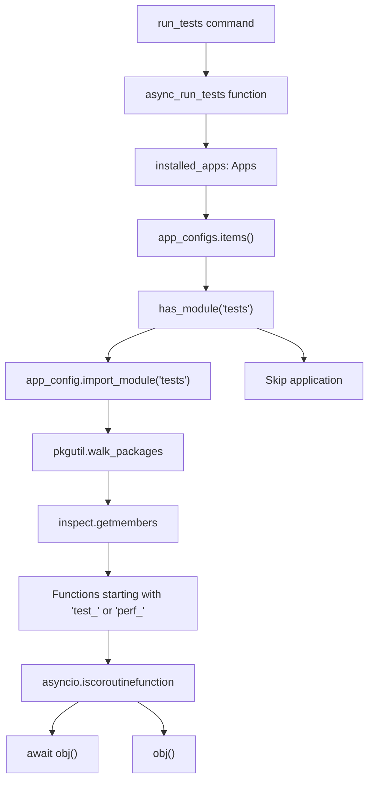
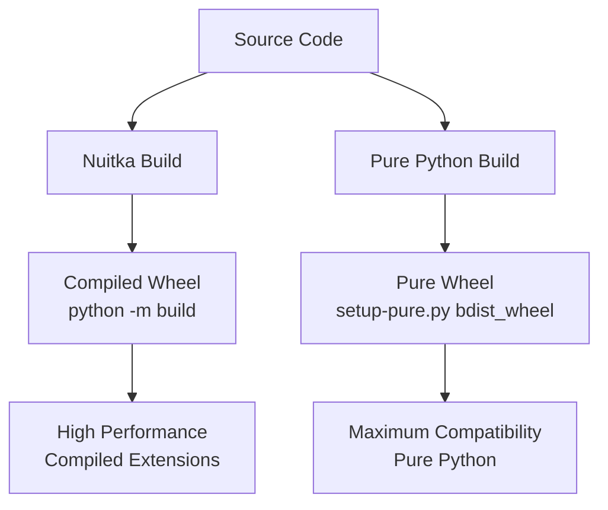
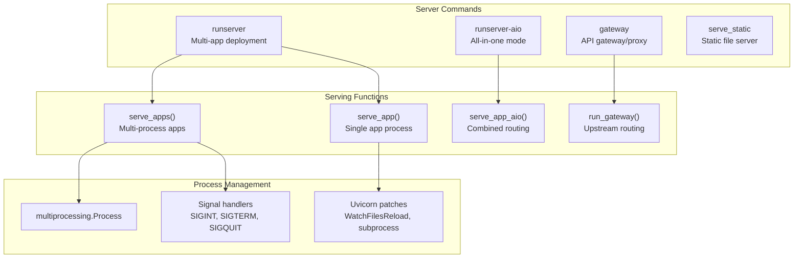
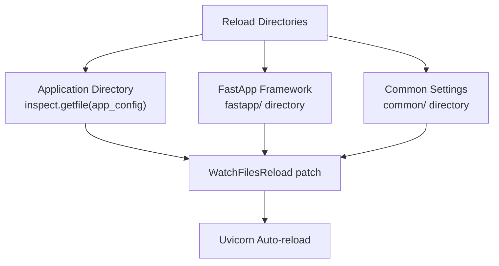
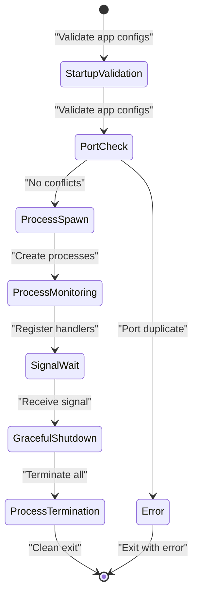

# Testing and Build Process

> **Relevant source files**
> * [Readme.md](/Readme.md)
> * [fastapp/commands/__init__.py](/fastapp/commands/__init__.py)
> * [fastapp/commands/decorators.py](/fastapp/commands/decorators.py)
> * [fastapp/commands/server.py](/fastapp/commands/server.py)
> * [fastapp/commands/tests.py](/fastapp/commands/tests.py)
> * [fastapp/misc/serve.py](/fastapp/misc/serve.py)
> * [fastapp/serve/aio.py](/fastapp/serve/aio.py)

This document covers the testing framework, build processes, and performance optimization tools in QingKongFramework. It explains how to run tests across applications, build optimized distributions, and manage development/production servers with performance enhancements.

For information about CLI commands in general, see [Command Line Interface](Command-Line-Interface.md). For deployment configurations, see [Deployment with Docker](Deployment-with-Docker.md).

## Testing Framework

QingKongFramework provides a comprehensive testing system that can discover and execute test functions across all installed applications. The test runner supports both synchronous and asynchronous test functions and provides filtering capabilities.

### Test Discovery and Execution

The testing system automatically discovers test functions using Python's module inspection capabilities:



Sources: [fastapp/commands/tests.py L12-L43](/fastapp/commands/tests.py#L12-L43)

### Test Command Interface

The test runner provides filtering options for targeted testing:

| Parameter | Type | Description |
| --- | --- | --- |
| `--apps` | multiple | Specific application labels to test |
| `--cases` | multiple | Specific test function names to execute |

The command uses the `@async_init_fastapp` decorator to ensure proper framework initialization before running tests:

* Initializes all installed apps
* Sets up cache connections
* Establishes database connections with Tortoise ORM
* Ensures proper cleanup of connections after test completion

Sources: [fastapp/commands/tests.py L45-L54](/fastapp/commands/tests.py#L45-L54)

 [fastapp/commands/decorators.py L10-L24](/fastapp/commands/decorators.py#L10-L24)

## Build Processes

QingKongFramework supports two distinct build approaches optimized for different use cases:

### Build Configuration Matrix



Sources: [Readme.md L1-L15](/Readme.md#L1-L15)

### Nuitka Build Process

The Nuitka build process creates optimized compiled extensions, particularly beneficial for JSON processing performance:

* **Command**: `python -m build`
* **Optimizations**: Leverages orjson==3.10.15 for accelerated JSON operations
* **Target**: Production deployments requiring maximum performance

### Pure Python Build Process

The pure Python build maintains maximum compatibility across environments:

* **Command**: `python setup-pure.py bdist_wheel`
* **Benefits**: No compiled dependencies, easier deployment
* **Target**: Development environments or constrained deployment scenarios

## Development Server Architecture

The framework provides multiple server configurations for different development and production scenarios:

### Server Command Options



Sources: [fastapp/commands/server.py L10-L52](/fastapp/commands/server.py#L10-L52)

 [fastapp/misc/serve.py L29-L135](/fastapp/misc/serve.py#L29-L135)

### Performance Optimizations

The server implementation includes several performance enhancements:

#### Uvloop Integration

The framework automatically detects and installs uvloop for improved async performance:

```python
# uvloop installation with optional warning
if uvloop is not None:
    uvloop.install()
    if settings.UVLOOP_WARNING:
        print("[uvloop installed]")
```

#### Multi-Process Architecture

For production deployments, the framework supports multi-process serving with automatic process management:

* **Port Validation**: Prevents port conflicts between applications
* **Process Monitoring**: Tracks all spawned processes for clean shutdown
* **Signal Handling**: Graceful termination on SIGINT/SIGTERM/SIGQUIT
* **Daemon Management**: Proper cleanup of child processes

Sources: [fastapp/misc/serve.py L80-L123](/fastapp/misc/serve.py#L80-L123)

### Development Server Features

| Server Mode | Use Case | Key Features |
| --- | --- | --- |
| `runserver` | Multi-app development | Individual app processes, port isolation |
| `runserver-aio` | Single-process development | Combined routing, simplified debugging |
| `gateway` | API gateway/proxy | Upstream routing, load balancing |
| `serve_static` | Frontend development | Static files + API proxying |

#### Hot Reload Configuration

Development servers support hot reload with intelligent directory watching:



Sources: [fastapp/misc/serve.py L54-L61](/fastapp/misc/serve.py#L54-L61)

## Process Management and Monitoring

### Multi-Process Server Management

The framework implements robust process management for production deployments:

#### Process Lifecycle



#### Signal Handling Implementation

The server implements comprehensive signal handling for clean shutdown:

* **SIGINT**: Keyboard interrupt (Ctrl+C)
* **SIGTERM**: Termination request
* **SIGQUIT**: Quit signal
* **Process Tracking**: Maintains list of active processes for cleanup

Sources: [fastapp/misc/serve.py L65-L122](/fastapp/misc/serve.py#L65-L122)

### Logging and Debugging Configuration

Each server mode includes customized logging configuration:

* **Per-App Labeling**: Log messages tagged with application labels
* **Log Level Control**: Configurable verbosity levels
* **Template System**: Consistent logging format across services
* **Debug Mode**: Enhanced error reporting for development

Sources: [fastapp/misc/serve.py L43-L46](/fastapp/misc/serve.py#L43-L46)