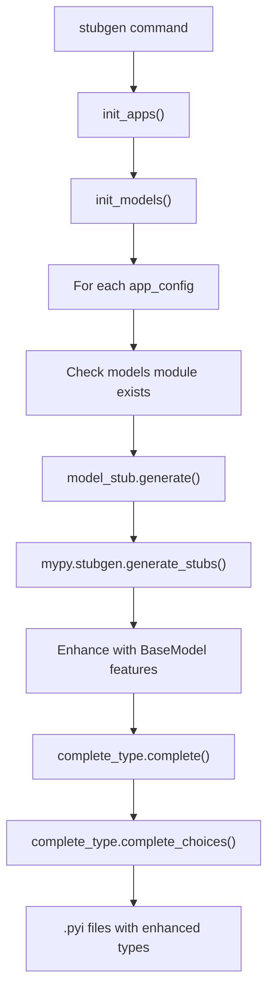
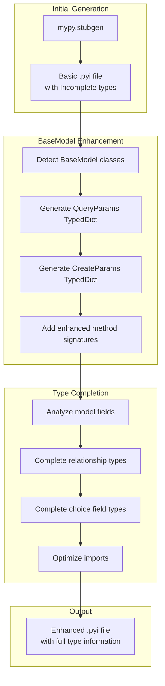
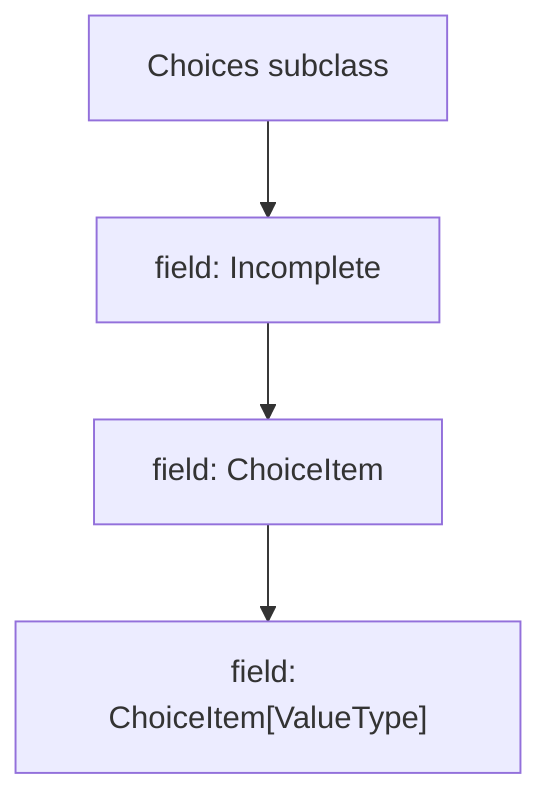
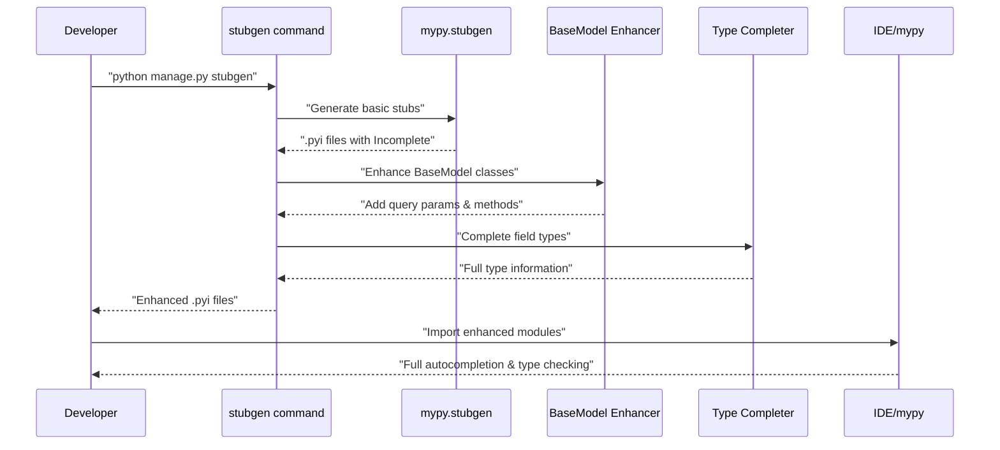

# Type Stub Generation

> **Relevant source files**
> * [fastapp/commands/misc.py](/fastapp/commands/misc.py)
> * [fastapp/contrib/auth/typing.py](/fastapp/contrib/auth/typing.py)
> * [fastapp/misc/complete_type.py](/fastapp/misc/complete_type.py)
> * [fastapp/misc/model_stub.py](/fastapp/misc/model_stub.py)
> * [fastapp/serializers/base.py](/fastapp/serializers/base.py)
> * [fastapp/utils/module_loading.py](/fastapp/utils/module_loading.py)

This document covers the automatic type stub generation system that creates `.pyi` files with enhanced type annotations for Tortoise ORM models. The system generates mypy-compatible type hints that include dynamic query parameters, enhanced method signatures, and proper relationship typing.

For information about the underlying BaseModel extensions that make this possible, see [BaseModel Extensions](BaseModel-Extensions.md). For details about the CLI system that exposes the stub generation command, see [Development and Utility Commands](Development-and-Utility-Commands.md).

## Purpose and Scope

The type stub generation system automatically creates comprehensive type annotations for database models by:

* Generating initial `.pyi` stubs using mypy's stubgen
* Enhancing stubs with dynamic query parameter types
* Adding proper method signatures for ORM operations
* Completing field type information for relationships and choices
* Supporting custom managers and user protocols

## Generation Process Flow



**Sources:** [fastapp/commands/misc.py L18-L44](/fastapp/commands/misc.py#L18-L44)

 [fastapp/misc/model_stub.py L11-L39](/fastapp/misc/model_stub.py#L11-L39)

## Core Components

### Stub Generator

The main stub generation is handled by the `generate()` function which orchestrates the entire process:

| Component | Purpose | Location |
| --- | --- | --- |
| `generate()` | Main orchestration function | [fastapp/misc/model_stub.py L11-L128](/fastapp/misc/model_stub.py#L11-L128) |
| `complete()` | Field type completion | [fastapp/misc/complete_type.py L57-L149](/fastapp/misc/complete_type.py#L57-L149) |
| `complete_choices()` | Choice field completion | [fastapp/misc/complete_type.py L151-L194](/fastapp/misc/complete_type.py#L151-L194) |
| `stubgen` CLI command | Command-line interface | [fastapp/commands/misc.py L18-L44](/fastapp/commands/misc.py#L18-L44) |

### Type Enhancement Process



**Sources:** [fastapp/misc/model_stub.py L66-L116](/fastapp/misc/model_stub.py#L66-L116)

 [fastapp/misc/complete_type.py L99-L141](/fastapp/misc/complete_type.py#L99-L141)

## Generated Method Signatures

The stub generation creates enhanced method signatures for common ORM operations:

```python
# Generated signatures for BaseModel classes
@classmethod
async def create(cls, **kwargs: typing.Unpack[CreateParams]) -> typing.Self: ...

@classmethod  
def filter(cls, *args: Q, **kwargs: typing.Unpack[QueryParams]) -> QuerySet[typing.Self]: ...

@classmethod
def exclude(cls, *args: Q, **kwargs: typing.Unpack[QueryParams]) -> QuerySet[typing.Self]: ...

@classmethod
async def get(cls, *args: Q, using_db: typing.Optional[BaseDBAsyncClient] = None, **kwargs: typing.Unpack[QueryParams]) -> QuerySetSingle[typing.Self]: ...

@classmethod
async def get_or_none(cls, *args: Q, using_db: typing.Optional[BaseDBAsyncClient] = None, **kwargs: typing.Unpack[QueryParams]) -> QuerySetSingle[typing.Optional[typing.Self]]: ...

@classmethod
async def get_or_create(cls, defaults: typing.Optional[dict] = None, using_db: typing.Optional[BaseDBAsyncClient] = None, **kwargs: typing.Unpack[QueryParams]) -> typing.Tuple[typing.Self, bool]: ...
```

**Sources:** [fastapp/misc/model_stub.py L104-L115](/fastapp/misc/model_stub.py#L104-L115)

## Field Type Completion

### Relationship Field Handling

The system handles various relationship field types with proper typing:

| Field Type | Generated Type | Example |
| --- | --- | --- |
| ForeignKeyFieldInstance | `Model` or `Optional[Model]` | `user: User` |
| OneToOneFieldInstance | `Model` or `Optional[Model]` | `profile: UserProfile` |
| BackwardFKRelation | `Model` or `Optional[Model]` | `created_by: User` |
| ManyToManyFieldInstance | `ManyToManyRelation[Model]` | `tags: ManyToManyRelation[Tag]` |

**Sources:** [fastapp/misc/complete_type.py L109-L129](/fastapp/misc/complete_type.py#L109-L129)

### Choice Field Support

Choice fields are automatically detected and typed appropriately:



**Sources:** [fastapp/misc/complete_type.py L162-L185](/fastapp/misc/complete_type.py#L162-L185)

## CLI Usage

The stub generation is exposed through the `stubgen` management command:

```markdown
# Generate stubs for all apps
python manage.py stubgen

# Generate stubs for specific apps
python manage.py stubgen --apps app1 app2

# Generate stubs in different modes
python manage.py stubgen --mode lite
python manage.py stubgen --mode full
```

### Command Options

| Option | Purpose | Default |
| --- | --- | --- |
| `--mode` | Generation mode (lite/full) | `lite` |
| `--apps` | Specific apps to process | All non-contrib apps |

**Sources:** [fastapp/commands/misc.py L16-L44](/fastapp/commands/misc.py#L16-L44)

## Pre-Import Dependencies

The generated stubs include essential imports for proper typing:

```javascript
import typing
import datetime
import decimal
import uuid
from tortoise.queryset import Q, QuerySetSingle
from tortoise.backends.base.client import BaseDBAsyncClient
from fastapp.contrib.auth.typing import UserProtocol
from fastapp.models.base import QuerySet
from fastapp.models.choices import ChoiceItem, Choices
from fastapp.models.fields import ManyToManyRelation
```

**Sources:** [fastapp/misc/model_stub.py L46-L57](/fastapp/misc/model_stub.py#L46-L57)

## Integration with Development Workflow



**Sources:** [fastapp/commands/misc.py L18-L44](/fastapp/commands/misc.py#L18-L44)

 [fastapp/misc/model_stub.py L11-L128](/fastapp/misc/model_stub.py#L11-L128)

 [fastapp/misc/complete_type.py L57-L194](/fastapp/misc/complete_type.py#L57-L194)