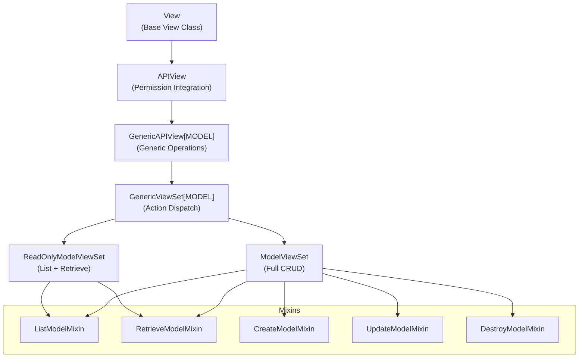
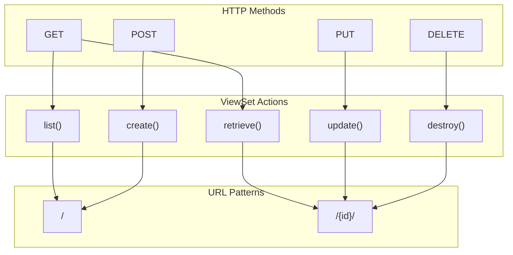
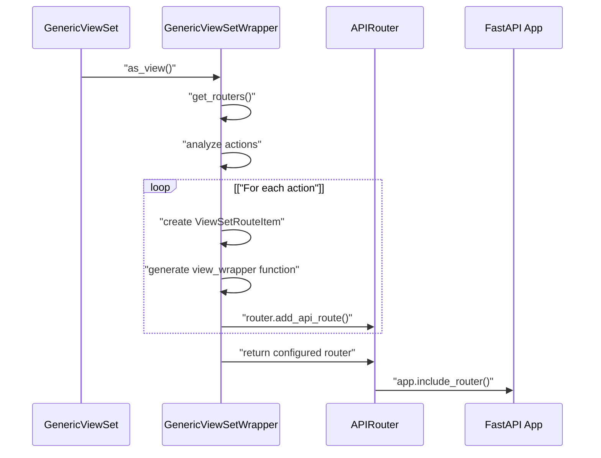
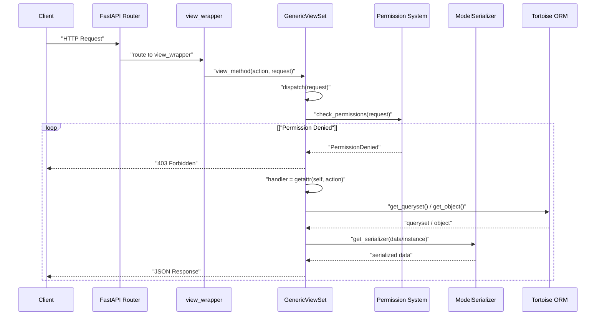

# ViewSets and CRUD Operations

> **Relevant source files**
> * [fastapp/paginate/base.py](/fastapp/paginate/base.py)
> * [fastapp/paginate/pro.py](/fastapp/paginate/pro.py)
> * [fastapp/permissions/base.py](/fastapp/permissions/base.py)
> * [fastapp/permissions/role.py](/fastapp/permissions/role.py)
> * [fastapp/views/viewsets.py](/fastapp/views/viewsets.py)

This page documents the ViewSet system in QingKongFramework, which provides Django-style class-based views adapted for FastAPI with automatic CRUD operations, routing, and API endpoint generation. ViewSets serve as the primary interface for building REST APIs with standardized create, read, update, and delete functionality.

For authentication and authorization details, see [Authentication and Authorization](Authentication-and-Authorization.md). For detailed information about the mixin classes that provide CRUD functionality, see [API View Mixins](API-View-Mixins.md). For pagination and permission configuration, see [Pagination and Permissions](Pagination-and-Permissions.md).

## ViewSet Architecture Overview

The ViewSet system is built on a hierarchical architecture that extends FastAPI's capabilities with Django-style patterns. The core components provide automatic route generation, permission checking, serialization, and CRUD operations.

### ViewSet Class Hierarchy



Sources: [fastapp/views/viewsets.py L197-L575](/fastapp/views/viewsets.py#L197-L575)

### Core ViewSet Components

| Component | Purpose | Key Methods |
| --- | --- | --- |
| `APIView` | Base API view with permission system | `check_permissions()`, `get_permissions()` |
| `GenericAPIView` | Generic operations and queryset management | `get_queryset()`, `get_object()`, `get_serializer()` |
| `GenericViewSet` | Action-based routing and dispatch | `dispatch()`, `get_actions()`, `get_extra_actions()` |
| `ModelViewSet` | Complete CRUD operations | Inherits all CRUD mixins |
| `ReadOnlyModelViewSet` | Read-only operations | `list()`, `retrieve()` only |

Sources: [fastapp/views/viewsets.py L197-L575](/fastapp/views/viewsets.py#L197-L575)

## CRUD Action Mapping

ViewSets map standard CRUD operations to HTTP methods and URL patterns through a standardized action system.

### REST Action Method Mapping



Sources: [fastapp/views/viewsets.py L51-L57](/fastapp/views/viewsets.py#L51-L57)

 [fastapp/views/viewsets.py L93-L98](/fastapp/views/viewsets.py#L93-L98)

The mapping is defined in the `REST_ACTION_METHOD_MAPPING` constant:

| Action | HTTP Method | URL Pattern | Description |
| --- | --- | --- | --- |
| `list` | GET | `/` | Retrieve multiple objects |
| `create` | POST | `/` | Create new object |
| `retrieve` | GET | `/{id}/` | Retrieve single object |
| `update` | PUT | `/{id}/` | Update existing object |
| `destroy` | DELETE | `/{id}/` | Delete object |

Sources: [fastapp/views/viewsets.py L51-L57](/fastapp/views/viewsets.py#L51-L57)

## Route Generation and FastAPI Integration

The ViewSet system automatically generates FastAPI routes through the `GenericViewSetWrapper` class, which handles the conversion from Django-style class-based views to FastAPI's function-based routing system.

### Route Generation Process



Sources: [fastapp/views/viewsets.py L71-L173](/fastapp/views/viewsets.py#L71-L173)

 [fastapp/views/viewsets.py L498-L535](/fastapp/views/viewsets.py#L498-L535)

### ViewSet Route Generation Components

The `GenericViewSetWrapper` class handles the complex task of converting ViewSet actions into FastAPI-compatible route handlers:

| Component | Purpose | Key Methods |
| --- | --- | --- |
| `ViewSetRouteItem` | Route configuration container | Stores action, URL pattern, HTTP methods |
| `GenericViewSetWrapper` | Route generation logic | `get_routers()`, `view()`, `as_router()` |
| Dynamic function generation | Creates FastAPI-compatible handlers | Runtime `exec()` of function definitions |

Sources: [fastapp/views/viewsets.py L64-L173](/fastapp/views/viewsets.py#L64-L173)

## Request Processing Flow

ViewSets process incoming requests through a standardized flow that handles authentication, permissions, serialization, and database operations.

### ViewSet Request Processing Pipeline



Sources: [fastapp/views/viewsets.py L547-L551](/fastapp/views/viewsets.py#L547-L551)

 [fastapp/views/viewsets.py L214-L238](/fastapp/views/viewsets.py#L214-L238)

 [fastapp/views/viewsets.py L398-L434](/fastapp/views/viewsets.py#L398-L434)

## Generic API View Features

The `GenericAPIView` class provides the foundation for all ViewSet operations with standardized queryset management, object retrieval, and serialization.

### Key Generic Operations

| Operation | Method | Purpose |
| --- | --- | --- |
| Queryset Management | `get_queryset()` | Retrieve base queryset for the view |
| Object Retrieval | `get_object()` | Get individual object with lookup |
| Serialization | `get_serializer()` | Create serializer instance |
| Filtering | `filter_queryset()` | Apply query filtering |
| Pagination | `paginate_queryset()` | Apply pagination to results |

Sources: [fastapp/views/viewsets.py L286-L474](/fastapp/views/viewsets.py#L286-L474)

### Serializer Integration

The ViewSet system integrates tightly with the ModelSerializer system to provide automatic data validation and serialization:

```python
# GenericAPIView serializer methods
async def get_serializer(
    self,
    instance: Any = None,
    data: Any = None,
    many: Optional[bool] = False,
    override_action: Optional[str] = None,
    **kwargs,
) -> ListSerializerWrapper | serializers.BaseSerializer
```

Sources: [fastapp/views/viewsets.py L398-L434](/fastapp/views/viewsets.py#L398-L434)

## Permission and Pagination Integration

ViewSets integrate with the framework's permission and pagination systems to provide consistent access control and result formatting.

### Permission System Integration

ViewSets use the `APIView` base class to implement permission checking:

| Permission Method | Purpose | When Called |
| --- | --- | --- |
| `check_permissions()` | Verify request permissions | Before any action |
| `check_object_permissions()` | Verify object-level permissions | When accessing specific objects |
| `get_permissions()` | Instantiate permission classes | During permission checking |

Sources: [fastapp/views/viewsets.py L208-L238](/fastapp/views/viewsets.py#L208-L238)

### Pagination Integration

ViewSets support multiple pagination backends through the `pagination_class` attribute:

| Pagination Component | Purpose | Key Methods |
| --- | --- | --- |
| `pagination_class` | Pagination backend configuration | Class-level setting |
| `paginate_queryset()` | Apply pagination to queryset | `paginate_queryset()` |
| `get_paginated_response()` | Format paginated response | `get_paginated_response()` |

Sources: [fastapp/views/viewsets.py L456-L474](/fastapp/views/viewsets.py#L456-L474)

 [fastapp/paginate/base.py L14-L32](/fastapp/paginate/base.py#L14-L32)

## ViewSet Usage Patterns

ViewSets are typically used by subclassing and configuring the required attributes:

### Basic ViewSet Configuration

```python
class MyModelViewSet(ModelViewSet):
    queryset = MyModel.objects.all()
    serializer_class = MyModelSerializer
    permission_classes = [IsAuthenticated]
    pagination_class = BasePaginate
    lookup_field = 'id'
```

### Custom Action Support

ViewSets support custom actions beyond the standard CRUD operations through the action decorator system:

```python
@action(detail=True, methods=['post'])
async def custom_action(self, request, id=None):
    # Custom action implementation
    pass
```

Sources: [fastapp/views/viewsets.py L492-L496](/fastapp/views/viewsets.py#L492-L496)

The ViewSet system provides a comprehensive foundation for building REST APIs with standardized CRUD operations, automatic routing, and integration with the framework's authentication, permission, and serialization systems.

Sources: [fastapp/views/viewsets.py L1-L576](/fastapp/views/viewsets.py#L1-L576)

 [fastapp/paginate/base.py L1-L32](/fastapp/paginate/base.py#L1-L32)

 [fastapp/permissions/base.py L1-L123](/fastapp/permissions/base.py#L1-L123)